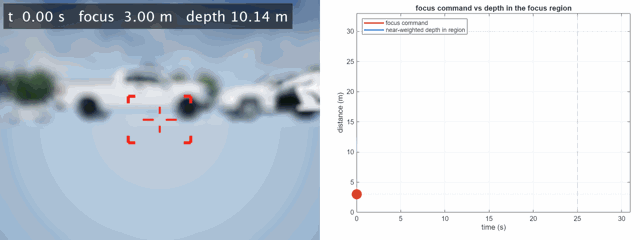

# Closed-Loop Camera Autofocus in a Simulated Scene

A Simulink model of a camera that has to focus itself. An Unreal Engine parking lot is rendered
to RGB and depth, a physically based defocus blur turns the depth into real optical blur, and a
contrast-detect autofocus loop drives the focus distance using nothing but the blurred image.

Left: the camera output, with the region the autofocus measures marked in red. Right: the focus
distance the loop commands, against the actual depth of the subject in that region. 

## How it works

**Contrast is the signal.** The loop
measures how much fine detail sits in a small region at the centre of the frame — a sharp image
has more gradient energy than a blurred one — and that provides a target to optimize.

**An integrator climbs the hill.** The control loop dithers the focus by a tiny amount, sees which way contrast moved, and integrates that gradient, so the focus command
is an accumulated output that simply holds still once it is on the peak.

**Stateflow implements a sweep.** An integrator can only climb the hill it is already on,
and when the camera pans to view something at a different distance the old peak is gone. The model
notices the drop in contrast, sweeps the focus across the range to find the new peak, and hands
control back to the integrator to hold it.

## Requirements

Built and tested in **MATLAB R2026b**. You need:

- Simulink
- Stateflow
- Automated Driving Toolbox
- Computer Vision Toolbox
- Image Processing Toolbox

The 3D scene runs in the Unreal Engine co-simulation that ships with Automated Driving Toolbox.

## Files

| File | Role |
| --- | --- |
| `AutofocusScene.slx` | the model |
| `exportAfVideo.m` | runs the model (or reuses the cache) and writes `autofocusCompare.gif` |
| `helpers/blurSceneImage.m` | the optics the model uses, called by the `DefocusBlur` block |
| `helpers/simulateDefocusBlur.m` | the defocus blur renderer |
| `helpers/defocusBlurParams.m` | renderer defaults |
| `helpers/nearWeightedDepth.m` | the reference depth statistic plotted on the right |

