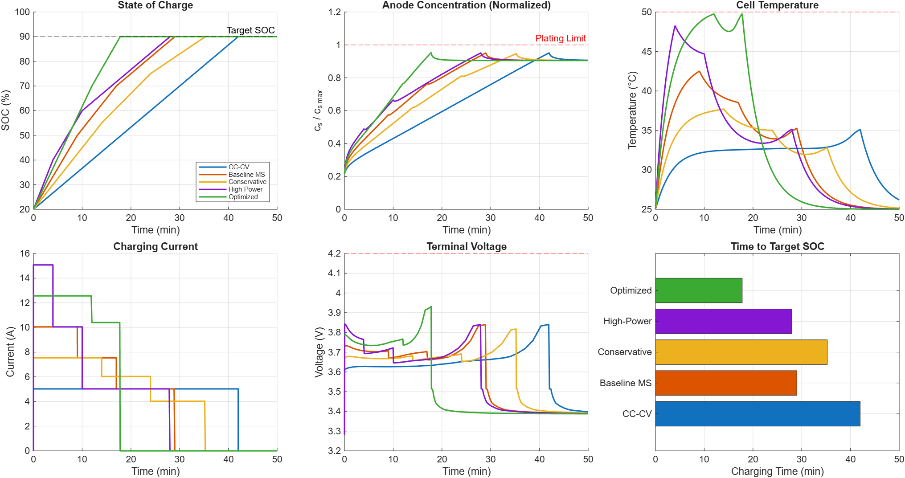

# Battery Fast Charging: Strategy Comparison and Optimization

Compare charging strategies for a lithium-ion battery using the Single Particle Model (SPM) from Simscape Battery. This example evaluates constant current-constant voltage (CC-CV), multi-stage, and optimized charging profiles for speed, safety, and efficiency.

### Interactive App


## Requirements

- MATLAB R2025a or later
- Simulink
- Simscape
- Simscape Battery
- Stateflow
- Global Optimization Toolbox (for `surrogateopt`)

## Overview

Fast charging lithium-ion batteries is critical for electric vehicle adoption, but must balance three competing objectives:

1. **Charging speed** - minimize time to reach target SOC
2. **Safety** - respect voltage, temperature, and lithium plating limits
3. **Battery health** - avoid conditions that accelerate degradation

This example implements and compares three approaches using a physics-based Single Particle Model (SPM) that captures electrochemical dynamics including solid-phase diffusion, Butler-Volmer kinetics, and thermal effects.

## Model Architecture

The Simulink model consists of:

- **BatteryPlant** - Simscape Battery SPM cell with thermal management, voltage/temperature sensing, SOC estimation via the `SOC Estimator (Coulomb Counting)` block, and a Simscape Probe for anode surface concentration (lithium plating monitoring)
- **CCCVController** - Standard constant current-constant voltage controller using the Battery CC-CV block
- **MultiStageController** - Stateflow chart implementing stepped current profiles with safety interlocks
- **OptimalProfileController** - Feeds a time-varying current profile from workspace (generated by optimization)
- **ControllerSelector** - Multiport switch to select active strategy

### Parameters

All parameters are defined in `setupParams.m`. The nominal capacity (`Q_nom`) is derived automatically from the SPM block's electrochemical parameters when the model is loaded.

**Cell specifications:**

| Parameter | Variable | Value | Source |
|-----------|----------|-------|--------|
| Nominal capacity | `Q_nom` | ~5 Ah | Computed from SPM (electrode geometry & material properties) |
| Max voltage | `V_max` | 4.2 V | Safety limit (electrolyte decomposition threshold) |
| Min voltage | `V_min` | 2.5 V | Safety limit (copper dissolution threshold) |

**Operating conditions:**

| Parameter | Variable | Value | Description |
|-----------|----------|-------|-------------|
| Initial SOC | `SOC_init` | 0.2 (configurable) | Starting state of charge |
| Target SOC | `SOC_target` | 0.9 (configurable, max 0.95) | Charge termination threshold |
| Initial temperature | `T_init` | 298.15 K (25°C) | Cell starting temperature |
| Ambient temperature | `T_ambient` | 298.15 K (25°C) | Environment temperature |

**Safety constraints:**

| Parameter | Variable | Value | Description |
|-----------|----------|-------|-------------|
| Max temperature | `T_max` | 323.15 K (50°C) | Prevents SEI growth / thermal runaway |
| Max anode concentration | `c_s_anode_max` | c_max×θ_max − 100 mol/m³ | Prevents lithium plating (saturation limit) |

**Thermal model:**

| Parameter | Variable | Value | Description |
|-----------|----------|-------|-------------|
| Convection coefficient | `h_conv` | 20 W/(m²·K) | Cell-to-ambient heat transfer |
| Cell surface area | `A_cell` | 0.01 m² | External cooling surface area |

**Controller parameters:**

| Parameter | Variable | Value | Description |
|-----------|----------|-------|-------------|
| CC charge current | `I_charge` | 1C (= Q_nom) | Constant current phase rate |
| CV proportional gain | `Kp_cv` | 10 | Voltage regulation gain |
| Multi-stage currents | `ms_currents` | [2C, 1.5C, 1C] | Stepped current levels |
| Multi-stage thresholds | `ms_soc_thresholds` | [0.5, 0.7, SOC_target] | SOC levels to step down |

**Optimization parameters:**

| Parameter | Variable | Value | Description |
|-----------|----------|-------|-------------|
| Number of segments | `N_opt_segments` | 5 | Piecewise-constant intervals |
| Max charge time | `t_charge_max` | 1800 s (30 min) | Optimization time horizon |
| Current bounds | `I_min_opt`, `I_max_opt` | [0.2C, 2.5C] | Bound constraints per segment |

All three controllers respect the `SOC_target` parameter: CC-CV has an internal SOC check, Multi-Stage uses it as the final threshold, and the optimal profile is truncated at the time SOC reaches the target. The model's electrochemistry limits charging to ~95% SOC maximum (anode concentration constraint).

## Charging Strategies

### 1. CC-CV (Constant Current - Constant Voltage)

The industry-standard approach:
- **CC phase**: Charge at 1C (5 A) until voltage reaches 4.2 V
- **CV phase**: Hold voltage at 4.2 V, current tapers until cutoff (C/20)
- **Termination**: SOC reaches target (90%)

**Constraints enforced:** Voltage limit (4.2 V, via CV regulation), SOC termination target.

This is the safest and simplest method, but also the slowest.

### 2. Multi-Stage Charging

Applies decreasing current levels as SOC increases, exploiting the battery's ability to accept higher currents at low SOC. Three profiles are evaluated:

| Profile | Stage Currents (C-rate) | SOC Thresholds |
|---------|------------------------|----------------|
| Baseline | 2.0C, 1.5C, 1.0C | 50%, 70%, 90% |
| Conservative | 1.5C, 1.2C, 0.8C | 55%, 75%, 90% |
| High-Power | 3.0C, 2.0C, 1.0C | 40%, 60%, 90% |

**Constraints enforced:** Voltage limit (4.2 V, triggers CV fallback), temperature limit (50°C, triggers shutdown), anode concentration limit (plating, triggers shutdown), SOC termination target.

The Stateflow controller includes safety interlocks that transition to CV mode if voltage limits are hit, and terminate charging if temperature or anode concentration limits are violated.

### 3. Optimization-Based Charging (Surrogate Optimization)

Formulates charging as a constrained black-box optimization problem solved with `surrogateopt` (Global Optimization Toolbox). Each function evaluation runs a single continuous Simulink simulation of the full charging trajectory, ensuring physically exact state propagation (concentration gradients, thermal dynamics):

- **Decision variables**: Piecewise-constant current levels over 5 time segments (each 6 minutes), bounded between 0.2C and 2.5C
- **Objective**: Minimize total charging time to reach target SOC
- **Method**: `surrogateopt` is a derivative-free optimizer designed for expensive black-box functions. It fits a Radial Basis Function (RBF) interpolant through evaluated points, then scores thousands of random candidates by balancing predicted objective (exploitation) vs. distance from known points (exploration). Separate surrogates enforce nonlinear constraints via feasibility-weighted merit. This is far more sample-efficient than genetic algorithms and avoids the noisy finite-difference gradients that cause gradient-based solvers to fail with Simulink models. Fast Restart eliminates model recompilation between evaluations (~5s per evaluation)

**Constraints enforced** (nonlinear inequality, evaluated from full trajectory):
- Terminal voltage ≤ 4.2 V — prevents electrolyte decomposition and gas generation
- Cell temperature ≤ 50°C — prevents accelerated SEI growth and thermal runaway risk
- Anode surface concentration ≤ c_s_anode_max — prevents lithium plating by keeping the anode below saturation, which causes capacity fade and internal short circuits

The combined objective+constraint function (`chargingObjConstr.m`) returns a struct with `Fval` (charging time) and `Ineq` (constraint violations), using `surrogateopt`'s native nonlinear constraint interface. The simulation function (`simulateCharging.m`) builds a piecewise-constant current timeseries and runs one continuous `sim()` call, avoiding state-stitching issues that arise with segment-by-segment approaches.

## Results



**Top row** — SOC, anode concentration (normalized), and cell temperature across all strategies. The optimized profile reaches 90% SOC in ~20 min while keeping anode concentration well below the plating limit and temperature below 50°C.

**Bottom row** — Current profiles, terminal voltage, and charging time comparison. Multi-stage strategies apply high current early and taper as SOC increases. The optimized profile pushes maximum current across 5 segments while respecting all constraints simultaneously. CC-CV is safest but slowest.

### Performance Summary

| Strategy | Charge Time | Max Voltage | Max Temp | Time Savings vs CC-CV |
|----------|-------------|-------------|----------|----------------------|
| CC-CV (1C) | 42.0 min | 3.84 V | 35°C | -- |
| Baseline MS | 29.0 min | 3.84 V | 42°C | 31% |
| Conservative | 35.3 min | 3.82 V | 38°C | 16% |
| High-Power | 28.0 min | 3.84 V | 48°C | 33% |
| Optimized | 17.8 min | 3.93 V | 50°C | 58% |

## Key Takeaways

1. **Multi-stage charging reduces charge time by 16-33%** compared to CC-CV while respecting all safety constraints
2. **Higher currents trade speed for thermal margin** — the High-Power profile is 33% faster but operates within 2°C of the safety limit
3. **Surrogate optimization achieves ~58% time savings** (17.8 min vs 42 min) by finding the fastest profile subject to all constraints simultaneously, including lithium plating limits that are difficult to monitor in practice
4. **Single continuous simulation ensures physical accuracy** — concentration gradients propagate naturally within one sim() call, avoiding state-stitching artifacts
5. **The SPM captures physics that simpler models miss** — concentration gradients, temperature-dependent kinetics, and side reactions provide realistic constraint boundaries

## Running the Example

### Interactive App (recommended)

1. Open MATLAB and navigate to this folder
2. Run `ChargingExplorerApp` from the Command Window

The app provides an interactive UI where you can:
- Select which charging strategies to compare (CC-CV, multi-stage profiles, optimized)
- Adjust initial SOC and target SOC via spinners (affects all strategies)
- Run simulations with live animated battery visualization (fill level = SOC, color = temperature)
- Run `surrogateopt` optimization directly from the UI with live progress updates
- Save/load optimized profiles per SOC configuration (files named `optimal_SOC{init}_{target}.mat`)
- Auto-load matching profiles when SOC values change; warning shown if profile doesn't match current settings
- Replay results with playback controls (play, pause, stop, speed, scrub)
- Visualize anode concentration alongside SOC to verify plating constraint satisfaction

### Live Script

1. Open `BatteryFastChargingExample.mlx` (or `.m`) in the MATLAB Editor
2. Run all sections sequentially

The live script runs all three strategies, performs the optimization, and generates comparison visualizations.

## File Structure

```
BatteryFastCharging/
├── README.md                    — This file
├── ChargingExplorerApp.m        — Interactive app (run with: ChargingExplorerApp)
├── BatteryFastChargingExample.m — Main example script (plain-text Live Script format)
├── BatteryFastCharging.slx      — Simulink model
├── setupParams.m                — Parameter definitions
├── simulateCharging.m           — Single continuous simulation for optimization
├── chargingObjConstr.m          — Combined objective + constraints for surrogateopt
├── data/                        — Saved optimization results
│   └── optimal_SOC20_90.mat     — Pre-computed optimal profile (SOC 20% → 90%)
└── images/                      — Generated plots for documentation
```

### Optimization Architecture

The optimization uses a single continuous simulation per function evaluation:

1. `surrogateopt` proposes a candidate current vector (5 values, one per segment)
2. `chargingObjConstr.m` calls `simulateCharging.m` which builds a piecewise-constant current timeseries and runs one `sim()` call for the full 1800s trajectory
3. Results (charge time, max voltage, max temperature, max anode concentration) are extracted from logged signals
4. The combined struct (`Fval` + `Ineq`) is returned to `surrogateopt`

**Fast Restart** is enabled before the optimization loop, eliminating model recompilation between evaluations. The SPM reinitializes from `SOC_init` on each call (verified: concentration resets to uniform profile), so each evaluation is independent.

All model parameters are passed via a `simParams` struct and applied via `Simulink.SimulationInput.setVariable()`. If a simulation fails (e.g., SPM asserts due to physically invalid conditions), penalty values are returned that signal infeasibility to the optimizer.

## SOC Estimation

The model uses the **SOC Estimator (Coulomb Counting)** block from the Simscape Battery `BatteryEstimators` library. This block integrates measured current over time to track state of charge:

```
SOC(t) = SOC_init + (1/Q_nom) * integral(I dt)
```

The block is configured with the cell capacity (`Q_nom = 5 Ah`) and initial SOC (`SOC_init = 0.2`). This provides the SOC feedback signal used by all three charging controllers.

## Anode Surface Concentration Monitoring

The anode surface lithium concentration is obtained directly from the SPM block using a **Simscape Probe**. This provides the true electrochemical surface concentration accounting for solid-phase diffusion dynamics within the anode particle.

During fast charging, the anode surface concentration increases as lithium intercalates. Lithium plating risk occurs when the surface approaches saturation (`c_max_anode × θ_max_anode`). The safety constraint enforces:

```
c_s_anode ≤ c_s_anode_max = c_max_anode × θ_max_anode − 100 mol/m³
```

This is more accurate than an SOC-based estimate because the SPM captures the radial concentration gradient that develops at high C-rates — the surface concentration can approach saturation even when the bulk-average (SOC) suggests margin remains.

## References

- Marquis, S.G., et al. "An asymptotic derivation of a single particle model with electrolyte." *Journal of The Electrochemical Society* 166.15 (2019): A3693.
- MathWorks. [Battery Single Particle](https://www.mathworks.com/help/simscape-battery/ref/batterysingleparticle.html) block documentation.
- MathWorks. [SOC Estimator (Coulomb Counting)](https://www.mathworks.com/help/simscape-battery/ref/socestimatorcoulombcounting.html) block documentation.
