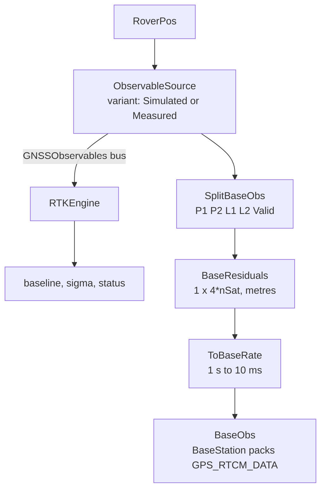
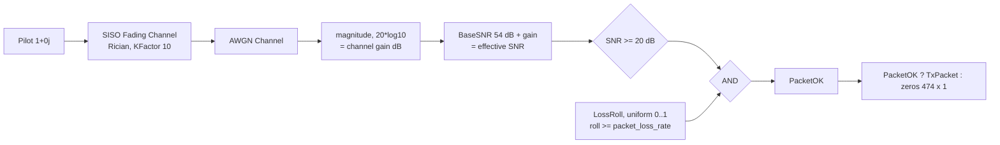
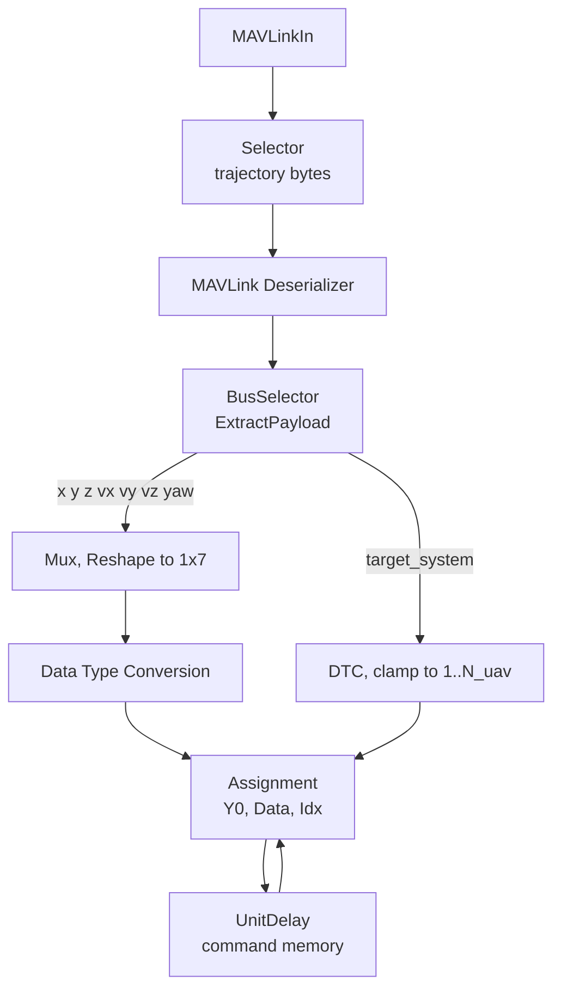
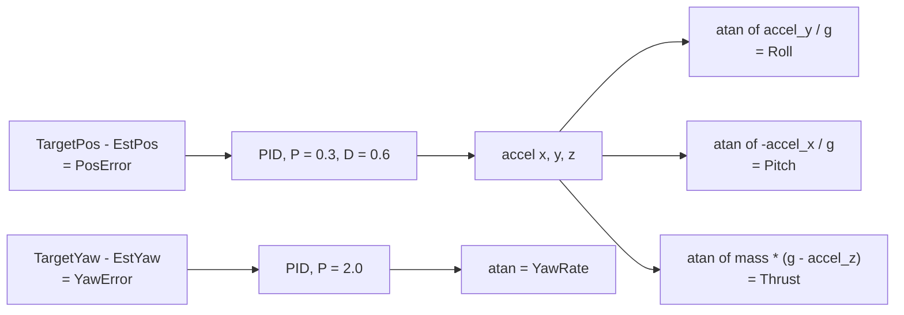
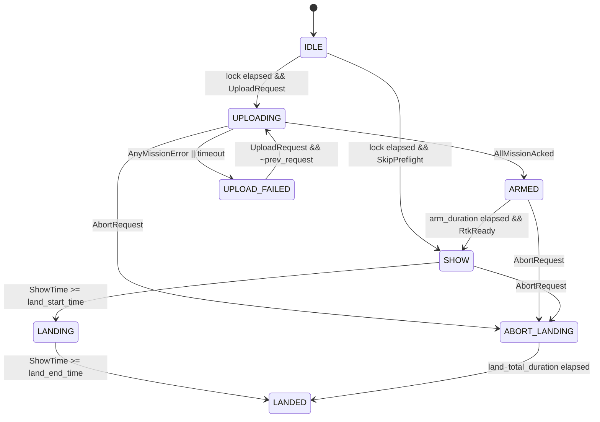
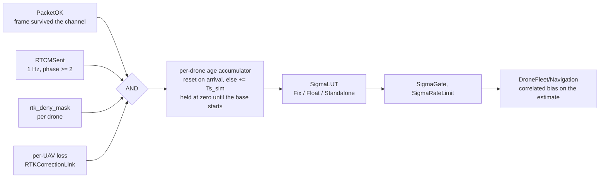

# Multi-UAV Drone Light Show — Design Documentation

Detailed design notes for the example. The [README](README.md) is the overview; this file is the
reasoning behind it — what each subsystem does, why the failure models are shaped the way they
are, what was measured, and what is deliberately abstracted.

**Contents**

- [Subsystem Details](#subsystem-details)
  - [RTKBase — carrier-phase RTK](#rtkbase--carrier-phase-rtk)
  - [BaseStation — MAVLink command distribution](#basestation--mavlink-command-distribution)
  - [RadioChannel — RF communication](#radiochannel--rf-communication)
  - [DroneFleet — vehicle dynamics and navigation](#dronefleet--vehicle-dynamics-and-navigation)
- [Age of Correction](#age-of-correction--the-timing-that-makes-it-work)
- [Degrading Named Drones](#degrading-named-drones)
- [Trajectory Planning](#trajectory-planning)
  - [Building a sequence](#building-a-sequence)
  - [Large fleets](#large-fleets)
  - [What the modelled link actually is](#what-the-modelled-link-actually-is)
  - [Keyframes per segment, not per second](#keyframes-per-segment-not-per-second)
  - [Formation sequence (default)](#formation-sequence-default)
  - [Flying text you type](#flying-text-you-type)
  - [Custom formations from a picture or an STL](#custom-formations-from-a-picture-or-an-stl)
- [Results in Detail](#results-in-detail)
- [Key Takeaways](#key-takeaways)
- [Known Limitations](#known-limitations)
- [App Reference](#app-reference)
- [Live Script Reference](#live-script-reference)
- [Design Decisions](#design-decisions)

---

## Subsystem Details

### RTKBase — carrier-phase RTK

Models a stationary base station with a known surveyed position. It does two separate things: it
runs a **carrier-phase RTK engine** over a base/rover pair of observables, and it broadcasts its
**own observables as RTCM-style residuals** for the fleet.



`ObservableSource` is a Variant Subsystem with two choices, `Simulated` and `Measured`, both
emitting the same `GNSSObservables` bus: dual-frequency code pseudoranges `P1 P2`, carrier phases
`L1 L2` in metres, and a per-satellite `Valid` mask. Row 1 of every array is the **base**, row 2 the
**rover**. `RTKEngine` forms double differences over that bus and runs a widelane → L1 ambiguity
cascade to a fixed baseline. The engine was measured unable to tell which variant fed it — the
playback path is bit-identical to the injected one.

`BaseResiduals` is the transmit side, and it is the part that makes this a real RTK link rather than
a DGPS one: a base station broadcasts **its own raw observables**, never a position and never
anything about a rover. It emits, per satellite,

```
residual = observable - rtk_rough_range                 (code rows P1, P2)
residual = phase - lambda * N_base - rtk_rough_range    (phase rows L1, L2)
```

Both subtractions are reconstructible by any receiver that knows the station coordinates
(RTCM 1005/1006) and the ephemeris, so nothing is lost — they exist because the payload is
single-precision. Raw phase at 2.47e7 m resolves to 2.000 m in a `single`, which is useless;
differencing the rough range alone still leaves ~2.47e5 m and 7.8e-3 m, *coarser* than the
2.236e-3 m phase noise that has to survive the trip. Folding out the base's own ~1e6-cycle phase
counter as well leaves ~2.3e3 m and 1.2e-4 m — nineteen times finer than the noise, and finer than
MSM4's own 22-bit fine-phaserange field. Code-aligning the phase is not a shortcut: an MSM
phaserange really does sit within metres of the pseudorange. The round trip through the shipping
blocks was measured in both directions and is bit-exact.

**What the model actually implements.** The residuals are *not* differenced against a rover
observable on the drone side; the fleet has no rover receiver of its own. The INS block abstracts
the *corrected* receiver and can only supply the **floor**: `PositionAccuracy = 0.02` m, one literal
for all N drones. Everything time-varying or per-drone is injected **downstream** of the sensor, at
a summing junction on its position output in `DroneFleet/Navigation`, scaled by the tier lookup
below. So the value of the link appears as **availability**, not as an accuracy delta: 2 cm while
corrections keep arriving, 0.3 m then 1.5 m while they do not. The payload is genuinely computed,
packed byte-for-byte into `GPS_RTCM_DATA` and carried over the channel — its *arrival* is what the
fleet consumes. That is an admitted design fact rather than an assumption. Adding a per-drone solve
is a larger change than this example needs, and would mostly cost simulation speed on the side of
the link that was deliberately kept cheap.

**Design for hardware swap.** `ObservableSource` *is* the hardware seam. The `Measured` choice reads
observables from workspace arrays via `obsBusFromArrays.m`; point it at a real dual-frequency
receiver's RINEX or raw output and the engine and the transmit path are untouched, because both
consume only the `GNSSObservables` bus. Nothing upstream of the bus is baked into the algorithm.

### BaseStation — MAVLink command distribution

The ground control station that broadcasts trajectory commands and RTK corrections to the fleet
using the MAVLink protocol.

**Time-division multiplexing.** With `N_uav` drones, the BaseStation sends one drone's command per
simulation tick, cycling through all drones with a modulo counter: tick 0 commands drone 1, tick 1
commands drone 2, … tick `N_uav-1` commands the last drone, and tick `N_uav` starts the cycle again.

**MAVLink messages sent each tick:**

| Message | Content | Purpose |
|---------|---------|---------|
| `SET_POSITION_TARGET_LOCAL_NED` | x, y, z, vx, vy, vz, yaw, target_system | Position/velocity setpoint for one drone |
| `GPS_RTCM_DATA` | RTCM-style phase-range residuals, packed as `uint8` | RTK correction broadcast to all drones |

The trajectory fields are selected from the pre-computed `TrajectoryPlan` matrix using the current
drone index. The `target_system` field identifies which drone should apply the command. Both
messages are serialized independently via MAVLink Serializer blocks (UAV Toolbox) and concatenated
into a single output packet.

**The telemetry uplink is one row per tick as well, but it is not a poll — it is self-scheduled.**
`TelemetryEncoder`'s `TelCounter` is a free-running Counter Limited wrapping at `N_uav-1`, with no
input ports at all; `TelAddOne` turns it into `tel_index`, which picks the row to send *and* stamps
the `SystemID` on the message. `RxTargetSys` reaches `MissionRequestEncoder` only — nothing in the
telemetry path. `BaseStation/Receiver` is a passive listener: `ExtractSystemID` recovers the sender
from the message's own field and `SysIdxClamp` → `AssignTelemetry` writes that row. So the fleet
takes turns on a shared slot (TDMA) and each drone self-reports, which is how real show telemetry
works — the ground station does not interrogate 500 drones one at a time. The received table is
still refreshed a row at a time and still takes `N_uav × Ts_sim` to come round, which is why the
3-D view can show a large fleet updating in a wave, and why the app offers the true airframe pose
as an alternative. See [Which pose the viewer draws](#which-pose-the-viewer-draws).

### Addressing a fleet past 255 drones

`target_system` is one byte, so one system ID per drone addresses 255 drones and no more. The failure
is silent rather than loud: `uint8()` **saturates**, so at 256 drones both #255 and #256 address 255,
the top drone never receives a waypoint, `REPAIR` retransmits into the same saturated address until
`stall > repair_stall_limit`, and the supervisor latches `UPLOAD_FAILED`.

Larger fleets are addressed as a **(`target_system`, `target_component`) pair** instead. Both fields
exist on all four mission messages, so the second byte is available without inventing a dialect: the
low byte counts drones within a bank, the high byte counts banks.

```
sys  = mod(idx - 1, mav_sys_span) + 1               idx = (comp - 1) * mav_sys_span + sys
comp = floor((idx - 1) / mav_sys_span) + 1
```

`mav_sys_span = 250` rather than 255 keeps the low byte clear of the top of the range and keeps the
banks readable: drones 1–250 are bank 1, 251–500 bank 2. At 250 drones or fewer every packet carries
component 1 and the scheme degenerates to the classic one-byte address, which is why nothing below
the old ceiling changes. Address 0 is MAVLink broadcast and this model's "no target" sentinel, so both
directions map 0 ↔ 0 explicitly — a `max(idx, 1)` ahead of each subtraction — rather than letting the
arithmetic underflow.

A real show of this size flies several radio networks, and the bank would be implicit in which radio
carried the packet. This model collapses them onto one channel and makes the bank explicit instead, so
every packet stays self-describing on a single simulated link.

Two small subsystems implement it, instanced at the seven points where a mission address crosses the
wire — `AddrSplit` (wide index → byte pair) where a message is filled, `AddrJoin` (byte pair → wide
index) where one is read:

| | Site | Message |
|---|---|---|
| `AddrSplit` | `BaseStation/Transmitter/MissionItemTx` | `MISSION_ITEM_INT` |
| `AddrSplit` | `BaseStation/Transmitter/MissionCountTx` | `MISSION_COUNT` |
| `AddrSplit` | `DroneFleet/Transmitter/MissionRequestEncoder/ReqMsgGate` | `MISSION_REQUEST_INT` |
| `AddrSplit` | `DroneFleet/Transmitter/MissionAckEncoder/AckMsgGate` | `MISSION_ACK` |
| `AddrJoin` | `DroneFleet/Receiver` | `MISSION_ITEM_INT` |
| `AddrJoin` | `BaseStation/MissionProtocol/AddrJoinAck` | `MISSION_ACK` |
| `AddrJoin` | `BaseStation/MissionProtocol/AddrJoinReq` | `MISSION_REQUEST_INT` |

`UploadIndexerChart` carries the index as `uint16` throughout (`mc_target`, `item_target`, `req_ts`);
each was `uint8`, and the third one mattered as much as the first two, because a saturated `req_ts`
means gap repair can never match a drone above 255. **The onboard buffer was never the constraint** —
it is a single shared data store indexed `(target_system-1) * num_waypoints + seq + 1` in 32-bit
integers. Only the wire fields were 8-bit.

**The ack accumulator was sized 100, not 255.** `MissionAckAccumBlk` reduced
`OR(AckedReg, NotInRange)` with `min` over a hard-coded `1:100`, which is *permissive*, not
restrictive: above 100 drones it required the first 100 acks and never waited on the rest, so a
delivery failure on drone 200 could not raise `AnyMissionError`. Every fleet larger than 100 was
armed on the strength of 100 confirmations. The registers are now sized `N_uav`.

**Measured.** Full mission delivery (`dbg_flags`, one flag per drone per keyframe, checked at
`ARMED`) at 100, 256 and 500 drones: complete for every drone, including both sides of the bank
boundary, with `UPLOAD_FAILED` never entered. A 12-drone fleet forced into three banks by shrinking
`mav_sys_span` to 5 flies the default show bit-identically to the single-bank case
(`max |Δ worst error| = 0.0000 m`). A 300-drone fleet flies a complete show on both delivery paths,
and each drone matches its own uploaded plan to 0.17 m against 71.4 m for the drone one bank away —
zero drones match a bank partner better than themselves. Arming now genuinely waits for the whole
fleet: at 120 drones the last drone to complete is #120 at 39.81 s and `ARMED` is entered at 39.81 s,
with 16 drones finishing after the 100th.

### RadioChannel — RF communication

Models the wireless link between the base station and the drone fleet using Communications Toolbox
blocks. It owns the whole correction link, not just the packet path:

```
RadioChannel
├── (link budget)          Pilot -> FadingChannel -> AWGNChannel -> SNR check
├── (packet gate)          LossRoll, PacketOK, and the erasure switch
├── RTKCorrectionLink      per-drone correction denial: rtk_deny_mask, UavLossRoll
└── CorrectionAgeMonitor   age accumulator -> SigmaLUT -> SigmaGate -> SigmaRateLimit
```

`CorrectionAgeMonitor` and `RTKCorrectionLink` used to sit on the root diagram, which is where a
reader looks for *system* structure rather than for the internals of a radio link. They belong
here: the age of a correction is a property of the link that delivers it, and the only thing that
leaves this subsystem is the per-drone `PosSigma` the fleet consumes.



**Key parameters**

- **BaseSNR:** 54 dB, typical for a short-range 2.4 GHz link under 500 m
- **Threshold:** 20 dB minimum SNR for successful decode
- **Fading:** Rician, `KFactor` 10, `MaximumDopplerShift` 9 Hz (SISO) — multipath in open air
- **AWGN:** additive white Gaussian noise
- **`packet_loss_rate`:** the frame erasure rate, re-rolled every `Ts_sim`

`PacketOK` is the AND of two independent conditions, and it is worth being straight about which one
does the work. **The pilot-tone branch never trips.** Clearing a 20 dB threshold from a 54 dB base
requires a 34 dB fade, which a Rician channel with `KFactor` 10 does not deliver; that branch is
pinned true for the whole simulation. Every frame this model actually drops is dropped by
`LossRoll`. The fading chain is retained because it is the correct place to put link physics and is
where you would tune `BaseSNR`, `KFactor` or the threshold to make fades meaningful — but as
shipped, `packet_loss_rate` is the knob with authority.

The channel is a pure **erasure** channel: a frame either arrives bit-exact or is replaced with
zeros. It does not corrupt bytes. That is deliberate and it matches the application layer — MAVLink
frames carry a CRC, so a receiver treats a corrupted frame and a missing frame as the same event.
Modelling bit errors would add cost without changing any observable behaviour.

One `PacketOK` gates all three consumers — the downlink command frame, the uplink telemetry, and
the RTCM correction — so they fail on the same ticks rather than independently. `CatPackets` reserves
bytes 281:474 of every frame for RTCM and the whole 474-byte frame is erased atomically, so on the
ticks a correction is present, frame loss *is* correction loss. Note that the slot is reserved every
tick but *occupied* only every `rtcm_interval` (1 s = one tick in 100): `Sw_RTCM` selects
`Zeros_RTCM` in between. Erasing one of the other 99 frames costs a command, not a correction — and
because a correction only goes out at 1 Hz, losing the frame that carried one adds a full second to
every drone's age of correction — one miss takes it to 1.990 s, which is why `rtk_timeout` = 2.5 s is
a threshold only two *consecutive* misses can cross. See
[Age of Correction](#age-of-correction--the-timing-that-makes-it-work).

### DroneFleet — vehicle dynamics and navigation

Contains the entire per-drone pipeline: command reception, position control, flight dynamics, and
state estimation. It is split into seven subsystems along the lines a real airframe divides on —
what comes off the radio, what the drone believes, what it is told to fly, and what it sends back:

```
DroneFleet
├── Receiver           MAVLink in: Selector -> Deserializer -> ExtractPayload -> command memory
├── MissionStatus      which waypoints are confirmed onboard (FlagsMat, ArrCount, AllMissionAccepted)
├── Transmitter        MAVLink out: TelemetryEncoder, MissionAckEncoder, MissionRequestEncoder,
│                      DownlinkMux, TelemetryCat
├── Navigation         the INS and everything that degrades its position estimate
│                      (AddGNSSErr, SigmaCol/SigmaCat, GnssNoise, the correlated bias)
├── SetpointGenerator  PlannedTrajectory (uploaded show) + LandingOverride (the abort descent)
├── PositionController PD position -> attitude, per drone
└── FlightDynamics     GuidanceModel and the true state (TransposePos)
```

Two Data Store Memory blocks — `OnboardBuffer` and `ReceivedFlags` — stay at `DroneFleet` level,
above every reader and writer, because a data store must be declared in a scope that encloses all
of them.

The port names follow a scheme worth knowing when reading the model: `True*` is ground truth from
the dynamics, `Est*`/`Meas*` is what the drone believes, `Plan*` is the uploaded show, `Cmd*` is
what the controller tracks, and `Rx*`/`Ack*`/`Req*` belong to the MAVLink link.

All seven are **virtual** subsystems: they are routing, not execution boundaries, so the split
changed no number in the model. That was verified rather than assumed — same propagated sample time
on every block, every logged signal bit-identical at tolerance 0, and a connectivity dump
confirming every block still feeds the same blocks across the boundary change.

**Command reception**



The Assignment block with UnitDelay implements a **command memory**: each tick updates only the
addressed drone's row in the `N_uav x 7` command matrix. This ensures all drones retain their
last-received command even when the TDM cycle is servicing other drones.

**Position controller**

A PD controller that converts position error into attitude commands:



The controller maps desired linear accelerations to attitude angles using the small-angle
approximation, valid for hover and slow flight. The `atan` blocks (`Math` function) provide output
saturation.

**Guidance model**

The `Multi-Instance Guidance Model` block (UAV Toolbox) simulates `N_uav` multirotors
simultaneously. It takes roll, pitch, yaw rate and thrust commands and produces 13 states per UAV:
position (3), velocity (3), Euler angles (3), body rates (3), and thrust (1). Gains configured in
`setupParams.m`: roll/pitch PD = `[6.0, 3.0]`, yaw rate P = 3.0, thrust P = 1.5.

**Inertial navigation system**

The INS block (the `insSensor` MATLAB System — see the source path below; it is *not* the
`insfilterAsync` filter, which this example never calls) takes the true pose and returns a corrupted
one. There is no GPS sensor block anywhere in the model: GNSS error is a base-Simulink
`Random Number` scaled by the RTK tier and summed in at `DroneFleet/Navigation`. Key settings, none
of which the RTK model touches:

- `PositionAccuracy = 0.02` m (RTK-level) — the **floor**, and the only thing this block supplies
- `PositionErrorFactor = [0.5, 0.5, 0.5]` — inert here, see below
- `TimeInput = 'on'`, with the port it adds held at constant `true` by `FixAlwaysTrue`

**A trap worth knowing about.** The dialog checkbox is called `TimeInput`, but it does not add a
Time port. From `getInputNamesImpl` in the block's source
(`...\shared\sensorsim\ins\simulink\+fusion\+internal\+simulink\insSensor.m`):

```matlab
if obj.TimeInput
    n = [n , "HasGNSSFix"];   % not "Time"
end
```

There is no `HasGNSSFix` dialog parameter — it is absent from the block's 13 `DialogParameters`
and `get_param` on it errors — so that port is the only route to it. And enabling it changes how
the block reads its **own** inputs: `stepImpl` loops over the rows of `Position`, treating them as
successive *time samples of one sensor* ("Simulink can offer a frame of HasGNSSFix"), with
timestamps spread across a single sample time. Here those rows are **drones**. So a false element
means "no fix at sub-sample *k* of this frame", elapsed time since loss is about zero, and
`PositionErrorFactor · Δt²` is about zero with it. Measured before the claim was withdrawn:
**15 s of supposedly total GNSS denial moved a drone 0.07 m.**

That is why this example models the bounded failure only. Per-drone GNSS outage through this block
needs one sensor instance per drone in a **For Each Subsystem**, where `numSamples` is 1 and
`HasGNSSFix` is a genuine scalar per iteration — a real option, and it costs the vectorised sensor
at 40–200 drones.

---

### Show supervision — the three Stateflow charts

Sequencing lives in Stateflow, not in the `.m` files. There are exactly three charts. (The model
holds five Stateflow objects; the other two are the MATLAB Function blocks `rtkCascade` and
`rtkObservables` inside `RTKBase`, which Simulink stores as charts.)

**`ShowSupervisor`** — 8 states, and the single source of the `Phase` signal the app decodes:



`Phase` is `IDLE 0, UPLOADING 1, ARMED 2, SHOW 3, LANDED 4, LANDING 5, UPLOAD_FAILED 6`. Note that
**`LANDING` and `ABORT_LANDING` both emit 5**, so `Phase` alone does not tell a planned descent from
an aborted one — `LandNow` is what distinguishes them.

Three details in this chart are load-bearing:

- **`IDLE → SHOW` on `SkipPreflight`** is the entire "Workspace (quick)" delivery path: it bypasses
  upload and arming altogether.
- **`ARMED` holds the fleet** with `NoFly = ~RtkReady` on both `entry` and `during`, so the guard is
  re-evaluated every tick rather than latched. The show is released only once the dwell has elapsed
  *and* RTK is still good.
- **`LANDING` keeps `t_phase_start` from `SHOW`**, so `ShowTime` carries on counting. The descent is
  part of the uploaded plan, and restarting the clock would strand the reference in mid-air.
  `TimeBroadcastEnable` is likewise dropped in `LANDED`, not on the way out of `SHOW`, which is what
  lets the planned descent reach the drones on the MAVLink path.
- **`UPLOAD_FAILED` is latched.** It leaves only on a *rising edge* of `UploadRequest`
  (`UploadRequest && ~prev_request`), so a failed upload will not retry itself while the request line
  is still held high — the operator has to ask again.

**`UploadIndexerChart`** (`BaseStation/MissionProtocol/UploadIndexerBlk`) — 6 states, and the thing
that makes the upload a protocol rather than a copy. It walks `COUNT_PHASE` (one `MISSION_COUNT` per
drone) → `ITEM_PHASE` (`N_uav × num_waypoints` items, linearised into `lin_idx`) → `REPAIR`, which
retransmits only what each drone's `MISSION_REQUEST_INT` says it still lacks. `REPAIR → GIVE_UP`
fires when `stall > repair_stall_limit`, which is how a hopeless link terminates instead of hanging.
Every state has an unconditional exit to `IDLE` on `~UploadEnable`, so dropping the enable always
resets the indexer cleanly. Its three address variables (`mc_target`, `item_target`, `req_ts`) are
`uint16`, wider than the byte that goes on the wire — see
[Addressing a fleet past 255 drones](#addressing-a-fleet-past-255-drones).

**`RtkGate`** — 3 states, and the reason a fix is not believed instantly:

`NOT_READY → PENDING` when `RtkStatus == rtk_status_l1`, then `PENDING → READY` only
`after(rtk_lock_dwell, sec)`. Any regression at any point returns to `NOT_READY`. The dwell needs its
own state because `after()` counts from state entry: the cascade re-validates its held integer set
every epoch and un-latches on failure, so an instantaneous test could release the show on an epoch
that regresses on the next tick.

---

## Age of correction — the timing that makes it work



| Parameter | Value | Meaning |
|-----------|-------|---------|
| `rtcm_interval` | 1.0 s | how often the base broadcasts `GPS_RTCM_DATA` |
| `rtk_timeout` | 2.5 s | age beyond which Fix drops to Float |
| `rtk_float_timeout` | 10.0 s | age beyond which Float drops to Standalone |
| `reconverge_time` | 5.0 s | how long the sigma takes to bleed back down after a recovery |

The margin between the first two matters. `rtk_timeout` must exceed `rtcm_interval`, or an ordinary
on-time correction arrives after the fix has already lapsed and the fleet flickers permanently.
Broadcasting at `Ts_sim` instead would be 100× the real RTCM rate and would hold the age at zero
permanently, which is the other way to make the mechanism unobservable.

The broadcast is gated on `Phase >= 2` — the base does not transmit corrections until the fleet has
nominally acquired lock. **The age must therefore be held at zero until broadcasting actually
starts.** Without that hold, zero packet loss still drove the age to 2.00 s, past the then-1.5 s
timeout, so the whole fleet took a Float-tier hit while parked on its pads and then spent
`reconverge_time` bleeding it off. That silently corrupted three otherwise-correct per-drone
measurements: undegraded drones read 0.0367 m instead of 0.0199 m, and a mask written live at
t = 4.09 s appeared to take effect at t = 1.49 s, *before* it was written. `AgeReset` is now
released by `OR(RTCMArrived, NOT RTCMActive)`.

One consequence for anyone measuring against this: count arrivals as **edges into zero**, not ticks
at zero. The pre-broadcast hold is 200 ticks long, so counting ticks reports 25 corrections as 225
and drags the median sawtooth peak to 0, because every held tick has a zero predecessor.

**Why age of correction and not "packet lost"?** The obvious wiring — degrade whenever the frame is
lost — makes RTK unfalsifiable. Frame loss is re-rolled every `Ts_sim`, so an "outage" lasts one
10 ms tick and produces about 0.05 mm against a 20 mm noise floor: every setting of the link
produces exactly 2 cm. Real receivers do not lose their fix the instant one datagram is missed;
they lose it when the last correction they hold becomes too old. Tracking age reproduces that, and
it is what makes the correction link observable in the results.

**Why a tier and not dead reckoning?** RTK is *differential*. Losing the correction stream does not
remove the satellites — the receiver still computes a position, it just falls back
**RTK Fix → RTK Float → Standalone**, and the error **stops** at the standalone accuracy. That is a
bounded failure: it ruins the formation, it does not lose the drone. Unbounded dead reckoning
belongs to losing GNSS itself, which this model deliberately does not claim to simulate (see the
INS section for why the block cannot express it per drone).

| State | Age of correction | Per-axis accuracy |
|-------|-------------------|-------------------|
| RTK Fix | `< rtk_timeout` (2.5 s) | 0.02 m |
| RTK Float | `rtk_timeout` … `rtk_float_timeout` (10 s) | 0.3 m |
| Standalone | `> rtk_float_timeout` | 1.5 m |

The INS supplies the 0.02 m floor. The *shortfall* to each tier is what gets injected, taken in
quadrature so the totals come out right: `sqrt(tier² − 0.02²)` = `[0, 0.2993, 1.4999]`. It is
injected as a **correlated bias** — a first-order lag with time constant `gnss_err_tau`, not white
noise, because `PositionController` at 100 Hz filters white noise straight back out and the
degradation would be invisible in flight. Recovery is rate-limited: the sigma rises the instant a
correction goes stale but falls only over `reconverge_time` (5 s), which is roughly how long a
real receiver takes to re-fix.

The quantitative confirmation of the tier model is in the stressed run: 25% frame loss gives a
measured degraded per-axis error of **0.2832 m against 0.2831 m predicted** from the tier and the
floor in quadrature, with a maximum of 1.0047 m where the old dead-reckoning wiring gave 6.09 m.

---

## Degrading named drones

`rtk_deny_mask` is an `N_uav`-by-1 logical: a true element means that drone's corrections are
never usable, so it walks Fix → Float → Standalone and stops there. It is **live-tunable** — write
it during a run and issue `set_param(mdl, 'SimulationCommand', 'update')` and the named drone
starts degrading from that moment, with no need to schedule a time in advance. `uav_loss_rate` is
the other per-drone knob: an independent per-drone erasure probability on the correction, which
decorrelates the fleet where `packet_loss_rate` erases the frame for everyone at once.

Both are exposed in the app — **Degrade** / **Restore** and **Per-UAV loss (%)** in the Navigation
panel — so neither needs a hand-written `assignin` to demonstrate.

There is also a `gnss_deny_mask`, and it is **not an operator control.** It survives only as the
nesting term into `RTCMArrived` — a correction is unusable if there are no satellites to apply it
to — which is one logical operation at all-false and saves rebuilding the structure later. Setting
an element true today would degrade that drone to Standalone, which is *bounded at 1.5 m*, whereas
a real GNSS outage is unbounded. That would be wrong physics presented as a feature, so the app
does not expose it and it must stay all-false until the outage path exists.

---

## Trajectory Planning

Trajectories are pre-computed before the model runs, using the UAV Toolbox. The work is split
across three files, and `setupParams.m` is only the first of them:

| File | Responsibility |
|---|---|
| `setupParams.m` | Every constant — airframe, gains, sample times, reference location, RTK and radio configuration — plus the `~exist` guards that let a caller override any of them, and the mode/timing tail that sizes the simulation. Calls the two below. |
| `planShow.m` | Geometry to trajectory: formation point clouds, drone-to-slot assignment, minimum-jerk transitions, keyframing, takeoff and landing. **Pure** — same inputs, same plan, no model required. Returns one plan struct. |
| `packShowUpload.m` | Plan to wire: keyframe selection, MAVLink packetisation, and how long the upload occupies the radio. Also pure. |

Because the two planners are pure, a show can be sized, rejected and re-sized without simulating
anything — which is what the first half of the Live Script does, and what makes the fleet-scaling
table below cheap to measure. `setupParams` unpacks both results back into the base workspace under
the names the model's block parameters reference, so the model itself is unchanged by the split.

The planning steps are:

1. **Formation generation** — Grid, Circle and Sphere patterns positioned at configurable altitude
   and spacing, **Text that spells whatever you type**, plus **custom shapes loaded from a picture
   or an STL**
2. **Drone-to-point assignment** — Hungarian algorithm (`matchpairs`, base MATLAB — it lives in
   `toolbox/matlab/specfun`, so this costs no toolbox licence) minimises total travel distance
   between formations, and also drone→pad at takeoff and drone→pad at landing
3. **Trajectory generation** — `minjerkpolytraj` (UAV Toolbox) creates smooth, dynamically feasible
   paths with zero velocity and acceleration at endpoints
4. **Timeline** — Takeoff (≥ 5 s) → [Hold → Transition] × `num_formations` → landing

The takeoff is a *floor*, not a fixed 5 s. Three terms compete for it, and they answer three
different questions: the 5 s floor, how fast the climb should **look** (`climb_speed`, 1.5 m/s
averaged along the path), and how fast it is **allowed** to be (the min-jerk peak inverted
against `v_track_target`, 7 m/s). The distance driving all three is the longest pad-to-first-slot
*path* in the fleet, not the altitude — a drone crossing as it climbs has further to go than the
billboard is tall.

The middle term is the newest and it fixes a real complaint: *the drones take off too fast.*
There was no climb rate at all, only the floor and the flyability ceiling, so the fastest speed
the fleet can track was serving as the artistic choice — and a limit makes a poor default. It
showed up as an asymmetry against a descent that has had an explicit "sedate, real" 1.5 m/s
since the start. Measured on the default show, the climb and the descent cover the same 10 m:

| | distance | duration | mean | peak |
|---|---|---|---|---|
| climb, before | 10.00 m | 5.00 s (the floor) | 2.00 m/s | 4.38 m/s |
| climb, now | 10.00 m | 6.67 s | 1.50 m/s | 3.28 m/s |
| descent | 10.00 m | 6.67 s | 1.50 m/s | 3.28 m/s |

A 30-drone text billboard was worse — the same 47.6 m flown in 14.9 s up and 31.6 s down, and
the peak came out at *exactly* 7.00 m/s because the sizing lands right on `v_track_target`. The
fleet was going up between 1.33× and 2.13× faster than it came down, with nothing in the plan
intending it. `climb_speed` defaults to `land_speed` rather than to a separately tuned number,
because the argument for it is the symmetry: the show rises exactly as sedately as it descends,
and the rate has already been justified once for the descent. It also lowered the show's headline
commanded speed, which is the tell that the climb *was* the fastest thing in it — 4.38 → 4.17 m/s
on the default show, 7.00 → 3.28 m/s on the billboard.

The flyability term is kept even though the climb rate dominates it at the shipped setting. It is
not redundant: `climb_speed` is settable, and the two cross over at
`v_track_target / MINJERK_PEAK_RATIO` = 3.2 m/s, above which it is the only thing standing between
a briskly-set climb and an uncommandable one. Below it, flyability comes free — a climb slow enough
to look right is always slow enough to fly. It still earns its place on the tall shows that
motivated it: a billboard 34 m tall needs 18 m/s out of a flat 5 s climb, and nothing downstream
can rescue that, since the app's auto-fit only ever lengthens *transitions*. Note that
`minjerkpolytraj` peaks at **35/16 · d/T**, not the 15/8 of a quintic: it brings jerk to rest as
well as velocity and acceleration.

Cost: the default show runs 1.7 s longer (70.7 → 72.3 s). The billboard runs 16.9 s longer, which
is the price of a 47.6 m climb at a walking pace — its descent already took 31.6 s for the same
distance.

**Launch pads and landing spots are assigned, not projected.** Both used to be the formation
with `z = 0`, which is fine for a Grid and degenerate for anything vertical — a billboard
stacks a whole column of drones onto one pad, and `min_sep_achieved` comes back as *exactly*
0.00 m. When the projection collides, the pads become a square grid on `formation_spacing`
and `matchpairs` maps drone to pad; the descent lands on those same pads. Pads that already
clear `d_min` are left untouched, so every Grid/Circle/Sphere show launches where it always
did. This also fixed a case with no billboard in it: a Sphere projected straight down has
near-overhead pairs, and `Grid→Circle→Sphere` was flying at 2.28 m against a 2.0 m
requirement. It is 3.72 m now.

The result is an `[N_uav x 7 x num_samples]` matrix (position, velocity, yaw) indexed by a time
vector, loaded into Simulink via `From Workspace` (timeseries).

### Building a sequence

The **Formations** dropdown carries four canned sequences, and the row below it builds any other
one a step at a time: pick a formation in **Add formation** and press **Add** to append it,
**Undo** to drop the last step, **Clear** to start again from a single Grid. The picker lists the
four built-in patterns and every shape loaded from a file, so `Grid→Logo→Circle→Logo→Grid` — a show
the four presets cannot express — is five clicks.

There is only one sequence, not two: the buttons compose the `A→B→C` string in the dropdown, which
is the only thing `generateShow` reads, and picking a preset re-seeds the builder from it. The
composed sequence *replaces* its own dropdown entry as it grows rather than appending, so the list
does not fill with half-built sequences. Nothing is planned until **Generate** — the status bar
says so after each Add.

### Large fleets

Up to 500 drones. Feasibility is not what limits it — the plan clears `d_min` at every size tested
(3.54 m at 500, against 2.0 m) — **time** is. And the limit is not monotonic in the fleet, which is
the whole point of this section: **200 drones is the hardest show this example can be asked to fly,
and 500 is easier.**

A single-ring Circle has radius `N_uav * formation_spacing / (2*pi)`, linear in the fleet, so the
transit between formations grows linearly while `transition_duration` does not. Past
`formation_radius_max` (175 m, which at spacing 5 is about 220 drones) `planShow` switches Circle to
concentric rings and Sphere to a thinner shell, both sized by **area**, and the extent grows as
`sqrt(N)` instead. Measured, planning only:

| Fleet | Circle radius | Peak speed at 8 s transitions | Transition needed | Upload |
|---|---|---|---|---|
| 20 | 15.9 m | 9.0 m/s | 10.3 s | 21.8 s |
| 100 | 79.6 m | 47.2 m/s | 53.9 s | 109.2 s |
| 200 | 159.2 m | 95.2 m/s | 108.8 s | 218.4 s |
| 500 | 65.0 m | 17.3 m/s | 19.7 s | 546.0 s |

against a fleet that tracks about 8 m/s (`v_track_max`). At 500 the single-ring law would have asked
for a 398 m radius; the area law gives 65 m, so the transition the planner needs falls from 108.8 s
at 200 drones to 19.7 s at 500. That discontinuity is also *why* the old cap sat at 200: the transit
time tracks the radius at about 0.686 s/m, and the app's Transition field stops at 120 s, so
120/0.686 = 175 m is exactly where a single ring stops being expressible. The threshold is stated as
a radius rather than a fleet size on purpose — `formation_spacing` moves it as much as `N_uav` does
— and every fleet at or below the old cap still takes the single-ring branch and plans
bit-identically to before.

With the default 8 s transition the fleet is trackable to roughly 17 drones, which is why the app
*applies* `traj_min_transition` instead of reporting it: a plan that demands more than `v_track_max`
gets its transition raised, once, and the status bar says what changed and why. On the scripted route
that same value is **advisory** — `planShow` warns and then plans what was asked for, so a script
that ignores the warning simulates a show the planner already objected to. What that costs is
measurable: forcing 6 s transitions at 20 drones keeps mean tracking error at 0.196 m but drops
**flown separation to 0.81 m against the 2.00 m `d_min`** — the plan stays legal and the flight
through it does not.

### Speed is not the binding limit — acceleration is

The table above reads as though speed were the constraint, and for most of this example's history the
planner agreed: it measured peak commanded speed, warned above `v_track_max`, and sized
`traj_min_transition` to land on `v_track_target`. That is half a check. A transition also has to stay
inside the lateral acceleration `PositionController` is *allowed to command* — `SatX`/`SatY` clamp it
at `a_max` (3.0 m/s², a 17.0° tilt) — and the two constraints scale differently with the time
allowed. Speed goes as 1/T; acceleration goes as 1/T². Halving a transition doubles the speed and
**quadruples** the acceleration, so every route has a band of durations that are legal on speed and
illegal on acceleration, and the band widens with the fleet.

The gap is not narrow. At 36 drones over `Grid → Circle → Grid` at the app's default 8 s transitions:

| Quantity | Demanded | Limit | Verdict |
|---|---|---|---|
| Peak commanded speed | 6.97 m/s | 8.00 m/s `v_track_max` | legal, no warning |
| Peak lateral acceleration | 2.98 m/s² | 3.00 m/s² `a_max` clamp | **99 % of authority** |

Nothing warned, the app reported *Show ready*, and four drones left the show — the worst ending
**174 m** from its commanded position. So the planner now measures `traj_peak_accel` alongside
`traj_peak_speed`, on the same grid and by the same double-differencing of planned positions, and
`traj_min_transition` is the larger of the two requirements:

```matlab
traj_min_transition_speed = transition_duration * traj_peak_speed / v_track_target;
traj_min_transition_accel = transition_duration * sqrt(traj_peak_accel / a_track_target);
traj_min_transition       = max(traj_min_transition_speed, traj_min_transition_accel);
```

The `sqrt` is the 1/T² law inverted, and it is exact for the same geometry — sizing the 36-drone show
this way asks for 9.77 s and the regenerated plan comes back at 1.99 m/s² against a 2.00 m/s² target.
Only horizontal acceleration is measured, because only the horizontal channel has the clamp: the
vertical channel is a thrust command with far more authority and much stiffer gains (`Kp_z` = 12
against `Kp_xy` = 1), and including the climb would let the takeoff dominate a number whose only
recommended cure is a longer *transition*.

`a_track_max` (2.5) and `a_track_target` (2.0) are set below `a_max` rather than at it, for the same
reason `v_track_target` sits below `v_track_max`: the clamp is per-axis, and the feedback term
`Kp_pos * e` draws on the same ceiling, so a plan sized right at the limit leaves the loop nothing to
correct with. Both numbers are placed on measurement — peak demand against flown error, sweeping
fleet size at fixed 8 s transitions:

| Peak demand | % of `a_max` | Worst flown error | |
|---|---|---|---|
| 0.97 m/s² | 32 % | 0.84 m | tracks |
| 1.58 m/s² | 53 % | 1.22 m | tracks |
| 2.22 m/s² | 74 % | 1.54 m | tracks |
| 2.37 m/s² | 79 % | 1.58 m | tracks |
| 2.76 m/s² | 92 % | 3.35 m | degraded |
| 2.98 m/s² | 99 % | **127.66 m** | escapes |

2.5 sits just above the highest demand measured good and well below the lowest measured bad, exactly
as 8.0 m/s does for speed. The band 2.37–2.76 m/s² is untested, so treat it as advisory rather than a
cliff edge — though the *outcome* either side of it is close to a cliff, which is why the sizing
target is 2.0 and not 2.4. Checked against the fleet sizes that were previously silent:

| Fleet | Peak speed | Peak accel | Warned before | Warns now |
|---|---|---|---|---|
| 24 | 5.22 m/s | 2.23 m/s² | no | no — measured good |
| 28 | 5.57 m/s | 2.38 m/s² | no | no — measured good |
| 32 | 6.47 m/s | 2.77 m/s² | no | **yes**, on acceleration |
| 36 | 6.97 m/s | 2.98 m/s² | no | **yes**, on acceleration |
| 40 | 8.05 m/s | 3.45 m/s² | speed only | both — and sizes to 10.5 s, not 9.2 s |
| 60 | 12.25 m/s | 5.24 m/s² | speed | both — speed binds here (14.0 s vs 12.9 s) |

The last row matters as a sanity check: the acceleration constraint does not simply dominate
everywhere. Past about 50 drones the speed requirement overtakes it again, because the speed-driven
transition is already long enough to bring the acceleration inside its limit — which is why fleets
that large were incidentally safe before this check existed, while 32–40 was a silent hole.

A rotating hold cannot trip the new warning, by construction rather than by luck:
`formationHoldSamples` caps rotation at `rotation_accel_target` (1.8 m/s²), below `a_track_target`
(2.0) and so below `a_track_max` (2.5). That has to keep holding, because the cure the warning
recommends is a longer *transition* and lengthening transitions does nothing whatever to a spin —
widening `rotation_accel_frac` past 2.0/`a_max` = 0.67 would break it, and the symptom would be the
auto-fit stretching transitions to cure a rotation.

The upload column is the one thing that still grows monotonically, because it is bytes on a wire
rather than metres in the air — and it does not depend on the transition length at all. It used to:
a flat 2 Hz keyframe grid put 509 waypoints on the wire for the 100-drone plan and 948 for the
200-drone one, so raising the transition to something trackable made the upload worse in step.
Keyframes per *segment* (below) cap all four rows above at **90 keyframes per drone**, so the upload
scales with the number of drones and segments and no longer with how long the show lasts. One
`MISSION_ITEM_INT` per `Ts_sim` tick works out at 0.7–1.1 s of model time per drone. Minutes,
still — so **Workspace (quick)** delivery remains the sane choice for exploring big fleets.

Past 250 drones the fleet also changes how a drone is *addressed*, not just how long the upload takes:
one MAVLink system ID per drone runs out at 255. See
[Addressing a fleet past 255 drones](#addressing-a-fleet-past-255-drones).

### What the modelled link actually is

Those upload figures describe **one telemetry radio, not a show network** — which is why they look
slow. The wire carries exactly one `MISSION_ITEM_INT` per `Ts_sim` tick, so 100 messages/s at
`mavlink_packet_size = 50` B is **5 kB/s** — about a third of a 115200-baud serial link. That is the
mission stream alone, not the link's total occupancy: telemetry is coming back the other way and
RTCM is going out alongside, which together put the radio at roughly **two thirds** while an upload
is in progress. Full accounting in
[Bandwidth](#bandwidth-what-the-link-actually-carries). For that link the numbers are right: the 200-drone plan is 18,000 mission items and
900 kB, and 900 kB at 5 kB/s *is* about three minutes. Feed the same bytes to a 2.4 GHz show network
at the ~100 kB/s of useful payload such frames get once MAC headers, inter-frame spacing and the
per-item `MISSION_REQUEST_INT` are paid for, and it is under ten seconds.

One message per tick is structural, not a shortcut. `Fill_MII` → `Ser_MII` (MAVLink Serializer, one
message bus per step) → `RadioChannel` → `DroneFleet/Receiver/MIGate/Deser_MI` (MAVLink
Deserializer) → `BufferWrite` (one waypoint row per step) is a scalar chain end to end, and a
`MISSION_ITEM_INT` carries exactly one waypoint by definition — so a fatter packet is not available
inside the mission protocol. Note also that sending drone-by-drone costs nothing extra: all aircraft
share one channel, so the aggregate is 18,000 items either way, and interleaving would only change
*which* drone finishes first.

Two things a real show does differently, then: it runs the link two orders of magnitude faster than
a 115200-baud radio, and its software usually sends compressed trajectory segments or a file over
MAVLink FTP rather than a keyframe list. What this model reproduces faithfully is protocol
*behaviour* — `MISSION_COUNT`, sequence numbers, loss, retries, the `REPAIR` gap-walk and
`MISSION_ACK` accumulation — not throughput.

Nor can the rate simply be turned up. Both toolbox blocks are scalar by construction: the Serializer
takes one bus struct and returns a **fixed-width** byte vector (`isOutputFixedSizeImpl` true,
`isInputSizeMutableImpl` false) holding exactly one frame — 280 B wide here whatever the message,
of which a `MISSION_ITEM_INT` is about 50 — and the Deserializer returns one message bus per step. Its
`QueueOutputMsg` option does not widen that — it adds an internal buffer so frames arriving together
are not dropped, then drains them one per step, so bursting K frames into one tick costs K ticks to
decode and gains nothing. Raising throughput therefore means K parallel encode/decode chains — which
models K radios rather than one fast radio — or a finer `Ts_sim`, which multiplies the step count of
the whole show. So the lever that was actually pulled is the other one: send *fewer items*.

### Keyframes per segment, not per second

The upload grid used to be `0 : 1/upload_waypoint_rate : show_duration` — a flat 2 Hz across the
whole show. That spends the budget in the wrong places. It gave a 5 s hold, where nothing moves, the
same eleven waypoints as a 5 s takeoff, and it made the item count grow linearly with show
duration — which is precisely what the auto-fitted transition does to a big fleet. Keyframes are now
placed per timeline segment:

- **moving** segments get `min(upload_keyframes_max, 2 Hz worth)` points, so short ones keep their
  existing density and long ones stop growing. `upload_keyframes_max = 16` is chosen so no
  transition in the default show gets coarser — 16 points across an 8 s transition *is* 2 Hz.
- **holds** get two anchors. The fleet is stationary, so two points reproduce a hold exactly under
  linear interpolation. That one is free, not a trade.
- **rotating holds** are sized by **angle**, not by the clock. A step of `dtheta` uploads as its
  chord, which sags `r*(1-cos(dtheta/2))` inward of the true circle, so bounding the sag bounds
  `dtheta` independently of the radius. Sizing them by time left the widest step at 0.34 rad, which
  sagged 0.28 m at r = 9.5 m.

| Show | Waypoints | Upload |
|---|---|---|
| default 10-UAV (15 s transitions) | 248 → 90 | 29.9 s → 10.9 s |
| app default, 8 UAV (8 s transitions) | 142 → 90 | 13.7 s → 8.7 s |
| 200 UAV, 49 s transitions | 677 → 60 | 1627 s → 146 s |

This is safe for a specific, checkable reason: a transition is `minjerkpolytraj` over **two**
waypoints, so it is a straight line in space traversed by a quintic time profile, and every drone
shares the same normalized profile. Coarser keyframes move the fleet along the *same* lines and
through the same continuum of formation blend shapes — only the timing within a leg changes.
Measured by reconstructing both grids the way the drone does: minimum separation comes out
**identical** in all three cases (3.507, 4.103, 1.122 m), and peak speed is equal or marginally
*lower* (15.544 → 15.472 m/s on the third), because a chord's slope is the average of the quintic's
speed over that leg and so cannot exceed its peak. Deviation from the dense plan is unchanged at
0.093 m on the first two — it lives in the takeoff climb, not the transitions — and reaches 1.37 m
only on the 49 s legs, which are hundreds of metres long. What is genuinely given up is acceleration
continuity at the keyframes.

One consequence inside the model: `OnboardTrajSource` builds its velocity command by differencing
consecutive waypoints, and used to scale that delta by the constant `upload_waypoint_rate`. That is
Δp/Δt only while every interval is the same length, so it now looks 1/Δt up in `upload_rate_vec`
with the same `PreLookup` index it already uses for position. Without that, a 20 s transition would
have been flown with a 2.7× velocity feedforward.

Even so, **Workspace (quick)** delivery — or `skip_preflight` — is still the way to explore big
fleets, and the MAVLink path is the way to watch the protocol. The scaling behaviour was measured on
the plan and confirmed by running the model at 120 drones, which exercises the bus widths and the
guidance model rather than just the arithmetic.

### Formation sequence (default)

| # | Formation | Colour | Duration |
|---|-----------|-------|----------|
| 1 | Grid      | Red   | 5 s hold |
| 2 | Circle    | Green | 5 s hold |
| 3 | Sphere    | Blue  | 5 s hold |
| 4 | Circle    | Yellow| 5 s hold |
| 5 | Grid      | Magenta| 5 s hold |

Transitions between formations: 8 seconds each, using minimum-jerk polynomials.

The show always finishes with a landing: a `minjerkpolytraj` descent **to the launch pads** is
appended after the last hold, sized from `land_speed` (1.5 m/s) and the longest drone→pad path, and
it is part of `trajectory_data` — so it is uploaded as ordinary waypoints and both delivery paths
fly it. `show_duration` therefore covers the descent and the ground settle; the show-relative bounds
of the descent itself are `land_start_time` and `land_end_time`. When the pads sit directly under
the last formation the assignment is the identity and the descent is the straight drop it always was.

### Flying text you type

Type a word into **Text:** in the app's Fleet & Formation panel and press **Fly Text** (or call
`formationFromText('HELLO')`). The string is rendered with a real TrueType font (`insertText`),
thresholded to a silhouette, and reduced to its **stroke centrelines** — so it arrives as the same
candidate point cloud a loaded picture does and flies through the same placement path. 30 drones on
"HI" is a 46.2 m wide × 33.8 m tall billboard with a closest pair of 3.20 m.

There are two ways text reaches a show, and they answer different questions:

| | What it does | Use it when |
|---|---|---|
| built-in **Text** in **Add formation** | Formation type 4, spelling whatever `formation_text` says — the field is published on every **Generate** | You want one word somewhere in a sequence you are building by hand |
| **Fly Text** | Also registers the string as a formation of its own (type 5, 6, …), then builds `Grid→<Word>→Grid` and generates | You want a second word: `formation_text` is a single string, so `Grid→HI→Grid→OK` needs two formations |

- **`|` starts a second line** (a real newline does too). Worth using on anything long:
  "HAPPYBIRTHDAY" on one line is an 11.9:1 letterbox with no height left to fly in, and split
  across two lines it is 2.3:1.
- **Reckon on ~10 drones per character.** Below that there are not enough drones to trace a glyph,
  whatever the cloud — "MATLAB" is illegible at 40 drones and clear at 100. Both the app and
  `setupParams` say so; neither refuses, since flying a long word with a small fleet is a
  legitimate thing to simulate.
- **Options:** `'FontSize'` (render resolution only — the flown size comes from
  `formation_spacing` and `d_min`), `'Font'` (defaults to the first available bold face; a font
  that is not installed is an error naming `listTrueTypeFonts`, not a substitution), `'Name'`,
  `'MaxPoints'`.

**Why centrelines and not the outline.** A glyph is thick strokes, so its outline is two parallel
curves per stroke and the drones sit either side of every stroke instead of along it — legible as a
blob, not as a word. Measured on a single 40 px bar, the centreline puts 100 % of its points up the
middle where the outline puts 3 %. Pictures still default to the outline, which is what makes a logo
readable; `'Reduce','centreline'` is opt-in.

### Custom formations from a picture or an STL

Click **Load Image / STL…** in the app's Fleet & Formation panel (or call `formationFromMedia`
directly). The loaded shape is added to the Formations dropdown as `Grid→<Name>→Grid` and `<Name>`,
gets the next formation type (5, 6, …) and the next `lighting_colors` row, and is generated
immediately so the viewer shows it.

| Input | Sampling | Placement |
|-------|----------|-----------|
| `.png .jpg .bmp .tif .gif` | Threshold to a silhouette (a PNG alpha channel is used directly), take `bwperim` edges; fall back to the filled region when the outline has fewer pixels than drones | **Vertical billboard** — image x → East, image y → altitude, facing the audience, with its **bottom** at `show_altitude` |
| `.stl` | Area-weighted samples across the triangle faces, reduced with `pcdownsample` | Full 3D, with its **bottom** at `show_altitude` |

`show_altitude` is the **floor**, not the centre: the lowest drone sits at it and the shape builds
upward. Centring is what this used to do, and it made the altitude field silently stop meaning
anything above about 40 drones — every value below the shape's half-height produced the identical
flight, because a separate ground guard shifted the whole thing back up again. `planShow` references
the bottom instead, which makes that guard unnecessary rather than merely unlikely to fire.

Both paths return a candidate *point cloud*, not N points: `sampleFormationCloud` fits exactly
`N_uav` slots to it with farthest-point seeding plus `kmeans`, snapping each centroid back onto a
candidate point so drones sit on the shape rather than inside its curves. Moving the UAV spinner
re-fits the shape. The formation is scaled to the footprint a Grid of the same fleet would occupy,
then grown if needed until the closest pair clears `d_min` by a factor of 1.6, and shifted (never
clamped) so the lowest drone stays at least 1 m above ground.

**Why 1.6 and not a few percent.** `min_sep_achieved` is checked across every sample of the flown
plan, and drones lose ground on the way *in*: the built-in Grid holds 5.0 m at rest and dips to
3.67 m mid-transition, because minjerk paths between two different shapes cross. A formation sitting
just above `d_min` therefore flies straight through it.

**Separation and speed pull against each other.** An outline strings its drones along a curve, so
clearing `d_min` forces it well past a Grid's footprint — a 40-drone billboard ends up ~60 m wide
against a Grid's ~30 m — and crossing twice the distance in the same 8 s needs twice the speed,
about 10 m/s against the ~8 m/s the fleet can track. Fixing separation alone just moves the failure,
so loading a shape also applies the transition duration `setupParams` recommends
(`traj_min_transition`) and regenerates once, reporting the change in the status bar. Geometry does
not change with duration, so one pass is exact. A 40-drone billboard lands on ~11.4 s instead of 8 s.

---

## Results in Detail

All figures are measured, not estimated. The reference configuration is the Live Script's own
defaults: **20 drones**, sequence `[1 2 3 2 1]` (Grid → Circle → Sphere → Circle → Grid), 5 m
spacing, 10 m altitude, 10 s holds, 15 s transitions, delivery over the radio.

### The reference show

| Quantity | Value | Against |
|---|---|---|
| Minimum separation, planned | 3.80 m | 2.00 m `d_min` |
| Minimum separation, flown | 3.76 m | 2.00 m `d_min` |
| Assignment bound | 3.52 m | tightest static formation 4.98 m / √2 |
| Peak commanded speed | 4.80 m/s | 8.00 m/s trackable |
| Shortest safe transition | 10.28 s | 15.0 s requested |
| Worst tracking error | 0.61 m | worst drone, whole show |
| Mean tracking error | 0.067 m | all drones, whole show |
| Keyframes per drone | 90 | capped per segment, not per second |
| Upload occupies the radio for | 21.8 s | 1800 packets at 50 B/tick |
| Pre-flight budget | 28.0 s | `max(lock 2 + upload 21.8 + arm 2, RTK budget 28)` |
| SHOW entered at | 22.99 s | sized anchor 25.84 s → 2.85 s of slack |
| Show including landing | 123.7 s | 8.7 s of landing inside it |

The pre-flight is a **bound on two overlapping things**, combined with `max` rather than `+`: the
mission has to finish uploading, *and* the base station's RTK engine has to report a fixed L1
solution. The operator uploads while the base surveys in, exactly as on a real pad. Which one binds
moves with the settings — at 20 drones the upload chain sets the trajectory anchor while the RTK
*budget* sets the stop time; shrink the fleet and the RTK gate binds instead.

### Varying one control at a time

Each row changes exactly one setting from the reference show and re-runs the whole pipeline end to
end.

| Arm | Worst error | Mean error | Flown separation | Bound |
|---|---|---|---|---|
| Reference (over the radio) | 0.61 m | 0.067 m | 3.76 m | 3.52 m |
| Straight from the workspace | 0.37 m | 0.062 m | 3.72 m | 3.52 m |
| Text `[4 1 4]` spelling "MATLAB" | 1.49 m | 0.184 m | 2.65 m | 2.26 m |
| Sequence `[1 2 3 4]` | 0.70 m | 0.095 m | 2.67 m | 2.26 m |
| Fleet of one | 0.91 m | 0.037 m | — | — |
| 6 s transitions (planner objected) | 5.66 m | 0.196 m | **0.81 m** | 3.52 m |
| Rotation on | **141.7 m** | 0.69 m | **2.31 m** | 3.52 m |

Three of these rows are worth reading twice.

**The workspace path tracks better than the radio path, and the radio is not the whole reason.**
0.37 m against 0.61 m looks like a clean measurement of what the link costs, and it is not.
Source 1 also skips the pre-flight, so the fleet never waits for the RTK fix and flies with the
injected GNSS error gated off, on the bare 0.02 m INS floor. Isolating the link means holding the
pre-flight fixed and varying `comm_latency`, `packet_loss_rate` or `comm_jitter` instead.

**The text formation tracks worse than the geometric ones because its own geometry is tighter.**
A glyph is a point cloud sampled down to the fleet size, so its closest pair is whatever the
sampling produced — 3.20 m here against the Grid's 4.98 m — and the bound falls with it. The flown
figure sits about 0.04 m under the planned one in both cases (3.80 → 3.76 and 2.70 → 2.65), which is
the tracking error and nothing more.

**The two bold numbers are failures, and they are different kinds.** The 6 s transition is a failure
the planner *predicted*: it warns that transitions demand 12.0 m/s against 8.0 m/s trackable, and
the consequence is not instability — mean error stays at 0.196 m and the spikes sit at the
transitions — it is a **violated safety constraint**, 0.81 m of flown separation against the 2.00 m
the plan is required to respect. The rotation figure is a defect nobody predicted; see
[Known Limitations](#known-limitations).

---

## Key Takeaways

1. **Age of correction, not packet loss, is what makes an RTK link observable.** Degrading on
   frame loss makes RTK unfalsifiable: loss is re-rolled every `Ts_sim`, so an outage lasts one
   10 ms tick and contributes about 0.05 mm against a 20 mm noise floor — every setting of the
   link then produces exactly 2 cm. Tracking how *old* the held correction is reproduces what a
   real receiver does and is what makes the link visible in the results.
2. **The right failure model for losing corrections is bounded, not divergent.** RTK is
   differential; losing the stream does not remove the satellites. The receiver falls back
   Fix → Float → Standalone and the error *stops* at 1.5 m. That ruins the formation without
   losing the drone. Unbounded dead reckoning belongs to losing GNSS itself, which this model
   does not claim to simulate.
3. **Assigning drones to slots on squared distance buys a separation guarantee; plain distance
   buys none.** Minimising the sum of squared distances keeps separation through a transition at
   or above the tighter formation's own closest pair divided by √2. The bound has to be computed
   from the formations actually planned, not from `formation_spacing` — those are the same number
   only for a Grid.
4. **The old 200-drone ceiling was a radius law, not a feasibility limit.** Transit time tracks
   formation radius at about 0.686 s/m and the app's Transition field stops at 120 s, so 175 m of
   radius — about 220 drones at 5 m spacing — is where a single ring stops being expressible.
   Sizing Circle and Sphere by *area* past that point made the extent grow as √N, raised the cap
   to 500, and made a 500-drone show easier to fly than a 200-drone one.
5. **Splitting the planner out of the parameter script is what makes the plan checkable.**
   `planShow` and `packShowUpload` are pure functions, so a show can be sized, rejected and
   re-sized with no model in memory. Every plan-level number in this document was measured that
   way; the split was verified bit-identical against the previous monolithic implementation
   across six configurations, including a rotating one.
6. **Pre-flight drift off the pad is the estimator, not a commanded climb.** The fleet sits 2.4 m
   off its pads in ARMED, correlated with navigation error at r = 0.712, and the offset is gone
   by SHOW entry. Most of the scatter is real motion rather than estimation error, so holding the
   pad harder would be cosmetic.
7. **Simulation speed came from not executing work whose result is discarded.** The base station
   builds six MAVLink chains and a switch keeps one, so gating the unused chains on the phase
   that needs them cut a reference run from 28.51 s to 19.83 s **bit-identically**; moving four
   blocks to code generation took 59.6 s to 39.3 s, also bit-identically. Neither changed a
   single logged sample — which is the only acceptable way to make a model faster.

---

## Known Limitations

**Rotating holds at large fleets.** With `formation_rotate` on at 20 drones, one drone of twenty
leaves formation during the final rotating hold and ends 141 m from its pad, on the ground, still
moving outward; the other nineteen stay inside 1.1 m (fleet p99 = 1.10 m). Flown separation drops
to 2.31 m against the 3.52 m bound. What is established about it: the excursion is **real**, not
an interpolation artefact (the flown fleet leaves the plan's envelope 5× over — 211 m of radius
against the plan's 41 m); it starts at show t ≈ 111 s, **in the Show phase**, 3.7 s before the
landing begins; **both** delivery paths reproduce it and the uploaded keyframe time base is clean
(128 keyframes, strictly increasing, no duplicates), which rules out the radio and puts it in the
plan geometry or the position loop; and the rotating plan is **bit-identical** to the previous
implementation's, so it is pre-existing rather than introduced. A landing out of a rotating hold at
a large fleet is the uncovered case.

It is tempting to unify this with the acceleration-saturation failure above, and the measurement says
no: this configuration peaks at **1.75 m/s²**, only 58 % of `a_max`, so the fleet is nowhere near its
clamp. It also already trips the *speed* warning at 8.79 m/s, so it is not a silent case either. Two
distinct failures that both end with one drone a long way from its pad.

**`traj_min_transition` is advisory on the scripted route.** `planShow` warns and then plans
exactly what was asked for. The auto-fit that lengthens transitions belongs to the app. A script
that ignores the warning simulates a show the planner already objected to — see the 6 s row above
for what that costs.

**Sustained acceleration saturation is unrecoverable, and duration is what decides it.** The planner
now sizes transitions so the fleet is not asked to saturate ([above](#speed-is-not-the-binding-limit--acceleration-is)),
but nothing makes saturation *safe* once it occurs — a live `a_max` change, a hand-written plan or a
disturbance can still get there. What was measured, on one 36-drone run where the same plan produced
both outcomes: brief saturation is absorbed and sustained saturation is not, with the boundary at
roughly 1.5 s unbroken.

| Longest unbroken saturation | Final error |
|---|---|
| 0.00 s (fleet median) | 0.86 m |
| 1.36 s | 5.24 m |
| 3.05 s | 5.62 m |
| **6.38 s** | **127.66 m** |

Saturation duty cycle correlates **0.906** with flown error; peak demand alone correlates only 0.352,
and four drones sharing an identical 6.05 m/s² per-axis demand flew errors of 1.98, 5.24, 5.62 and
127.66 m. So this is a bifurcation, not a threshold — which is why the planner's job is to keep the
plan out of saturation rather than to predict which drone will fall over the edge.

The mechanism, measured off the true-position log of the escaping drone: horizontal acceleration ran
at **100 % of the per-axis clamp corner** (4.26 against 4.24 m/s², i.e. both axes pinned) for the
whole divergence, yet only **28 %** of that authority pointed at the setpoint — the delivered
acceleration sat **81.7°** off the direction to the target, so the drone wheeled around its commanded
position instead of closing on it. It is worth being precise about two things that look like
explanations and are not. The per-axis clamp does rotate the command rather than scale it, but only
by 13° on average, which is not enough to account for 81.7°. And a flown speed *exceeding* the
commanded one (17.57 m/s against 10.74 m/s in the older speed table) is a symptom of saturation, not
evidence against it: once the clamp is pinned the loop is open, so the drone keeps whatever velocity
it had instead of being pulled back to the commanded one. An earlier version of this document read
that as the fleet being "driven unstable" and stated the failure was *not* saturation. That was
wrong. It also explains a detail that had looked paradoxical — why a longer final hold makes the
error *larger*: it gives an already-open loop more time to coast, not more time to recover.

Raising `a_max` is the other conceivable fix and is not taken: it needs a model change, and the roll
and pitch commands are derived from acceleration by a small-angle approximation (`RollGain = 1/g`)
that 17.0° already strains.

**Duplicate plan timestamps.** The plan's time vector repeats a timestamp at segment boundaries:
**8 of 309 samples** in the reference show and **12 of 553** with rotation on. This is not
rotation-specific — it was found by looking for it under rotation and then measuring the default,
which had it too. The duplicates do not reach the wire (the uploaded keyframe times are strictly
increasing), but any comparison that interpolates the plan onto a flight time base has to drop
them, and the interpolated reference then draws a chord across each collapsed instant. The Live
Script reports the count and warns rather than absorbing it silently, so error reported near a
collapsed instant is not read as tracking error.

**The fading channel is not what governs packet delivery today.** The Communications Toolbox
chain is modelled and retained for tuning, but at the configured `BaseSNR` and `KFactor` the SNR
threshold is never reached, so `packet_loss_rate` is the parameter that actually drives erasures.

**The drone side of RTK is deliberately abstracted.** The base station is full-fidelity —
dual-frequency observables on a bus, a wide-lane → L1 ambiguity cascade, MSM-style code-aligned
phase-range residuals on the wire. The fleet consumes correction *arrival*, and its accuracy is
the INS floor plus a downstream, per-drone tier injection. A per-drone carrier-phase solve would
multiply the cascade by N and demonstrate nothing this example is about, while the base-side
engine costs about 1% of the run.

---

## App Reference

```matlab
DroneLightShowApp
```

- **Workflow — one panel, numbered.** **Run the show** holds the whole path from settings to a flown
  show in the order you walk it: **1 Plan** (Generate, Reset) → **2 Deliver** (the dropdown) → **3
  Fly** (Upload & Fly | Simulate), with **Halt** (Stop, Abort & Land) below the rule because it is
  not part of the sequence. Generate comes first; nothing else in the panel works until you have
  pressed it. Then **Deliver** decides which of the two Fly buttons is live and greys the other:
  **MAVLink upload (full fidelity)** → **Upload & Fly**; **Workspace (quick)** → **Simulate**. The
  two sit **side by side on one row** with exactly one enabled, so the either/or is on screen rather
  than described, and a single grey line at the bottom of the panel says which is live and why.
  This was two panels — *Trajectory Delivery* and *Controls* — and the split put the most important
  consequence of the most consequential control in a panel the operator was not looking at; each had
  grown a prose hint whose only job was to describe the other panel's button, which is the tell.
  The upload and the show share **one** simulation — the onboard buffer is a data store, and data
  store contents do not survive across `sim` calls, so an upload in its own run would leave the
  fleet nothing to fly. The dropdown also sets the *default* pose the 3-D view shows — the received
  downlink pose on the MAVLink path, the true position on the quick one — which **Pose shown** can
  override.
- **Playback redraws; it does not run.** **Play**, the **scrub bar** and **Playback speed** are their
  own panel, because they are exactly the controls that only ever redraw data that already exists.
  Play animates whatever data exists and reads **Pause** while it does; the bar says where in the
  show you are and moves the fleet anywhere else in it, frame by frame, pausing playback for the drag
  and resuming from where you let go. None of it plans, uploads or simulates anything. They used to
  sit in a *Run* row with a second button called *Replay*, which put the two words that sound most
  like "fly it" on the two controls that fly nothing at all — the button that runs the model is
  **Simulate**, in Run the show.
- **The bar replaced a Restart button.** Restart wound the cached frames back to `t = 0` and played
  from there, which is one position on the bar — the left-hand end — wearing a control of its own,
  and `t = 0` was never the moment an operator wanted twice; the interesting one is whatever they
  just watched. Play from the end of the show restarts from the top, so the wind-back did not need
  its own button either. Two things Restart did quietly had to move with it: trails are a record of
  where a drone came *from*, so any jump in position wipes them or a straight line is drawn across
  the sky between the frame you left and the frame you landed on, and the wall-clock pacing anchor
  has to be re-taken at the frame you land on or the resume sprints to catch up. Both now happen on
  every seek, and both happen **once per drag rather than once per drag event**: the anchor at the
  release, the wipe at the start of the drag and again at the release, which is all the picture needs
  at a sixth of the cost (see
  [Why the playback loop ends with a full `drawnow`](#why-the-playback-loop-ends-with-a-full-drawnow)).
  The bar goes flat during a streaming run because the frames ahead of "now" have not been computed. Playback speed moved here from the Viewer panel, next to the button it paces; see
  [Pacing playback](#pacing-playback). **Stop** deliberately did *not* move: a run is what you
  urgently need to stop, so it stays beside the Fly buttons, and it halts playback too.
- **Equal widths for the pairs that are alternatives.** Generate/Reset, Upload & Fly/Simulate and
  Stop/Abort & Land are each two buttons at one step, so all six are one width (123.5 px measured) on
  two shared edges. Abort & Land used to be ~30 px wider because its row spanned a fourth column that
  exists only for the Fly row's status lamp; width reads as significance, and it was not carrying
  any. Each pair now sits in a nested 1×2 grid spanning the outer grid's columns 2–3, so the split
  lands exactly on the outer column boundary. Colour, not size, is what still marks Abort & Land as
  the one button that changes what the aircraft do.
- **The status line wraps and the row grows with it.** It carries the app's longest strings — a
  refusal has to say what was asked, what the limit is and what to change, which runs past 450
  characters — and it was one un-wrapped line in a fixed 25 px row, so the messages that mattered
  most were the ones you could not read. It is now a `WordWrap` label in a `'fit'` row, the only
  `'fit'` row in the left column: a `'fit'` row asks a wrapped label for its *wrapped* height, so
  MATLAB does the line counting and the bar is 16 px for `Setup complete` and 110 px for a
  460-character refusal. `updateStatus` also mirrors the message into the label's tooltip, which
  costs nothing and does not depend on the layout being right.
- **Both playback sliders sit in one grid, so they cannot drift out of line.** The scrub bar and
  **Playback speed** were two grids with their own columns — `{62,'1x',104}` over `{88,'1x',40}` — so
  one bar started 26 px right of the other and ended 64 px short of it, and two misaligned bars read
  as two unrelated controls. They now share a `{112,'1x',104}` column set: 112 because
  `Playback speed:` needs about 92 px at the default font and had 88, i.e. it was clipped. Putting
  them in one grid was necessary but not sufficient — the speed slider still came out 97.8 px wide
  against the scrub bar's 102.0 in the *same* column, because a `uislider` shrinks its bar to keep the
  outermost tick *label* inside the cell and this one had `0.25` under its left end. Its ticks are off
  now: the readout to the right states the value exactly, which is more than labels at the two ends
  ever did, and the row went from 46 px to 26 in a column with none to spare. The range moved to the
  tooltip.
- **Show trajectory draws the plan, one phase at a time.** The overlay is every drone's planned path
  for the phase on screen: the transition being flown, or — while the fleet holds a formation — the
  one it is about to fly, so a transition and the hold before it show the *same* paths and nothing
  flickers at the boundary. It walks itself through the show (the climb, grid → circle,
  circle → next, …, the descent) and goes blank after touchdown, because a landed fleet has no next
  move. It is always the **plan**, never the log, even when logged `[Sim]` data is what is being
  animated — partly because a path is a commanded thing, and decisively because the plan is the only
  series that extends into a phase that has not happened yet, which is exactly what a hold has to
  show and what a live stream cannot provide. That also makes the gap between a drone and its line
  the tracking error, for free. Cost: **one** `Line` object for the whole fleet with the drones' paths
  separated by `NaN`, thinned to ~60 points each (always keeping the last, or every path would stop
  short of the formation it is the path *to*), rebuilt only when the phase changes — so unlike trails
  it costs nothing per frame beyond one timeline lookup. Two call sites ask for it by name,
  `generateShow` and the post-run replay rebuild, because both leave the fleet where `buildScenario`
  placed it and draw no frame of their own; without that the checkbox would look dead in the two
  moments it is most likely to be ticked. A *streamed* run ends the other way and is deliberately
  left alone: it finishes with the last flown frame still painted — landed fleet, full trails — and
  only the scrub thumb returns to the start, so the overlay stays blank (there is no move after
  touchdown) until Play or a scrub draws a frame. The overlay tracks the frame that is drawn, not the
  thumb; refreshing it there would put the start of the show over the end of it. It sits beside
  **Show trails** under **Pose shown**, which is the order the Viewer panel now reads in: pick the
  signal, then pick what is drawn over it.
- **Pose shown** — MAVLink path only; greyed out under Workspace delivery, which has no downlink to
  choose against. See [Which pose the viewer draws](#which-pose-the-viewer-draws).
- **Fleet & Formation reads "what", then "how much".** Fleet size, the sequence, the shapes that can
  go into it (**Load Image / STL…**, **Fly Text**) and their colours come first; **Spacing**,
  **Altitude**, **Transition** and **Hold** are the last four rows. The four numbers used to sit
  between the sequence and the shape loaders, so reading the panel top to bottom crossed between
  *what the show is* and *the numbers that size and time it* twice. The rotation rows travel with
  **Hold** rather than staying above: **Rotate** shares Hold's row, and how far a formation turns is
  decided by how long the hold is, so rotation is a property of the hold rather than a neighbour of
  it. Children go into the grid in creation order, so the code order *is* the screen order — with one
  pinned row index (the 30 px sequence line) that has to be moved by hand if anything above it moves.
- Fleet configuration — `N_uav` up to 500, formations, spacing, and the altitude of the **lowest
  drone** (a floor, not a centre — tall shapes build upward from it)
- Sequences built a formation at a time with **Add** / **Undo** / **Clear**, from the built-in
  patterns and from loaded shapes
- Custom formations built from a picture or an STL file (**Load Image / STL…**)
- Text the fleet spells out — type it in and press **Fly Text**
- **RTK tier** — a live *readout*, not a setting: the worst tier any drone is currently on
  (`RTK Fix (2 cm)` → `Float — n of N` → `Standalone — n of N`), with the count of drones off Fix.
  Polled off `SigmaRateLimit`, the same block the `posSigma` log is taken from, so the readout and
  the log cannot disagree. It keeps its last value when the run ends — at the 5 Hz text refresh
  nobody catches the transition live, so the useful question is which tier the show *reached*.
  This row used to be an RTK Mode dropdown and it was the one control in the app that lied: it
  wrote `nav_mode`, which no block reads, so all three settings simulated identically.
- **Degrade / Restore** — name one drone (or `0` for the whole fleet) and take its RTK corrections
  away. This writes `rtk_deny_mask`, which sits behind a Constant, so the buttons work *while the
  show is flying*: press Degrade when the formation reaches the part you want to watch break, rather
  than predicting the second in advance. A `Denied:` readout next to the buttons says who is
  currently degraded — including a mask left over from an earlier press, which is otherwise
  invisible and gets misread as a model bug. Asking for a drone the fleet does not have clamps to
  the fleet size and says so instead of throwing. Growing the fleet resizes the mask and keeps the
  drone already named; `setupParams` would otherwise replace a wrong-length mask with all-false and
  silently undo a degradation the panel still shows.
- **Per-UAV loss (%)** — an independent per-drone correction erasure probability (`uav_loss_rate`),
  distinct from **Packet loss** which erases the frame for the entire fleet at once. Use it for a
  fleet where some drones sit behind an obstruction; use packet loss for a bad base station.
- Communication parameters — latency, jitter, packet loss
- 3-D real-time visualisation with LED colours, trails, and a per-phase planned-path overlay
- Live telemetry — minimum separation, tracking error, show state
- **Sim Mode** — `Normal`, `Accelerator` or `Rapid Accelerator`. Accelerator streams the live view
  normally and is about 18 % faster warm. Rapid Accelerator is faster again and numerically
  identical, but it runs the model as a separate executable, so there is no live view: keep it for
  long batch runs.

### Which pose the viewer draws

The telemetry downlink is modelled as a **self-scheduled broadcast**, not a poll. Each drone owns a
recurring slot: `TelemetryEncoder`'s `TelCounter` is a free-running Counter Limited wrapping at
`N_uav-1` — it has no input ports, so nothing addresses it — and `TelAddOne` uses the count both to
select the row to transmit and to stamp the message's `SystemID`. `BaseStation/Receiver` never asks
for anything; it recovers the sender from `ExtractSystemID` and `AssignTelemetry` writes that row
into a table held in a `UnitDelay`. This is deliberately how a real show link behaves — 500 drones
self-report on a shared channel rather than being interrogated one at a time, and every packet is
self-describing, which is what makes the receiver indifferent to arrival order and to loss. Every
row is therefore exactly as fresh as that drone's last slot and no fresher, and the whole table
refreshes once every `N_uav × Ts_sim`:

| Fleet | Whole-table refresh | Per-drone report rate |
|---|---|---|
| 20 | 0.2 s | 5 Hz |
| 100 | 1.0 s | 1 Hz |
| 500 | 5.0 s | 0.2 Hz |

At 100 drones a 1 Hz per-drone report is roughly what a real telemetry link gives, so this is the
radio behaving correctly rather than a viewer bug. But it is not what *"where is the fleet"* means,
and above a few dozen drones the staleness is visible as a wave crossing the formation — which is
exactly the report that prompted the control.

**A sudden sideways step during the takeoff was a third thing, and it was neither staleness nor the
telemetry radio — it was the *correction* radio, and it is fixed.** On `As received` the fleet used
to visibly snap up to **0.8 m** to one side in a single frame, often during the climb, and it never
appeared on `True airframe pose`. The chain, measured end to end on a default 10-drone show:

| Hop | What was measured |
|---|---|
| RTCM broadcast | `packet_loss_rate = 0.01` erases a frame at the **transmitter**, so the loss is fleet-wide and perfectly correlated |
| `corrAge` | runs 1.0 → **1.990 s** — which crossed the old `rtk_timeout` of 1.50 s |
| tier | all 10 drones dropped Fix → Float together; `posSigma` 0.000 → **0.299 m** ≈ `gps_accuracy_rtk_float` |
| estimate (`insPositions`) | stepped up to **0.777 m horizontally within one 0.01 s sample**, each drone in its own direction — the tier LUT interpolates **Flat**, and `rtk_fall_slew` slews only the *recovery*, so the rise is a one-sample staircase edge by construction |
| MAVLink | transports it **exactly** — every decoded row matches a real estimate sample to **1e-7 m**, and rows are at most 0.240 s old |
| viewer | drew the snap, because `As received` draws the estimate. `True airframe pose` is `fleetPositions`, ground truth from the plant, so it cannot show an estimate defect |

Every hop is the model working; the defect was the **margin**. `rtk_timeout` was 1.5 s against a
1.0 s broadcast period, so a single lost frame *always* tripped it. The default show broadcasts 62
corrections, so at 1 % the *expected* count is 0.6 — but the shipped `loss_seed` draws two, at
t = 18.50 and t = 66.50, and t = 18.50 is mid-climb. `rtk_timeout` is now **2.5 s**, above the 1.990 s
that one loss produces, so it takes two *consecutive* losses to drop the fix — 1e-4 per pair instead
of 1e-2 per frame. That is also the more faithful receiver: real hardware does not abandon an RTK fix
because one 1 Hz correction epoch went missing. Measured after: **zero** dropouts in a default run,
worst drawn sideways step down from 0.805 m to 0.575 m — and what remains at 0.575 m is the pad-hold
release below, which appears on *both* view sources. Nothing is given up, because the two sigma paths
are independent: with drone 3 denied, it still loses fix at age 2.5 s (t = 11.5), holds Float at
0.299 m, degrades to Standard at 1.500 m from t = 18.5 and stays there for the rest of the run, while
every undegraded drone stays clean.

**The other step at takeoff is the pad-hold release, and it is on both views.** `poseForView` parks
the fleet on its pads for every frame before phase 3 and releases on the phase, so at SHOW entry the
drawn pose jumps to wherever the fleet actually is. Measured at N = 10: **0.575 m** on `As received`
and **0.556 m** on `True airframe pose` — near-identical, because what the hold is hiding is not an
estimate error but the fleet genuinely station-keeping off its pads (true-vs-pad peaks at 1.73 m
during the pre-flight). It is masked in practice by everything starting to move on the same frame,
which is why it reads as less wrong than the mid-climb snap did. The real fix is upstream — gate the
position controller while the fleet is unarmed, so the fleet is *on* its pads and the hold becomes
unnecessary — and that needs a model change, not a parameter.

**The true state is not the estimate delayed — it is the estimate error *rejected*.** The estimate
feeds the controller, not the dynamics, so the loop drives the *estimate* onto the command and an
error step therefore appears in the true state with the **opposite sign**, attenuated. Measured for
the worst drone: an estimate error step of `(−0.318, −0.732)` produced airframe motion of
`(+0.004, +0.125)` — cosine **−0.931**, **16 %** of the magnitude, spread over 0.85 s instead of
0.01 s. No time shift reconciles the two signals: the best-fitting true instant for that drawn row
is **4.76 s away and still leaves 0.773 m of residual**. What does leak into the flight is real but
small — `cmdPositions` moves 0.000 m laterally through the climb while the airframe moves 0.252 m,
and tracking error goes 0.224 → 0.317 m.

To see a lost correction bite on the first frame again, set `rtk_timeout` back to 1.5 s. It is a
legitimate thing to demonstrate — just not on the whole fleet, unannounced, in mid-climb.

**Whether staleness is visible is arithmetic, and the fleet size is only half of it.** Between two drawn
frames `dt` apart, `dt/Ts_sim` telemetry slots have gone by, so that many rows can have been
rewritten. The wave shows when that count falls **below** `N_uav` — and `dt` is set by the poll
governor, not by the fleet. Left **unpaced**, the model outruns the wall clock by
about 8×, so `dt` is *seconds* of sim time and 360–420 slots go by per frame: the whole table is
rewritten between frames at any fleet up to a few hundred, and the two taps are indistinguishable.
Paced to **real time** — which is what the app always does now — the governor holds the stream back
to 1×, `dt` collapses, and the same fleet goes stale. Measured as the mean fraction of rows whose
drawn position changed between consecutive frames during the show:

| Fleet | Pacing | Frame `dt` | Slots per frame | Predicted `min(slots/N, 1)` | `As received` | `True airframe pose` |
|---|---|---|---|---|---|---|
| 12 | unpaced | 4.20 s | 420 | 1.000 | 1.000 | 1.000 |
| 120 | unpaced | 3.64 s | 364 | 1.000 | 0.992 (min 0.317) | **1.000** (min 1.000) |
| 120 | real time (shipped) | 0.32 s | 32 | 0.265 | **0.261** (min 0.000) | 1.000 by construction |

The last row is the complaint, measured: at real-time pacing only **26 %** of the fleet's drawn
position changes from one frame to the next, and 0.261 against 0.265 predicted from `slots/N` says
the mechanism is precisely the slot schedule and nothing else. Some frames move no drone at all.
The `True airframe pose` column is 1.000 with a *minimum* of 1.000 — every drone on every frame,
which is the whole point of it.

**Re-measured after the live governor moved to Simulink pacing, because this figure depends on `dt`
and pacing is a change to `dt`.** It came back unchanged: frame period 0.327 s, 32.7 slots, 0.269
measured against 0.272 predicted, over 294 show frames. It is unchanged for a reason worth keeping —
pacing shortens the solver's share of a cycle and at 120 drones the *renderer* owns the cycle, so
there was no solver time left to reclaim. See [Pacing playback](#pacing-playback). The number would
move if the render mode did, which is the honest scope of the claim: it is this schedule read at
*this* frame rate.

The unpaced rows are the same arithmetic from the other side: with three times more slots than
drones the table genuinely is fully rewritten between frames, so the taps agree. What the 0.317
minimum on that row catches is not staleness but drones whose position was rewritten with the *same
value* — a fleet holding a formation. Fleet size alone does not decide whether the wave is visible;
`N_uav` against `dt/Ts_sim` does.

**This table is why the live rate is no longer a setting.** The app briefly offered
`Real time / 2x / Fastest`, and the unpaced rows above are what that bought: a run that finishes
sooner and, in the same move, erases the phenomenon the example is built to demonstrate. The 26 %
figure is the headline measurement in the README, and it cannot be allowed to depend on where a
user left a dropdown. So a streamed run is always paced to 1× where that is reachable, `Live Rate`
reports the factor actually achieved where it is not, and the unpaced rows are kept here as
validation of the `slots/N` model rather than as a mode you can select. If you want a run over with
sooner, that is **Sim Mode → Rapid Accelerator**, which is explicit that it costs you the live view.
For a *smooth* watch, fly it once and then `Play` the log: replay does not reuse the frames that were
drawn live, it rebuilds them from the model's own `Ts_sim` log, so it animates at 20 Hz whatever the
live view managed. `Pose shown = As received` is the one exception, because nothing in the model
records the received table — see [Pacing playback](#pacing-playback).

#### Bandwidth: what the link actually carries

Three streams share the modelled radio, and it is worth writing all three down before asking
whether the telemetry schedule can be widened — because `mavlink_bandwidth` is a *declaration*
that nothing in the model enforces, so the only thing keeping the example honest is this
arithmetic:

| Quantity | Value |
|---|---|
| `mavlink_bandwidth` | 14 000 B/s — 115200 baud with framing, i.e. **140 B per `Ts_sim` tick** |
| `LOCAL_POSITION_NED` on the wire | 28 B payload + 12 B MAVLink v2 framing = **40 B per pose** |
| Poses per tick the link affords | `floor(140 / 40)` = **3** |
| ↑ Telemetry, drones → base (K = 1) | 4 000 B/s — 29 % of budget |
| ↓ Mission items, base → drones, during upload | 5 000 B/s — 36 % of budget |
| ↓ RTCM, base → drones | `GPS_RTCM_DATA` = 182 B payload + 12 B framing = 194 B, once per `rtcm_interval` (1 s) = **194 B/s** — 1.4 % of budget |
| Total while uploading | 9 194 B/s — **66 % of budget** |

**Do not read the 474-byte `TxPacket` as 47 kB/s.** `CatPackets` concatenates a 280-byte slot
(`TxSwitch`, the fixed-width output every MAVLink Serializer emits regardless of which message it
just encoded) with a 194-byte RTCM slot (`Sw_RTCM`, a 3-input Switch that selects `Zeros_RTCM`
except on the tick a correction is due). At `Ts_sim` = 0.01 s that vector is 474 B wide every tick,
but the *frame* inside the first slot is one ~50-byte message and the second slot is zeros on 99
ticks in 100. 474 is a transport width; the rows above are bytes. The
[architecture diagram](README.md#architecture) labels it as a buffer for the same reason.

**One pooled budget, because this is a half-duplex radio.** The table adds an uplink stream to two
downlink streams, which is only legitimate if transmit and receive contend for the same air time —
true of the 900 MHz / 433 MHz TDM telemetry radios this 115200-baud figure describes, where the two
ends alternate in scheduled slots. It is *not* true of a full-duplex serial line, and the
distinction changes the answer below: with 14 000 B/s available in each direction independently,
telemetry never competes with the upload and *K* = 3 fits unconditionally. The conservative pooled
reading is the one used here; if you retarget this at a full-duplex link, revisit it.

#### Why the slot schedule is not simply widened

The obvious fix — have the encoder emit *K* rows per tick instead of one, making the refresh
`N_uav × Ts_sim / K` — is bounded by that budget, and the ceiling is low.

*K* = 3 is the ceiling, not a free parameter, and it buys 3× and nothing more: 0.40 s for a
120-drone sweep, 1.67 s at 500. Bandwidth alone — ignoring tick quantisation — floors a 120-drone
sweep at 0.343 s. And *K* = 3 only fits **outside** the upload window: 12 000 B/s of telemetry plus
5 000 B/s of mission items plus 194 B/s of RTCM is 17 194 B/s against a 14 000 B/s link, so
pre-flight would be over-budget. `K` = 2 (8 000 + 5 000 + 194 = 13 194 B/s) is the largest value
that stays inside the pooled budget at all times.

Refreshing all 120 poses in a single tick — what "show me the whole fleet now" actually asks for —
needs 4 800 B per 10 ms, or **480 kB/s ≈ 3.8 Mbit/s**; 2 MB/s at 500 drones. That is 34× the
declared radio: a 2.4 GHz mesh, not a telemetry link. Modelling that is defensible, but it is a
different link, and the upload figures in
[What the modelled link actually is](#what-the-modelled-link-actually-is) are derived from the same
one-packet-per-tick rate, so they would all have to move with it.

**The schedule is therefore left as it is, because it is right.** Real show telemetry runs 1–5 Hz
per drone; the 1 Hz this model gives at 100 drones is in that band, and no show radio streams a
whole fleet at 100 Hz. The staleness wave is the radio being honest about a shared channel, which is
exactly why the `True airframe pose` tap exists — it answers "where is the fleet" without pretending
the link is faster than it is.

**What is actually checked, and what is not.** `mavlink_bandwidth` is enforced in exactly one place:
`bandwidth_capacity = floor(mavlink_bandwidth * Ts_sim / mavlink_packet_size)` in
`packShowUpload.m`, a sufficiency check on the **mission-item stream only**. No block in the model
meters bytes, drops a frame for being over budget, or backs the schedule off — the telemetry
direction and the RTCM slot have no equivalent check at all. `setupParams.m` says as much at the
parameter (*"only checked for sufficiency"*), and it is worth repeating here: the budget above is an
argument about whether the modelled schedule is *physically plausible*, not a constraint the
simulation would enforce if you widened it. Change `K` and the model will happily transmit; it is
the arithmetic, not the solver, that tells you the radio could not.

**Pose shown** picks the tap:

| Setting | Block read | What it is |
|---|---|---|
| `As received (downlink)` | `BaseStation/Receiver/SwTelTable` | `[N × 6]` = `[x y z vx vy vz]`, decoded MAVLink telemetry. Each drone's own *estimate*, packed from `Transmitter/MeasPos` off `DroneFleet/Navigation`, after the radio and the round-robin scheduler. The gap between this and the truth is the navigation error — measured 4.79 m during the pre-flight while the RTK engine is code-only, collapsing 34× to 0.14 m once it fixes. |
| `True airframe pose` | `DroneFleet/FlightDynamics/TransposePos` | `[N × 3]` true NED position, every drone every frame. The same tap the Workspace path has always used. |

Neither setting changes what flies — the radio, the RTK engine and the mission protocol are fully
simulated either way. It is read once at the top of `runUploadPolled`, so switching mid-run takes
effect on the next run; the status bar says so rather than appearing to do nothing. Rebinding the
runtime-object handle mid-loop would mean surviving a rebuild of the very thing being polled, for a
choice an operator makes before pressing the button.

### Pacing playback

**Playback speed** paces `Play` — data that already exists, planned or logged. It is
the only speed control in the app, and it does nothing while a simulation is streaming: a live run
is always paced to real time. There were two such controls for a while and it was the single most
confusing thing in the viewer panel; the reasoning behind collapsing them is in
[Which pose the viewer draws](#which-pose-the-viewer-draws).

**With one exception, and it cost the takeoff.** On `Upload & Fly` the *pre-flight* is deliberately
**not** paced — at 200 drones the MISSION_ITEM_INT stream alone is ~108 s of sim time, and holding a
stationary fleet to 1× would mean two minutes of watching nothing — so the throttle goes on at SHOW
entry and the pre-flight runs as fast as the solver can manage. The trap is that the poll interval is
*wall* clock while what it buys is *sim* time, and that exchange rate is not constant: with items on
the wire a `PollMax` poll covers **0.14 s** of sim, but the instant the radio goes quiet the same
0.5 s poll covers **5.44 s** — an ~11× sprint. SHOW entry is therefore discovered in arrears, and
everything the model flew inside the crossing poll is never drawn at all. Measured on the default
show: last pre-show frame `t = 11.59`, first in-show frame `t = 17.03`, so the show opened already
**1.03 s into a 6.67 s climb**. Nothing bounded that but where the poll boundary happened to fall,
and against a 5.44 s blind window a 6.67 s climb loses **2.7 s on average (41 % of it)**, opening
past halfway 39 % of the time. That is what "after Upload & Fly the takeoff is instantaneous" was —
not a bad plan and not a coarse uploaded buffer, but a climb the viewer joined most of the way up,
on the one path that has an unpaced window to cross.

The file already recorded the other half of this defect: a poll stepping over `arm_duration` made a
show that uploaded, armed, flew and landed perfectly report `FAILED`, which was fixed by latching
`armed` from any phase reachable only through ARMED. A phase can be latched after the fact; a climb
has to be *drawn* while it happens. So the fix shrinks the blind window instead: once the stream is
fully delivered the pre-flight polls at **0.05 s**, which bounds the crossing step to ~0.54 s of sim
at that sprint rate. Measured after: the crossing poll fell to **0.140 s**, the first drawn frame of
the show sits **2.1 %** into the climb with the fleet still on its pads at `-0.00 m`, and the climb
draws from zero. It is close to free, because the poll interval is wall clock and the sim advances
unpaced either way — the gate wait still passes at ~11×, it is simply sampled ~10× more finely. The
run stayed at **1.00×** and frame rate went *up*, 8.1 → 9.3 fps, from drawing a few dozen extra
static frames. Pacing that window instead was rejected: it would buy the operator 13 s of real-time
footage of a fleet sitting on its pads. The quick (`Workspace`) path never had the bug — it engages
pacing *before* `SimulationCommand start`, so it is governed from its first poll.

Because the live view is fixed at 1×, playback is still the *smoothest* way to watch a show, though
by a smaller margin than it used to be on a small fleet. A streamed run draws at roughly **8 fps** at
10 drones (measured: 928 frames over a full MAVLink show) and about **3 fps** at 120 (measured:
294 frames over an 85 s show, mean frame period 0.327 s). No setting improves either — but the
difference between them is *what is limiting the loop*, not the 1× target.

Holding a show that runs 2–5× faster than real time down to 1× means giving some wall clock back, and
the only question is whether the drawing gets any of it. The app asks Simulink to pace the run, which
makes the solver wait *between* steps: the chunk it hands control back in shrinks from ~300 ms of show
to ~60 ms, and a frame fits in each one. Where the model will not accept pacing, the fallback withholds
the same wall clock *after* the chunk instead — which pads the cycle without shortening it, so the
granularity available to draw at stays ~300 ms and the same 1× comes out at ~3 fps. Both were measured
on the same show with 40 ms of drawing per frame: **4.4 fps against 10.1 fps at an identical 1.00×.**
The governor picks between them from measurements and reports which it used; there is no setting.

The constraint the fallback ran into is structural, and worth stating because it explains why the fix
had to come from Simulink rather than from a shorter poll interval: a poll cycle is *at least one
solver chunk* long, so asking for a shorter pause cannot buy frames — it only adds polls inside a
chunk that has not yielded, each of which draws and advances the show by nothing.

**And that is also why pacing buys nothing at 120 drones.** It shortens the *solver's* share of the
cycle; it cannot shorten the drawing. At 120 drones as meshes a frame costs ~0.3 s on its own, so the
cycle is set by the renderer, the solver chunk is no longer the binding term, and the frame period
comes out at 0.327 s — statistically the same 0.32 s the pre-pacing governor produced. The governor
notices this and stops spending frames on it: the slice is sized from the measured cost of an
*advance* rather than of a frame, so once extra polls stop buying sim time it stops asking for them.
The lever at that fleet size is the render mode, not the throttle.

Fly it once, then replay the log at whatever speed suits.

**Playback is resampled to 20 Hz, because pacing a sparse buffer correctly still looks wrong.** The
deadline rule below is exact, and for a while it was exact against data far too coarse to animate.
Both cached buffers were sparse, for unrelated reasons, and both are now put on a uniform 0.05 s grid
before anything is drawn:

| Buffer | As produced | Why it was sparse | On the viewer grid |
|---|---|---|---|
| Planned trajectory (`Play`, before a run) | 256 samples over 87.07 s = **2.93 Hz**, gaps up to **5.0 s** | It is a *keyframe* grid — one row per trajectory breakpoint — and a formation hold is one long breakpoint | 1742 samples, **20.00 Hz**, worst gap 0.0500 s |
| Streamed run log (`Play [Sim]`, after a run) | one frame per governor cycle — measured **3.17 Hz** | It recorded what the viewer *looked at*, not what the model produced | 38 samples over the same span, **20.00 Hz** — 5.4× the frames |

The planned-trajectory case is the one that misled: at 1.0× the animation genuinely froze for up to
five seconds at each formation, so raising **Playback speed** looked like it made the show *more*
realistic — 2.93 Hz consumed at 4× is about 11 fps of wall clock. It was buying frame rate with a
control that is supposed to buy show time. Resampling is linear and it is exact at the original
breakpoints (deviation **0 m** evaluated there), so the added samples interpolate the plan rather
than inventing anything; the duplicate instants at segment boundaries are dropped first, because
`interp1` rejects a non-increasing grid.

`upgradeReplayLog` handles the run log by discarding the poll snapshots entirely and rebuilding from
`out.fleetPositions` — the `Ts_sim` log of true pose, 100 Hz, decimated by 5. It is trimmed to where
the stream actually stopped (an aborted run must not replay past its own end) and re-run through
`poseForView`, so the fleet is still pad-parked for every frame whose phase is below 3 and a replay
still shows what was on screen. Two things make it decline and keep the poll log instead: a fleet
size or sample count that does not match, and **`Pose shown = As received`** — that table lives only
in the viewer's snapshots, no block logs it, so there is nothing denser to substitute. The status
line reports both numbers for that reason (`N frames drawn live, M replayable`) rather than one that
would be wrong on one of the two paths. `out` is cleared before every start, so a log left by an
earlier run at the same fleet size cannot pass the guards.

Resampling is capped at 8 million elements, about 64 MB of doubles. Only the extreme corner reaches
it: 500 drones over a 400 s show comes out at 5333 samples (13.3 Hz, 61.0 MB) rather than 20 Hz.
120 drones over 200 s is 11.0 MB at the full 20 Hz.

Playback is timed against a **wall-clock deadline**: `PaceClock` is armed when playback starts,
`PaceRefTime` records the show time it started from, and the sample due at any moment is the first
one whose show time has passed `PaceRefTime + elapsed × PlaySpeed`. One rule covers both directions
— below 1× it waits, above what the renderer can draw it skips — and it is drift-free, because
`pause()` overshoots by a few milliseconds on every call and 300 frames of that is seconds of
accumulated error. Deriving each frame from the clock absorbs the overshoot into the next frame
instead. Changing the speed re-anchors both the clock and the reference time at the sample on screen,
so a mid-show drag takes effect from that moment rather than re-scaling time already spent.

This replaced a scheme that advanced `max(1, round(PlaySpeed × samplesPerSec × 0.05))` samples per
fixed `pause(0.05)`. On a 6-drone show sampled at 7.79 samples/s, every speed from 0.25× to 2×
rounded to a step of **1** and only 4× reached 2 — so the slider was very nearly inert, playback ran
at a fixed ≈2.6× real time whatever was asked for, and the floor at 1 meant the mechanism could only
ever *skip* samples: there was no way to slow anything down. It was not a MAVLink-versus-Workspace
difference; it affected both, and depended only on how densely the cached data happened to be
sampled. Measured on that same show, end to end through the real `Play` button:

| Requested | Wall time | Show span / speed | Achieved | Old scheme |
|---|---|---|---|---|
| 0.50× | 79.36 s | 79.33 s | **0.50×** | ≈2.6× |
| 1.00× | 39.69 s | 39.67 s | **1.00×** | ≈2.6× |
| 2.00× | 19.86 s | 19.83 s | **2.00×** | ≈2.6× |
| 4.00× | 9.95 s | 9.92 s | **3.99×** | ≈2.6× |

The label claiming *1.0× is real time* is now a measurement rather than an aspiration. A speed
changed halfway through the same show flipped at 19.91 s against 19.83 s predicted and finished at
24.88 s against 24.79 s, with the second half achieving 3.99× of the 4× requested.

### Why the playback loop ends with a full `drawnow`

`playLoop` is a busy `while` loop, so **every** Play, Pause, Stop and dropdown click is serviced in
the gap it leaves between frames — and for a while it did not leave a usable one. Pause could take
**seconds** to land, sporadically: the same configuration measured 4.76 s on one press and 0.01 s on
the next. Measured as the wall time from posting a Pause to the show actually stopping:

| Fleet | Speed | Before | After |
|---|---|---|---|
| 10 drones | 1.0× | 0.06 s | ≤0.05 s |
| 10 drones | 2× | **3.29 s** | ≤0.05 s |
| 10 drones | 4× | **4.85 s** | ≤0.05 s |
| 60 drones | 1.0× | **4.76 s** | ≤0.05 s |

The pattern points at the pacing: `FrameWait` is only positive while the renderer is *faster* than
the requested speed, so above 1× — or at 1× on a large fleet — the loop asked for the 1 ms floor and
nothing more, and a millisecond looks like too thin a slice to service a click in. It is the obvious
explanation and it is the wrong one: widening the floor to 15 ms left the lag at 2.31 s at 2×.

Splitting the lag in two is what found it, because the halves have different causes and would need
different fixes — **dispatch** (the queue never being drained, so the click sits unlooked-at) against
**return** (the loop carrying on after the click was already serviced). Dispatch was the entire
4.41 s; return never exceeded 0.07 s. So the sleep was never the gate — nothing was *reading the
queue*. `drawFrame` ends with `drawnow limitrate`, which caps updates at 20 fps and **discards** the
rest, and a discarded update does not drain the queue. Playback runs right at that cap (20–29 fps at
10 drones, 12–16 at 60), so most calls fell on the discarding side of it — which is also why 0.25×
and 1.0× on a small fleet always felt fine. Reproduced away from the app, on a bare `uifigure` doing
the same per-frame work, a queued callback waited **0.09 s behind `limitrate` against 0.01 s behind a
full `drawnow`**. The loop therefore adds one plain `drawnow` per frame — it costs 0.6 ms — and keeps
a 2 ms floor (`YieldFloor`) purely so it never asks for `pause(0)`.

Worst-case Pause over three repeats of each of four configurations is now 0.04–0.05 s. What a wider
yield would cost is **frames, not speed** — the pacing picks the sample the clock says is due and
skips the rest — but at 0.6 ms the flush costs neither: achieved speed still tracks the request
(0.96× at 1× and 3.89× at 4×, measured) at 13.9 fps with trails and 18.7 fps without on 10 drones.

Those two fps figures are the *paced* rate at 1×, not the renderer's: the display copy is resampled
to 20 Hz, so 1× cannot exceed 20 fps and the trails-off case was already against that ceiling. Timed
at 4×, where the loop draws flat out, **trails cost +17% per frame at 10 drones (8.1 ms) and +81% at
60 (42.3 ms)** — one view update per drone per frame, so the fleet size is the whole story. That is
why the Viewer hint quotes the 60-drone figure: it is the case the advice is for. An older 17 ms → 37 ms
pair measured at 50 drones came from the scrub path, which then still wiped the trails on every event.

**Dragging the scrub bar does the trail work once per drag, not once per event.** A drag fires a
stream of callbacks, and `seekFrame` used to wipe all the trails and `drawFrame` used to re-grow them
on every one of them — a `clearpoints` and an `addpoints` per drone, each its own round trip to the
view on a `uifigure`. That measured **79.9 ms per scrub frame against 6.9 ms with trails off** at
10 drones, i.e. a drag redrawing at about 13 fps. It bought nothing: because the wipe came first,
what the operator actually saw mid-drag was a one-point trail — no trail. The wipe now happens once
at the start of the drag and once at the release, and `drawFrame` skips the `addpoints` while a drag
is in progress. Same picture, a sixth of the cost. A drag is a series of jumps rather than a flown
path, so there was never a streak worth drawing there in the first place.

## Live Script Reference

```matlab
DroneShowExample
```

`DroneShowExample.m` is a **plain-text Live Script** — open it in the MATLAB Editor and it renders
as a Live Script with formatted text and interactive controls; run it from the Command Window and it
behaves as an ordinary script. It walks the pipeline in nine sections: choose the show, plan it,
read what the planner decided, look at the formations, look at what goes over the radio, fly it,
read the phase trace, measure the flight against the plan, and replay it in 3-D.

Section 1 exposes **nine live controls** — a subset of the app's twenty-seven — as sliders, a
checkbox, dropdowns and an edit field:

| Control | Variable | Notes |
|---|---|---|
| Fleet size | `N_uav` | 1–60 slider |
| Formation sequence | `formation_sequence` | four canned sequences |
| Text to fly | `formation_text` | only used when the sequence contains a 4 |
| Formation spacing | `formation_spacing` | metres between drones |
| Show altitude | `show_altitude` | negative — the model works in NED |
| Hold duration | `hold_duration` | seconds per formation |
| Transition duration | `transition_duration` | seconds per formation change |
| Rotate formations | `formation_rotate` | see **Known Limitations** before using this at a large fleet |
| Trajectory source | `traj_source` | 2 = over the radio, 1 = straight from the workspace |

Everything else keeps its `setupParams` default, and the section `clear`s the overridable parameters
first rather than leaving them alone: `setupParams` guards each one with `~exist`, so a value left
behind by an earlier app session — a degraded drone in `rtk_deny_mask`, a packet loss rate, a stale
`num_formations` from a different sequence — would otherwise survive into the run and the report
would describe a show nobody asked for.

`skip_preflight` and `upload_request` are *derived* from `traj_source` rather than offered, because
the delivery path is one decision and the app couples them the same way. The combination the app
never produces — an upload during a skipped pre-flight — is one the supervisor will happily run
while `setupParams` has already reported the pre-flight as skipped and sized the simulation for it,
which truncates the landing.

---

## Design Decisions

**Why carrier-phase RTK on the base side, and not on the drone side?**
The example used to broadcast a position-domain DGPS correction: a 3-D NED vector, simple to
simulate and defensible for baselines of a few hundred metres. It was replaced because it was not
what the name on the subsystem claimed. A real base station has no idea where the rovers are and
transmits no position at all — it transmits its own observables, and the receiver does the
differencing. Sending a correction vector made the link a shape that no RTCM message has.

So the base side is now full-fidelity: dual-frequency observables on a bus, a widelane → L1
ambiguity cascade in `RTKEngine`, and MSM-style code-aligned phase-range residuals on the wire.
The drone side is deliberately *not*: the fleet consumes correction **arrival**, and its accuracy
comes from the INS floor plus a downstream tier injection. That asymmetry is a speed decision.
A per-drone solve would multiply the cascade by N and buy nothing this example demonstrates, while
the base-side engine costs about 1% of the run — both halves of that claim were measured rather
than asserted.

**Why MAVLink TDM instead of broadcast?**
Real drone show systems use TDM to avoid RF collisions. Each drone gets its own time slot, and the
`target_system` field in MAVLink ensures only the addressed drone updates its setpoint. The command
memory (UnitDelay + Assignment) ensures all drones fly smoothly between updates.

**Why model the radio channel?**
Packet loss is a primary failure mode in real drone shows, and it is the failure mode this example
exists to demonstrate: a frame that does not arrive costs a correction, a stale correction costs the
fix, and a lost fix costs position accuracy. As shipped, that chain is driven by `packet_loss_rate`
rather than by the fading physics — the SNR threshold cannot be reached at the configured `BaseSNR`
and `KFactor` (see [RadioChannel](#radiochannel--rf-communication)). The Communications Toolbox
chain is the right place to model the link and is retained for tuning, but treat the erasure rate as
the parameter that governs behaviour today.

**Why is `FadingChannel` on `SimulateUsing = 'Code generation'` when measuring it alone proved
nothing?**
On its own it does not help. The block runs every `Ts_sim` and its output cannot change any result,
so switching it looked like free speed — but over 3 warm readings per mode the median difference was
**1.65 s against a within-mode spread of 6.08 s**, unresolvable. An earlier single reading per mode
suggested a 14.8 % saving; that did not survive repetition, which is the general lesson for timing
anything in this example.

It is nevertheless on `'Code generation'` today, because the decision was made at the level of the
whole set rather than block by block: switching all four candidate blocks together cleared the noise
floor where the individual arms did not. No portability was given up in the process —
`DroneFleet/Navigation/INS` and `RadioChannel/AWGNChannel` already required a supported C compiler,
so the model never ran without one.

The age-of-correction chain is roughly eleven scalar blocks at 100 Hz. Its cost is well under that
6 s noise floor and is not separately measurable on this machine; treat it as free.

**Why separate the guidance model from the position controller?**
The position controller (PD law) represents the high-level autopilot, while the Multi-Instance
Guidance Model represents the vehicle's inner-loop attitude dynamics. This separation mirrors real
autopilot architecture and allows tuning each layer independently.

**Why is the saved `StopTime` in the `.slx` not the show duration?**
It is dead state — every entry point overrides it. `total_sim_duration` is the value to use;
`show_duration` is show-relative, so stopping there ends the run while the fleet is still descending.
