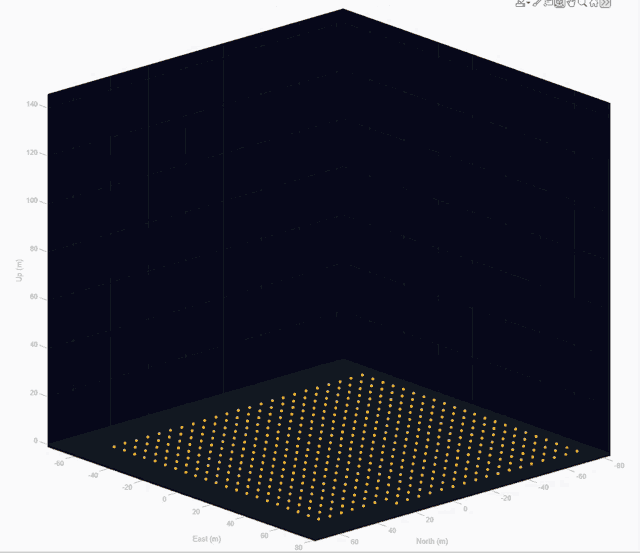
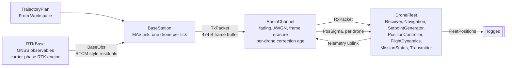

# Multi-UAV Drone Light Show: MAVLink Mission Delivery and RTK-Degraded Formation Flight

<!-- project-download-link:start -->
📦 Download this project [here](https://github.com/mathworks/Research-Office-Projects/releases/download/project-downloads/example-drone-show.zip).
<!-- project-download-link:end -->

A Simulink&reg; model of a coordinated drone light show, simulating the whole pipeline a real show
depends on: trajectory planning, MAVLink command distribution over a modelled radio link,
carrier-phase RTK correction from a base station, inertial navigation, and per-drone position
control for a fleet of up to 500 UAVs.

### Interactive App

```matlab
DroneLightShowApp
```



**500 drones** flying the MATLAB&reg; membrane as a formation loaded from an STL, recorded from the
app's 3-D view on a **Simulate** run: roughly 160 m across, peaking near 130 m, and landed back on
the pad grid by the end. Shown at 1.5&times;.

## Requirements

- **MATLAB&reg; and Simulink&reg; R2026a or later** — that is the release `MultiUAV_DroneShow.slx` is
  saved in, and Simulink cannot open a model saved by a newer release than its own
- A supported C compiler — `DroneFleet/Navigation/INS` and `RadioChannel/AWGNChannel` simulate via
  code generation

| Toolbox | Usage |
|---------|-------|
| Simulink&reg; | Core simulation engine |
| Stateflow&reg; | 3 charts: `ShowSupervisor` (8 states — the show phase machine and the source of `Phase`), `UploadIndexerChart` (6 — MAVLink mission protocol, gap repair, give-up), `RtkGate` (3 — dwell before a fix is trusted) |
| UAV Toolbox&trade; | Multi-Instance Guidance Model, MAVLink Serializer/Deserializer/Blank Message (22 blocks), `minjerkpolytraj` |
| Navigation Toolbox&trade; | `INS` block — dead-reckons the pose and takes the RTK tier as a live accuracy input; `lla2ned` — geodetic reference to local NED |
| Communications Toolbox&trade; | SISO Fading Channel, AWGN Channel |
| DSP System Toolbox&trade; | `Pad` (&times;8) — widens every MAVLink payload to its fixed message length before serialisation; `Cumulative Product` — leading-run scan that picks the first outstanding mission request |
| Image Processing Toolbox&trade; | `imbinarize`, `bwperim`, `bwareaopen`, `bwmorph` — silhouettes from pictures, stroke centrelines from text |
| Computer Vision Toolbox&trade; | `pointCloud`, `pcdownsample` — surface samples from an STL; `insertText` — typed text in a real font |
| Statistics and Machine Learning Toolbox&trade; | `kmeans`, `pdist`, `knnsearch` — fitting N drones to a shape |

The oldest release the *content* supports is **R2025a**, set by two things: the Multi-Instance
Guidance Model block, introduced in R2025a, and the plain-text Live Script format
`DroneShowExample.m` uses, which needs R2025a to render as a Live Script rather than run as an
ordinary script. Nothing else in the example is newer than R2025a. To produce an R2025a-compatible
copy of the model:

```matlab
Simulink.exportToVersion('MultiUAV_DroneShow', 'MultiUAV_DroneShow_R2025a.slx', 'R2025a')
```

## Overview

The point of the example is the **failure modes**. Corrections go stale, frames are erased, a named
drone loses its fix mid-show — and the fleet degrades the way a real one does, bounded rather than
divergent, visibly and measurably.

- **Formations from anything** — Grid, Circle and Sphere; text the fleet spells out in a real
  TrueType font; arbitrary shapes loaded from a picture or an STL file.
- **Sequences built a step at a time** — `Grid→Logo→Circle→Logo→Grid` is five clicks.
- **A real RTK base station** — dual-frequency observables on a bus, a wide-lane → L1 ambiguity
  cascade, and MSM-style code-aligned phase-range residuals packed byte-for-byte into
  `GPS_RTCM_DATA`.
- **Degradation you can trigger live** — take one named drone's corrections away while the show is
  flying and watch it walk RTK Fix → Float → Standalone.
- **Two delivery paths** — over the modelled MAVLink radio, with `MISSION_COUNT`, sequence numbers,
  retries and gap repair; or straight from the workspace when you want to explore quickly.
- **Addressing that outlives its own byte** — MAVLink's `target_system` is 8 bits, so past 255 drones
  the mission protocol addresses a drone by `(target_system, target_component)` pair: the low byte
  counts drones within a bank of `mav_sys_span`, the high byte counts banks.
- **Fleets up to 500** — a Circle or Sphere is sized `N × spacing / 2π`, but stops widening at a
  175 m radius and packs into concentric rings instead. So the awkward fleet size is the one just
  *below* the cap: 200 drones gets the full 159 m ring and the longest transitions in the example,
  while 500 drones fly a compact disc. Bigger is not automatically harder.

## Model Architecture



1. **TrajectoryPlan** — pre-computed minimum-jerk trajectories feed the BaseStation.
2. **RTKBase** — runs a carrier-phase RTK engine and broadcasts its own observables as residuals.
3. **BaseStation** — serialises setpoints and RTK data into MAVLink packets, time-division
   multiplexed one drone per tick. `TxPacket` is 474 bytes wide, but that is a *buffer*, not a
   byte count on the wire: 280 of it is the fixed-width output the MAVLink Serializer emits
   whatever the message — a `MISSION_ITEM_INT` frame is about 50 bytes of that — and the other
   194 is a dedicated RTCM slot carrying zeros except on the one tick in 100 when a correction
   goes out. What the link actually carries is about 5 kB/s, not 47 — see
   [Bandwidth](DOCUMENTATION.md#bandwidth-what-the-link-actually-carries).
4. **RadioChannel** — applies RF impairments, decides frame delivery, and tracks the **age of the
   correction each drone holds**.
5. **DroneFleet** — deserialises commands, runs position control and flight dynamics, and estimates
   state through an INS whose position error is degraded by that correction age.

**The mechanism that makes RTK observable** is age of correction, not packet loss. Frame loss is
re-rolled every `Ts_sim`, so an "outage" lasts one 10 ms tick and moves a drone about 0.05 mm — every
setting of the link would produce exactly 2 cm. A real receiver loses its fix when the correction it
*holds* becomes too old:

| State | Age of correction | Per-axis accuracy |
|-------|-------------------|-------------------|
| RTK Fix | `< rtk_timeout` (2.5 s) | 0.02 m |
| RTK Float | `rtk_timeout` … `rtk_float_timeout` (10 s) | 0.3 m |
| Standalone | `> rtk_float_timeout` | 1.5 m |

The error **stops** at 1.5 m rather than diverging, because losing corrections does not remove the
satellites. Full reasoning in
[Age of Correction](DOCUMENTATION.md#age-of-correction--the-timing-that-makes-it-work).

### Key Parameters

Set in `setupParams.m`; every one is guarded with `~exist`, so a caller can override any of them
before calling it.

| Parameter | Default | Description |
|-----------|---------|-------------|
| `N_uav` | 10 | Fleet size (the app allows 4–500; `setupParams` imposes no bound) |
| `Ts_sim` | 0.01 s | Simulation time step |
| `Ts_gps` | 0.1 s | GPS update rate |
| `d_min` | 2.0 m | Minimum inter-drone separation |
| `formation_spacing` | 5 m | Distance between drones in a formation |
| `show_altitude` | −10 m (NED) | Altitude of the **lowest drone**, i.e. 10 m AGL — a floor, not a centre. Flat formations sit on it; a Sphere or a text billboard rests its bottom on it and builds upward, so a tall shape at a large fleet is tall. |
| `transition_duration` | 15 s | Time per formation change (the app opens on **8 s**) |
| `v_track_max` / `v_track_target` | 8.0 / 7.0 m/s | Speed the plan is warned above, and the speed a lengthened transition is sized to hit |
| `a_track_max` / `a_track_target` | 2.5 / 2.0 m/s² | The same pair for lateral acceleration, against the 3.0 m/s² `a_max` the controller clamps at. Usually the binding constraint, because acceleration scales as 1/T² where speed scales as 1/T |
| `hold_duration` | 10 s | Time holding each formation (the app opens on **5 s**) |
| `climb_speed` / `land_speed` | 1.5 / 1.5 m/s | Mean rate along the path for the takeoff and the landing, which is what sizes each. Equal on purpose: the show rises exactly as sedately as it descends. The climb had no rate at all before, only a 5 s floor and the flyability ceiling, so it went up 1.33× faster than it came down on the default show and 2.13× on a text billboard |
| `mav_sys_span` | 250 | Drones per MAVLink system-ID bank. `target_system` is 8 bits, so fleets above it are addressed as `(target_system, target_component)` pairs — drones 1–250 are bank 1, 251–500 bank 2 |
| `rtcm_interval` | 1.0 s | RTCM correction broadcast period |
| `rtk_timeout` | 2.5 s | Correction age at which RTK Fix drops to Float. Above the 1.990 s that one lost broadcast produces, so a single miss is ridden out and it takes two consecutive ones to drop the fix — the same tolerance real receivers have. At 1.5 s a single 1 % roll took the whole fleet to Float twice per run, mid-climb as often as not |
| `rtk_float_timeout` | 10.0 s | Correction age at which Float drops to Standalone |
| `reconverge_time` | 5.0 s | How long the injected sigma takes to decay after a recovery |
| `rtk_deny_mask` | `false(N,1)` | Per drone: corrections never usable (live-tunable) |
| `uav_loss_rate` | 0 | Per-drone independent correction erasure probability |
| `packet_loss_rate` | 0.01 | Fleet-wide frame erasure rate, re-rolled every `Ts_sim` |
| `ref_lla` | `[42.3601, −71.0589, 0]` | Reference location (Boston, MA) |

**There are two default timings, not one.** `setupParams` opens on 15 s transitions and 10 s holds;
the app's fields open on 8 s and 5 s and assign over them. Both are legal, but a plan quantity
measured by running `setupParams` bare is measured on the *slower* show — the same sequence at 8 s
transitions demands roughly 1.65× the speed. Any figure quoted from a script should say which timing
produced it.

## Results

Measured on the Live Script's defaults: 20 drones, `Grid → Circle → Sphere → Circle → Grid`, 5 m
spacing, 10 m altitude, 10 s holds, 15 s transitions, delivery over the radio.

| Quantity | Value | Against |
|---|---|---|
| Minimum separation, planned | 3.80 m | 2.00 m `d_min` |
| Minimum separation, flown | 3.76 m | 2.00 m `d_min` |
| Assignment bound | 3.52 m | tightest static formation 4.98 m / √2 |
| Peak commanded speed | 4.80 m/s | 8.00 m/s trackable |
| Peak commanded lateral acceleration | 0.45 m/s² | 2.50 m/s² trackable, 3.00 m/s² clamp |
| Worst tracking error | 0.61 m | worst drone, whole show |
| Mean tracking error | 0.067 m | all drones, whole show |
| Upload occupies the radio for | 21.8 s | 1800 packets at 50 B/tick |
| Show including landing | 123.7 s | 8.7 s of landing inside it |

Changing one control at a time from that reference:

| Arm | Worst error | Mean error | Flown separation |
|---|---|---|---|
| Reference (over the radio) | 0.61 m | 0.067 m | 3.76 m |
| Straight from the workspace | 0.37 m | 0.062 m | 3.72 m |
| Text `[4 1 4]` spelling "MATLAB" | 1.49 m | 0.184 m | 2.65 m |
| 6 s transitions (planner objected) | 5.66 m | 0.196 m | **0.81 m** |

The last row is the example working as intended: the planner *warned* that 6 s transitions demand
11.7 m/s against 8.0 m/s trackable — and 2.82 m/s² against 2.50 — and the consequence is not
instability but a violated safety constraint — 0.81 m of flown separation against a 2.00 m
requirement. **The planner checks both limits, and acceleration is usually the one that binds.**
Speed scales as 1/T against the transition time where acceleration scales as 1/T², so a plan can
sit comfortably inside the speed limit and still ask for more lateral acceleration than the
position controller is allowed to command: 36 drones over `Grid → Circle → Grid` at 8 s transitions
demands 6.97 m/s of an 8.00 m/s limit while demanding 2.98 m/s² of a 3.00 m/s² clamp. Checking
speed alone reported that plan as ready to fly, and four drones left the show — the worst ending
174 m from its commanded position. Sized against acceleration the same show needs 9.8 s
transitions, and then it tracks to 1.54 m with 2.98 m of flown separation. Under a 25 % frame loss the
degraded per-axis error comes out at **0.2832 m against 0.2831 m predicted** from the tier and the
INS floor in quadrature. Full tables and discussion in
[Results in Detail](DOCUMENTATION.md#results-in-detail).

## Key Takeaways

1. **Age of correction is the mechanism, not packet loss** — frame erasure is re-rolled every 10 ms,
   so an outage lasts one tick and moves a drone 0.05 mm; what actually costs a drone its fix is the
   correction it *holds* going stale past 2.5 s, then 10 s.
2. **Degradation is bounded and predictable** — the tiers stop at 1.5 m per axis rather than
   diverging, and under 25 % frame loss the measured error lands at 0.2832 m against 0.2831 m
   predicted from the tier and the INS floor in quadrature.
3. **Acceleration binds before speed does** — it scales as 1/T² where speed scales as 1/T, so a plan
   can sit inside an 8.00 m/s limit at 6.97 m/s while asking 2.98 m/s² of a 3.00 m/s² clamp.
   Checking speed alone passed exactly that plan, and four drones left the show.
4. **Saturation is survivable only in bursts** — brief clamping is absorbed, but past roughly 1.5 s
   unbroken the loop has been open too long to re-acquire: 0.00 s of saturation → 0.86 m final
   error, 1.36 s → 5.24 m, 6.38 s → 127.66 m.
5. **Bigger fleets are not automatically harder** — formation radius caps at 175 m, so 200 drones
   fly the full 159 m ring and the longest transitions while 500 pack into a compact disc.
6. **A live run is renderer-bound at scale** — 120 drones as meshes cost ~0.3 s a frame, so fly it
   once and use **Play**, which replays the model's own `Ts_sim` log at 20 Hz whatever the live view
   managed.

## Running the Example

### Option 1 — the interactive app (recommended)

```matlab
DroneLightShowApp
```

Configure the fleet and build a sequence, then press **Generate**. It is the first row of the **Run
the show** panel, which is numbered because the order is real: **1 Plan** → **2 Deliver** → **3
Fly**. What you press at step 3 depends on step 2 — the **Deliver** dropdown decides how the
waypoints reach the drones, and enables exactly one of two buttons:

| Delivery | Button | What happens |
|---|---|---|
| **MAVLink upload (full fidelity)** — the default | **Upload & Fly** | Streams the mission over the modelled radio, checks every waypoint landed onboard, then flies it from the onboard buffer — all in **one** run, because the buffer is a data store and does not survive across runs. The 3-D view shows the pose the ground station *received* — or the true pose, if you ask for it. |
| **Workspace (quick)** | **Simulate** | Feeds the controller directly, skips the pre-flight entirely, and shows the *true* position. For iterating on a show quickly. |

The two buttons sit **side by side** on the Fly row with exactly one of them live, and the grey line
at the bottom of the panel says which and why. So if a button looks dead, look one row up at
Deliver. **Stop** and **Abort & Land** are below the rule in the same panel, because neither is part
of the sequence: Stop halts whatever is moving, Abort & Land brings the fleet down *without* ending
the run, and both stay live during an upload.

**Play** is its own **Playback** panel, with a scrub bar beside it and **Playback speed** below.
Play reads **Pause** while it runs, and the bar is both a position readout and a way to move: drag it
and the fleet follows the thumb, frame by frame, with the show time and the length of the show read
out to its right. Dragging during playback pauses it for the drag and carries on from where you let
go. All three controls only ever redraw data that already exists — the planned trajectory, or the
logged output of a finished run — and recompute nothing. 1.0x is real time to within 0.1 %
([measured](DOCUMENTATION.md#pacing-playback)).

**A live run takes as long as the show does.** It is paced to real time deliberately — a light show
is a thing you watch at 1× — so expect the default sequence to occupy about two and a half minutes,
and expect the 3-D view to be steppy while it streams — about 8 fps on a small fleet, and about 3 fps
at 120 drones. Which of those you get depends on what is actually limiting the loop. Simulink pacing
makes the solver wait between steps rather than after them, so the chunk it returns control in shrinks
to ~60 ms of show and a frame fits in each: [measured](DOCUMENTATION.md#pacing-playback), that is
10.1 fps against 4.4 fps for the same 1×. But it can only shorten the *solver's* share of the cycle.
Once the fleet is large enough that drawing it dominates — 120 drones as meshes costs ~0.3 s a frame —
the frame rate is set by the renderer and pacing has nothing left to give. Fly it once, then use
**Play** for a smooth watch: replay runs off the model's own `Ts_sim` log rather than off the frames
that were drawn live, so it animates at 20 Hz whatever the live view managed. The one exception is
**Pose shown = As received**, which can only replay what the ground station actually heard — nothing
records that table but the viewer itself, so that replay stays at the live frame rate. If you would
rather not sit through the run at all, that is **Sim Mode → Rapid Accelerator**, which is four times
quicker and says outright that it costs you the live view.

On the MAVLink path, **Pose shown** picks which pose the 3-D view draws. *As received* is the ground
station's telemetry table, on which the fleet takes turns one drone per time step, each drone
self-reporting in a recurring slot — so the whole fleet refreshes
every `N_uav × Ts_sim`, from 0.2 s at 20 drones to 5 s at 500, and a large fleet visibly updates in
a wave: measured at 120 drones on the live view, only **26 %** of the fleet's drawn position changes
from one frame to the next. That refresh period is the modelled radio, not a viewer artefact, and it
is what a real operator sees. The *percentage* is that schedule read at a frame rate — it is
`Δt / (N_uav × Ts_sim)`, so drawing more often does not fill the table any faster and each frame just
carries a thinner slice of fresh data. *True airframe pose* taps the flight dynamics instead: every
drone, every frame. Judge the link with one and the flight with the other — neither changes what flies. Full
measurements in [Which pose the viewer draws](DOCUMENTATION.md#which-pose-the-viewer-draws).

Under it, two checkboxes that are the same question asked both ways. **Show trails** is where each
drone *has been* — a streak per drone, one view update each per frame, so the cost follows the fleet:
+17% per frame at ten drones, +81% at sixty. **Show trajectory** is
where the fleet is *going*: the planned path of every drone for the phase on screen, which is the
transition being flown or, while the fleet holds a formation, the one it is about to fly. It follows
the show by itself — grid, then grid → circle, then circle → the next shape, then the descent — and it
is always the **plan**, never the log, so it is drawn during a live run too and the gap between a drone
and its line is the tracking error. It costs less than trails: one line object for the whole fleet,
rebuilt when the phase changes rather than every frame.

Everything the example can do is reachable from the panels — see the
[app reference](DOCUMENTATION.md#app-reference).

### Option 2 — the Live Script

```matlab
DroneShowExample
```

Nine sections with live controls at the top: choose the show, plan it, read what the planner
decided, look at the formations and at what goes over the radio, fly it, read the phase trace,
measure the flight against the plan, and replay it in 3-D.

### Option 3 — by hand

```matlab
setupParams          % all parameters, and computes the trajectories
open_system('MultiUAV_DroneShow')
sim('MultiUAV_DroneShow', 'StopTime', num2str(total_sim_duration))
```

`total_sim_duration`, not `show_duration` — the latter is show-relative, so stopping there ends the
run while the fleet is still descending.

## Known Limitations

- **Rotating holds at large fleets** — with `formation_rotate` on at 20 drones, one drone leaves
  formation during the final rotating hold and ends 141 m from its pad. The excursion is real, not
  an interpolation artefact, and is reproduced by both delivery paths. Measured at 1.75 m/s², well
  inside the clamp, so it is *not* the acceleration-saturation failure described below — it is
  still open.
- **`traj_min_transition` is advisory on the scripted route** — `planShow` warns and then plans what
  was asked for. The auto-fit that lengthens transitions belongs to the app.
- **Sustained acceleration saturation is unrecoverable, and only duration decides it** — the
  planner now sizes transitions against lateral acceleration as well as speed, because the two
  scale differently with the time allowed (1/T² against 1/T) and the acceleration limit is usually
  the one that binds. What the check cannot do is make saturation safe when it happens. Brief
  saturation is absorbed; past roughly 1.5 s unbroken the loop has been open too long to
  re-acquire. Measured on one run at 36 drones — same plan, same fleet — longest unbroken
  saturation against final error: 0.00 s → 0.86 m, 1.36 s → 5.24 m, 3.05 s → 5.62 m,
  6.38 s → 127.66 m. Duty cycle correlates 0.906 with flown error. During the divergence the
  drone runs at 100 % of its authority with only 28 % of it pointing at the setpoint, so it wheels
  around its commanded position instead of closing on it. Raising `a_max` would need a model
  change and would strain the small-angle roll/pitch approximation it feeds.
- **The fading channel does not govern packet delivery today** — at the configured `BaseSNR` and
  `KFactor` the SNR threshold is never reached, so `packet_loss_rate` is the knob with authority.
- **The drone side of RTK is deliberately abstracted** — the base station is full-fidelity; the
  fleet consumes correction *arrival* plus a downstream per-drone tier injection, not a per-drone
  carrier-phase solve.

Each is written up, with what was measured and what is still open, in
[Known Limitations](DOCUMENTATION.md#known-limitations).

## File Structure

```
drone-show/
├── README.md                           — This file
├── DOCUMENTATION.md                    — Design notes: subsystems, failure models, measurements
├── MultiUAV_DroneShow.slx              — Simulink model (primary deliverable)
├── DroneLightShowApp.m                 — Interactive app (run with: DroneLightShowApp)
├── DroneShowExample.m                  — Live Script, plain-text format (run: DroneShowExample)
├── setupParams.m                       — Constants, override guards, mode/timing tail
├── planShow.m                          — Geometry → trajectory (pure)
├── packShowUpload.m                    — Plan → MAVLink keyframes (pure)
├── formationFromMedia.m                — Picture/STL → candidate point cloud
├── formationFromText.m                 — Typed text → candidate point cloud (stroke centrelines)
├── formationHoldSamples.m              — Rotating hold → swept-angle keyframes
├── sampleFormationCloud.m              — Cloud → exactly N drone slots
├── createFleetBusObjects.m             — Bus objects for fleet telemetry
├── gnssObservableBus.m                 — GNSSObservables bus object
├── obsBusFromArrays.m                  — Workspace arrays → GNSSObservables (Measured variant)
└── images/                             — README figures
```

**Load Image / STL…** ships without sample assets — point it at any picture or STL of your own
(`formationFromMedia` takes the same path), or use **Fly Text** and the built-in shapes, which need
no files at all.

## Further Reading

[DOCUMENTATION.md](DOCUMENTATION.md) covers the design in full: what each subsystem does and why,
the RTK base station and the correction-age mechanism, trajectory planning and fleet scaling, the
formation sources, the complete result tables, the known limitations, and the design decisions
behind the abstractions.
