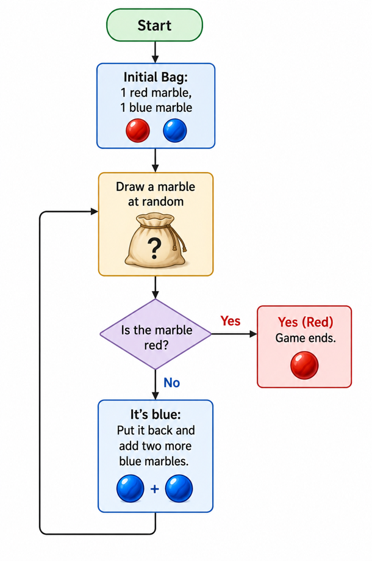

# Finding Pi with Marbles

Estimate &pi; using a simple marble bag game — a new physical random process discovered using [Claude Code](https://docs.anthropic.com/en/docs/claude-code) connected to MATLAB&reg; via the [MATLAB MCP server](https://www.mathworks.com/products/matlab-agentic-toolkit.html).

## The Game

Start with 1 red marble and 1 blue marble in a bag.



Each round, draw a marble at random:
- If **red**: the game ends. Record the stopping round &tau;.
- If **blue**: put it back, add two more blue marbles, and draw again.

Compute the score: **&tau; / (2&tau; - 1)**. Repeat many times and multiply the average by 4 — this converges to &pi;.

| Round | Bag Contents | P(red) |
|-------|-------------|--------|
| 1 | 1 red + 1 blue | 1/2 |
| 2 | 1 red + 3 blue | 1/4 |
| 3 | 1 red + 5 blue | 1/6 |
| k | 1 red + (2k-1) blue | 1/(2k) |

### Classroom Variant

The game has infinite expected length (though most games end within a few rounds). For physical play, cap at 5 rounds: if red hasn't appeared, record a replacement score of **0.5162**. The estimator remains unbiased.

## Why It Works

The stopping rule P(red) = 1/(2k) produces a PMF involving central binomial coefficients that connect to the arcsin series — one of the classical representations of &pi;. The Symbolic Math Toolbox&trade; proves it in one line:

```matlab
syms k
pmf = nchoosek(sym(2*k-2), k-1) / (k * 2^(2*k-1));
score = k / (2*k - 1);
symsum(score * pmf, k, 1, inf)   % returns pi/4
```

## Running the Example

1. Open MATLAB and navigate to this folder
2. Open `blog_post_with_code.m` in the MATLAB Editor (renders as a Live Script)
3. Run all sections

The Live Script walks through the full derivation: Monte Carlo simulation, symbolic proof, convergence analysis, and the practical truncated variant.

## Requirements

- MATLAB&reg; R2024b or later
- Symbolic Math Toolbox&trade;
