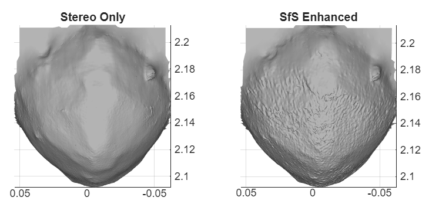

# Enhance Stereo Depth Maps with Shape from Shading

This example adds high-frequency surface detail to stereo depth maps of asteroid Bennu using Shape from Shading (SfS). A screened Poisson solver corrects depth gradients to match observed shading, revealing craters and ridges that stereo alone cannot resolve.

## Requirements

- MATLAB&reg; R2024b or later
- Computer Vision Toolbox™

## Getting Started

Open and run `EnhanceStereoDepthWithShapeFromShading.mlx`. The precomputed stereo data (`bennuSfSData.mat`) is included — no additional downloads needed.

## References

1. Horn, B.K.P. "Shape from Shading: A Method for Obtaining the Shape of a Smooth Opaque Object from One View." MIT AI Memo 232, 1970.
2. Frankot, R.T. and Chellappa, R. "A Method for Enforcing Integrability in Shape from Shading Algorithms." IEEE TPAMI, 1988.
3. Nehab, D., Rusinkiewicz, S., Davis, J., and Ramamoorthi, R. "Efficiently Combining Positions and Normals for Precise 3D Geometry." ACM SIGGRAPH, 2005.
