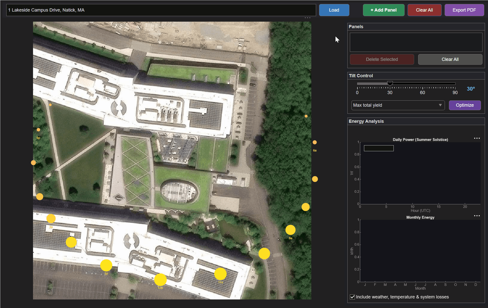

# Solar Panel Planner for MATLAB&reg;



An interactive application for planning rooftop solar panel installations using satellite imagery, sun-position modeling, and energy yield estimation in MATLAB&reg;.

## Overview

This app lets you enter any street address, view the rooftop on a satellite map, draw solar panel rectangles interactively, and estimate annual energy production. It models:

- **Sun position** throughout the year (altitude and azimuth for any latitude/longitude)
- **Clear-sky irradiance** with air mass and atmospheric effects
- **Temperature derating** using NOCT (Nominal Operating Cell Temperature) model
- **Clearness index** from NASA POWER monthly averages
- **Panel tilt optimization** for maximum annual yield
- **PDF report export** with site summary and energy analysis

## Quick Start

```matlab
% Launch the interactive app
SolarPanelApp()
```

1. Enter an address and click **Load** to fetch satellite imagery
2. Click **+ Add Panel** to draw panel rectangles on the roof
3. Adjust tilt with the slider or click **Optimize** for maximum yield
4. View daily power curves and monthly energy bar charts in real time

## Scripts

| Script | Description |
|--------|-------------|
| `examples/AddressSolarAnalysis.m` | Enter any address and get a full year solar analysis |
| `examples/SolarPanelDemo.m` | Demonstrates core functions: sun position, irradiance, panel power |
| `examples/SolarPotentialMap.m` | Visualizes solar potential across the United States |

## Helper Functions

| Function | Description |
|----------|-------------|
| `helpers/sunPosition` | Solar altitude and azimuth for any location and time |
| `helpers/solarPanelPower` | Instantaneous panel power output (W) given conditions |
| `helpers/clearnessIndex` | Monthly clearness index from latitude/longitude |
| `helpers/ambientTemperature` | Hourly ambient temperature from sinusoidal model |
| `helpers/geocodeAddress` | Convert street address to lat/lon via OpenStreetMap Nominatim |

## Requirements

- MATLAB&reg; R2023a or later
- Mapping Toolbox&trade; (satellite basemap imagery)
- MATLAB Report Generator&trade; (optional, for PDF export)
- Internet connection (required for basemap tiles and address geocoding via OpenStreetMap Nominatim)
