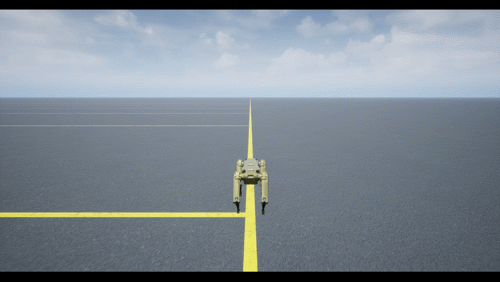
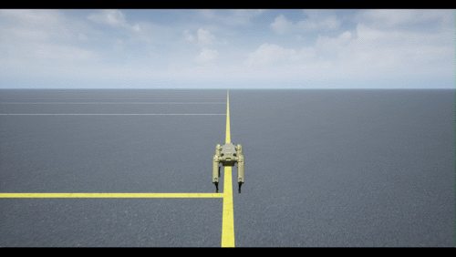
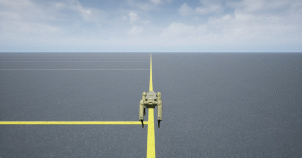
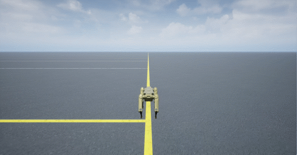

# Spot Quadruped — Keyboard-Controlled Walking with 3D Visualization

Interactive simulation of a Boston Dynamics Spot-inspired quadruped robot with real-time keyboard control and Unreal Engine&reg; 3D visualization. Built entirely in Simulink&reg; using Model-Based Design.

| | |
|:---:|:---:|
|  |  |
| Forward | Forward-Left |
|  |  |
| Backward | Sidestep |

## Setup

### 1. Required Toolboxes

| Toolbox | Used For |
|---------|----------|
| Simulink&reg; | Model simulation engine |
| Simscape&trade; | Physical network solver |
| Simscape&trade; Multibody&trade; | Rigid body dynamics, URDF import |
| Stateflow&reg; | Gait planner state machine |
| Robotics System Toolbox&trade; | `rigidBodyTree`, `importrobot`, Simulation 3D Robot block |
| Simulink&reg; 3D Animation&trade; | Simulation 3D Scene Configuration, Unreal Engine rendering |

### 2. Robot Mesh Files (Required Dependency)

This project requires the `spot_description` folder containing 3D mesh files (`.dae`, `.stl`) and a texture for Unreal Engine rendering. These files are maintained by **Clearpath Robotics** under a BSD 3-Clause license and are not included in this distribution.

**Option A — Download from GitHub (recommended):**

1. Go to: https://github.com/clearpathrobotics/spot_ros
2. Download or clone the repository
3. Copy the `spot_description/` folder into this project folder (next to `spot.urdf`)

**Option B — Sparse clone (terminal one-liner):**

Run this from the project root folder:

```bash
git clone --depth 1 --filter=blob:none --sparse https://github.com/clearpathrobotics/spot_ros.git _tmp_spot_ros && cd _tmp_spot_ros && git sparse-checkout set spot_description && cd .. && mv _tmp_spot_ros/spot_description . && rm -rf _tmp_spot_ros
```


### 3. Verify Setup

After setup, your folder should look like this:

```
spot-sim3D/
├── spot_physics.slx          ← Main Simulink model
├── setupParams.m             ← Parameter definitions
├── runSpotKeyboard.m         ← Launch script
├── readKeyboard.m            ← Keyboard input function
├── startKeyboard.m           ← Keyboard control figure
├── robotWith6DoFFloatingBase.m  ← Utility (for regeneration)
├── spotRobot3D.mat           ← Pre-built rigidBodyTree
├── spot.urdf                 ← Robot URDF description
├── spot_description/         ← ✓ Downloaded mesh files
│   ├── meshes/
│   │   ├── body.dae
│   │   ├── front_left_hip.dae
│   │   ├── ...
│   │   └── spot_mat.png
│   └── urdf/
└── README.md
```

## How to Run

1. Open MATLAB (R2024b or later) and navigate to this folder
2. Run `runSpotKeyboard`
3. Keep the "Quadruped Keyboard Control" figure window focused
4. Use arrow keys to walk/turn, A/D for sidestep

```matlab
cd('path/to/spot-sim3D')
runSpotKeyboard
```

The script opens the model, loads parameters, starts the keyboard window, and runs the simulation for 30 seconds. The Unreal Engine window opens automatically.

## Keyboard Controls

| Key | Action |
|-----|--------|
| Up arrow | Walk forward |
| Down arrow | Walk backward |
| Left arrow | Turn left |
| Right arrow | Turn right |
| A | Sidestep left |
| D | Sidestep right |
| Up + Left/Right | Steer while walking |

## Project Description

This project simulates a 12-DOF quadruped robot walking with a trotting gait. The entire system — plant dynamics, gait planning, inverse kinematics, joint control, and 3D visualization — lives in one Simulink model.

### Architecture

```
Keyboard Input
      │
      ▼
┌────────────┐      ┌───────────┐      ┌───────────────┐
│ Controller │──τ──▶│   Plant   │──q──▶│  Sim3D Robot  │
│            │◀──q──│ (Simscape)│      │(Unreal Engine)│
└────────────┘      └───────────┘      └───────────────┘
```

**Controller** — Gait planner (Stateflow) → Analytical IK → Gravity compensation → PD joint control

**Plant** — Simscape Multibody: floating base (6 DOF) + 4 legs × 3 joints (12 DOF) + ground contact

**Visualization** — Simulation 3D Robot block renders 18-DOF configuration at 25 FPS

## Regenerating spotRobot3D.mat

The `spotRobot3D.mat` file is pre-built and included. It only needs regeneration if you modify the URDF or meshes:

```matlab
spotRobot3D = robotWith6DoFFloatingBase('row');
spotFixed = importrobot('spot.urdf');
spotFixed.DataFormat = 'row';
addSubtree(spotRobot3D, 'baseZRevBody', spotFixed, ReplaceBase=false);

spotColor3D = [0.635 0.502 0.176];
meshDir3D = fullfile(pwd, 'spot_description', 'meshes');
for iBody = 1:numel(spotRobot3D.Bodies)
    b3d = spotRobot3D.Bodies{iBody};
    if ~isempty(b3d.Visuals)
        vd = getVisual(b3d);
        clearVisual(b3d);
        meshFile3D = fullfile(meshDir3D, [b3d.Name '.dae']);
        if isfile(meshFile3D)
            addVisual(b3d, "Mesh", meshFile3D, vd(1).Tform, FaceColor=spotColor3D);
        end
    end
end
save('spotRobot3D.mat', 'spotRobot3D');
```

## Acknowledgments

Robot mesh files are provided by [Clearpath Robotics](https://github.com/clearpathrobotics/spot_ros) under the BSD 3-Clause License.
