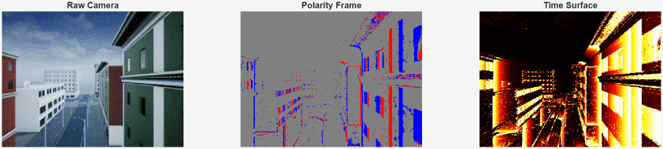

# Event Camera Simulator for MATLAB&reg; and Simulink&reg;

An event camera simulator for MATLAB&reg; and Simulink&reg;, implementing the event generation algorithm from [ESIM](https://rpg.ifi.uzh.ch/docs/CORL18_Rebecq.pdf) (Rebecq et al., 2018). Converts intensity frame sequences into asynchronous events by detecting threshold crossings in log-intensity space with linear timestamp interpolation, producing output in the standard `[x, y, timestamp, polarity]` format.



## Features

- **EventCamera** — Core Dynamic Vision Sensor (DVS) simulator with configurable ON/OFF thresholds, refractory period, intensity-dependent bandwidth, readout latency, and threshold mismatch (fixed-pattern noise)
- **EventNoiseModel** — Temporal stochastic noise injection: background activity, hot pixels, timestamp jitter, and leak-rate drift
- **EventVisualizer** — Real-time 3-panel display: raw camera, polarity frame (blue ON / red OFF), and exponential-decay time surface
- **Simulink blocks** — Masked library blocks for all three components, ready to drop into any model

The simulator separates pixel physics into two stages. **EventCamera** models properties intrinsic to the pixel that determine which events fire — including manufacturing variation like threshold mismatch, which is randomly initialized but fixed for the sensor's lifetime. **EventNoiseModel** models temporally stochastic processes that add, remove, or perturb events independently at each timestep. This separation lets you branch the clean event stream for algorithm testing while independently evaluating noise robustness.

## Requirements

- MATLAB R2023a or later
- [Simulink](https://www.mathworks.com/products/simulink.html) (optional, only for block library and Sim 3D example)
- [Simulink&reg; 3D Animation&trade;](https://www.mathworks.com/products/3d-animation.html) (optional, only for UAV flyover example)

## Installation

Clone or download this repository, then add the `eventcamera` folder to your MATLAB path:

```matlab
addpath('path/to/eventcamera')
```

For Simulink blocks (appears in Library Browser as "Event Camera"):

```matlab
addpath('path/to/eventcamera/simulink')
```

## Quick Start

### MATLAB

```matlab
cam = EventCamera('ContrastThresholdOn', 0.2, 'ContrastThresholdOff', 0.2);

% First frame initializes the reference (returns empty)
events = cam(frame1, t1);

% Subsequent frames produce events
events = cam(frame2, t2);
% events is Nx4: [x, y, timestamp, polarity]
%   polarity: +1 (ON) = brightness increase, -1 (OFF) = brightness decrease
```

### Simulink

1. Add `eventcamera/` and `eventcamera/simulink/` to your MATLAB path
2. Open the Simulink Library Browser and find the **Event Camera** library
3. Drag the **Event Camera** block into your model
4. Connect a grayscale/RGB image to the `Frame` input and a timestamp to the `Timestamp` input
5. The `Events` output is an Nx4 variable-size signal

## Project Structure

```
eventcamera/                     Distributable package
  EventCamera.m                  Core DVS simulator (matlab.System)
  EventNoiseModel.m              Noise model (matlab.System)
  EventVisualizer.m              Real-time visualization (matlab.System)
  eventCameraSummary.m           Post-simulation summary figure
  simulink/                      Optional Simulink support
    eventcameralib.slx           Block library
    slblocks.m                   Library Browser registration
examples/
  eventCameraDemo.m              Standalone MATLAB demo (moving bar)
  eventCameraUAVDemo.slx         Simulink Sim 3D UAV city flyover
tests/
  tEventCamera.m                 Unit tests
```

## Block Parameters

### Event Camera

| Parameter | Default | Description |
|-----------|---------|-------------|
| ON threshold (C+) | 0.2 | Log-intensity increase that triggers an ON event |
| OFF threshold (C-) | 0.2 | Log-intensity decrease that triggers an OFF event |
| Max events per frame | 500000 | Upper bound on events per frame |
| Refractory period (s) | 0 | Per-pixel dead time after firing (0 = disabled) |
| Pixel bandwidth (Hz) | Inf | Intensity-dependent low-pass cutoff on log-intensity (Inf = disabled) |
| Latency (s) | 100e-6 | Fixed pixel readout delay added to event timestamps (0 = disabled) |
| Threshold mismatch (std dev) | 0 | Per-pixel threshold variation (0 = disabled) |

### Event Noise Model

| Parameter | Default | Description |
|-----------|---------|-------------|
| Background noise (events/s) | 0 | Random spurious events across sensor |
| Timestamp jitter std dev (s) | 0 | Gaussian noise on event timestamps |
| Number of hot pixels | 0 | Fixed pixels that fire constantly |
| Hot pixel rate (events/s/pixel) | 1000 | Firing rate of each hot pixel |
| Leak rate (events/s/pixel) | 0 | Reference drift causing events in static regions |

## Examples

### Moving Bar Demo (MATLAB only)

```matlab
addpath('eventcamera'); addpath('examples');
eventCameraDemo
```

### UAV City Flyover (Simulink + Sim 3D)

Demonstrates the full noise pipeline: a Sim 3D camera feeds through a shot noise model (Poisson-sampled photon counts) into the Event Camera, then branches into a clean path and a noisy path (with background activity, hot pixels, and timestamp jitter) for side-by-side comparison.

```matlab
addpath('eventcamera'); addpath('eventcamera/simulink'); addpath('examples');
simOut = sim('eventCameraUAVDemo');
```

## Running Tests

```matlab
addpath('eventcamera');
results = runtests('tests/tEventCamera.m');
```

## How It Works

The simulator implements the ESIM linear-interpolation approach:

1. Each incoming frame is converted to log-intensity space
2. An intensity-dependent low-pass filter models photoreceptor bandwidth (bright pixels respond faster, dark pixels lag)
3. Per-pixel difference from a stored reference level is computed
4. When the difference exceeds the contrast threshold, events fire
5. Event timestamps are linearly interpolated between the previous and current frame
6. A fixed latency is added to model the comparator-to-readout pipeline delay
7. The reference level is updated in a staircase pattern (incremented by `numEvents * threshold`)

This produces realistic asynchronous event streams where ON events appear at brightening edges and OFF events at darkening edges.

## License

This project is licensed under the BSD 3-Clause License — see [license.txt](license.txt) for details.

Copyright (c) 2026, The MathWorks, Inc.
