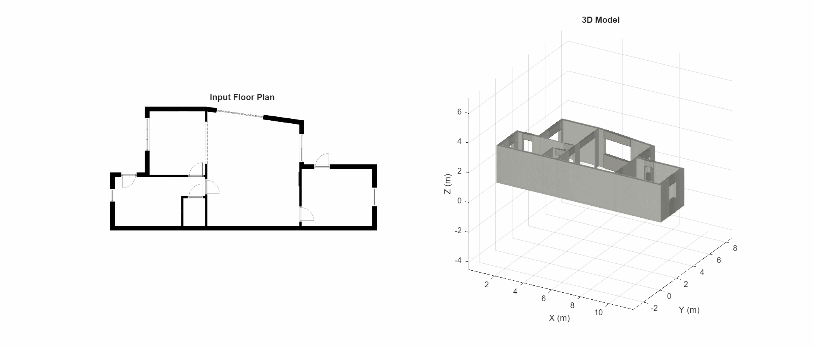

# Floor Plan to 3D Model

Convert architectural floor plan images into 3D wall geometry with automatic door, window, and passage detection.



## How it works

The pipeline takes a monochrome floor plan image and produces a 3D extruded model with openings cut into the walls:

1. **Binarize** the image to isolate wall pixels, then clean with morphological operations
2. **Estimate scale** from wall thickness using the skeleton distance transform
3. **Trace and simplify** wall boundaries into clean polygons (Douglas-Peucker + collinear merging + axis snapping)
4. **Label wall-end edges** by finding short polygon edges where both vertices are convex corners
5. **Pair wall-ends** by casting perpendicular rays to find matching parallel edges across gaps
6. **Classify openings** as doors (arc symbols nearby), windows (hatching or exterior), or passages (wide interior gaps)
7. **Render in 3D** with lintels over doors/passages and lintels + sills framing windows

## Requirements

- MATLAB R2023b or newer
- Image Processing Toolbox
- (Optional) Simulink 3D Animation toolbox for Sim3D export

## Quick start

```matlab
% Extract geometry from a floor plan image
geometry = extractFloorPlanGeometry("test_floorplan.png");

% View the 3D result in a MATLAB figure
visualizeFloorPlan3D(geometry);
```

Or run the live script `FloorPlanTo3D.m` for a step-by-step walkthrough with plots at each stage.

## Sim3D export

If you have the Simulink 3D Animation toolbox, you can push the extracted geometry into a Sim3D world as box primitives:

```matlab
geometry = extractFloorPlanGeometry("test_floorplan.png");
world = buildSim3DScene(geometry);

% The scene is now running in the Sim3D viewer.
% When done:
delete(world);
```

Each polygon edge becomes a wall panel, and openings get lintel/sill boxes. You can customize appearance:

```matlab
world = buildSim3DScene(geometry, ...
    WallColor=[0.9 0.9 0.88], ...
    LintelColor=[0.7 0.7 0.68], ...
    FloorColor=[0.95 0.93 0.88]);
```

## Input format

Designed for ISO 128-compliant monochrome architectural floor plans:

- Walls drawn as solid black regions on a white background
- Doors indicated by quarter-circle arc symbols (swing direction)
- Windows indicated by hatching or parallel line patterns
- Consistent wall thickness at a given scale

## Options

```matlab
geometry = extractFloorPlanGeometry("plan.png", ...
    "ExteriorWallThickness", 0.20, ...  % meters (used for scale calibration)
    "WallHeight", 2.5, ...              % meters
    "DoorHeight", 2.1, ...              % meters
    "WindowBottom", 0.9, ...            % meters (sill height)
    "WindowTop", 2.0, ...              % meters (lintel height)
    "ShowPlots", true);                 % render 3D on completion
```

## Files

| File | Description |
|------|-------------|
| `extractFloorPlanGeometry.m` | Main extraction pipeline. Returns a struct with wall polygons, openings, and scale. |
| `visualizeFloorPlan3D.m` | 3D renderer. Extrudes walls and adds lintel/sill geometry for openings. |
| `buildSim3DScene.m` | Exports geometry to a Sim3D world as box primitives. Requires Simulink 3D Animation. |
| `FloorPlanTo3D.m` | Live script tutorial walking through each pipeline step. |
| `test_floorplan.png` | Sample floor plan image. |

## Output struct

`extractFloorPlanGeometry` returns a struct with:

- `Regions` - cell array of Nx2 polygon vertex arrays (pixel coords)
- `Openings` - struct array with fields: `p1`, `p2`, `width`, `type`, `midpoint`, `thickness`, `corners`
- `Scale` - meters per pixel
- `WallHeight`, `DoorHeight`, `WindowBottom`, `WindowTop` - vertical dimensions in meters
- `FloorDimensions` - [width, height] in meters
- `ImageSize` - [rows, cols] of the input image
