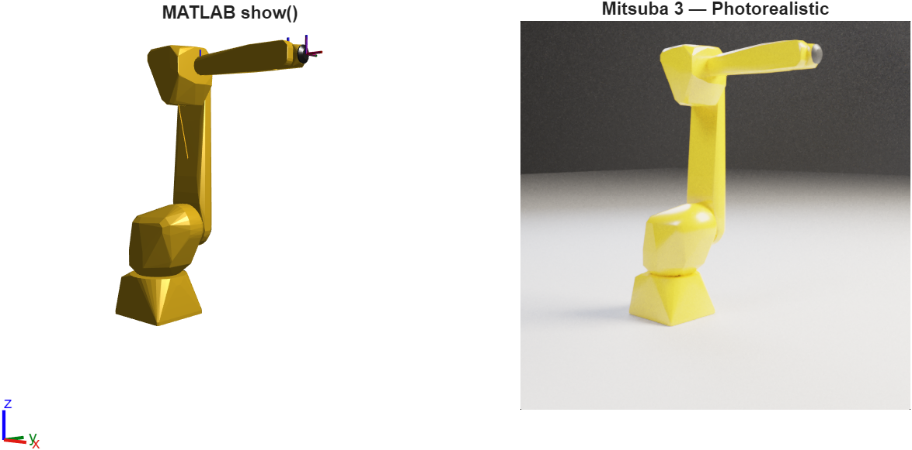
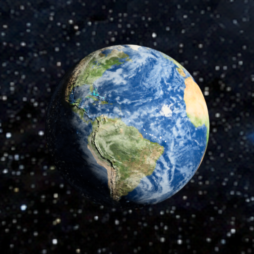
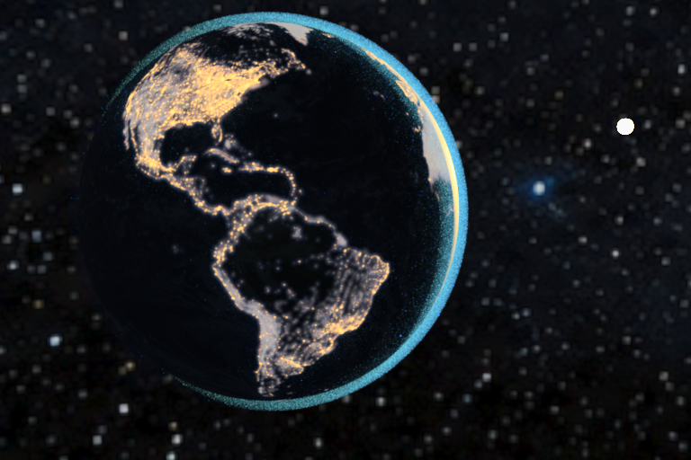
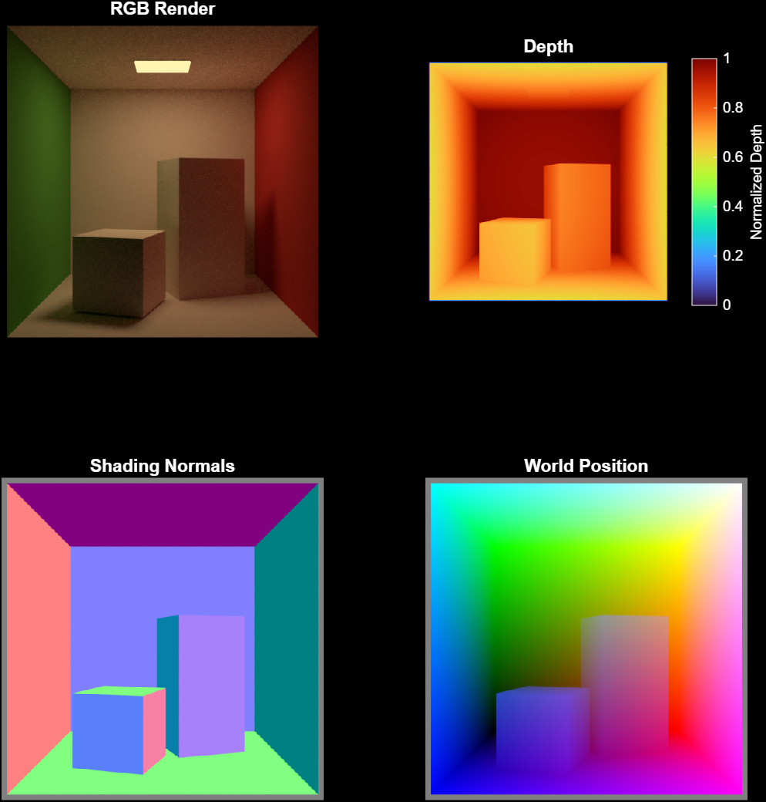
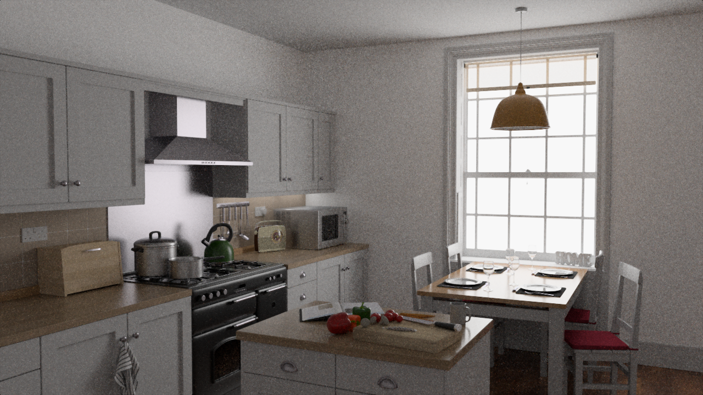
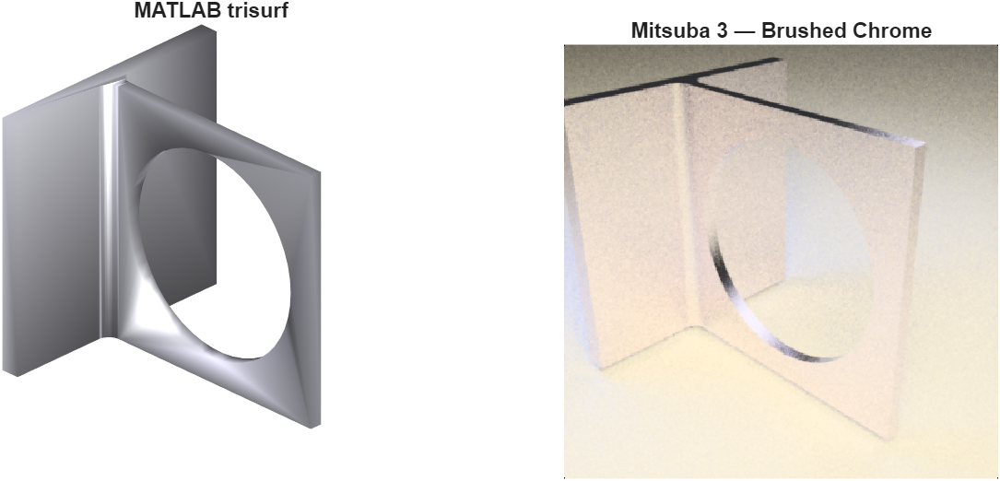
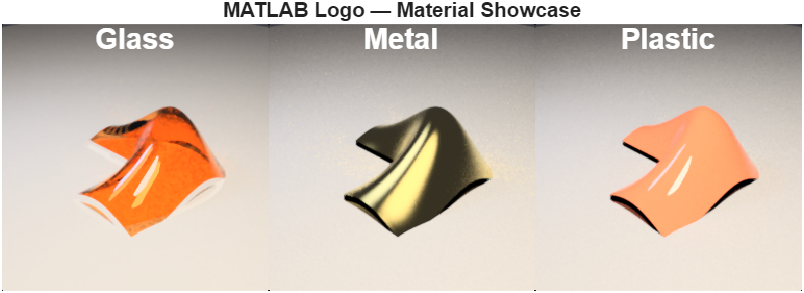
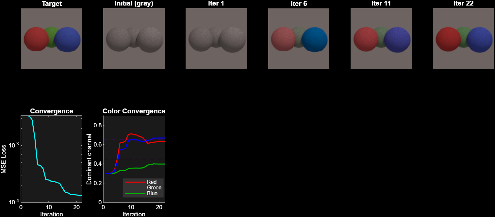
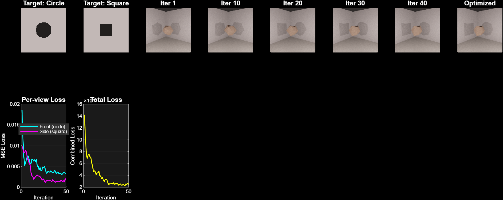

# MATSUBA - Physically-Based Rendering for MATLAB&reg;

MATSUBA brings [Mitsuba 3](https://mitsuba.readthedocs.io/) into MATLAB&reg; with an idiomatic API. Write pure MATLAB code to build scenes, set materials, position cameras, and render photorealistic images. All Python&trade; interop is handled behind the scenes.

```matlab
mi.setup
mi.setVariant("scalar_rgb");

scene = mi.Scene.build( ...
    mi.shape.sphere(bsdf=mi.bsdf.conductor(material="Au")), ...
    mi.emitter.point(position=[2 3 4], intensity=mi.spectrum(value=80)), ...
    mi.sensor.perspective(fov=45, ...
        to_world=mi.Transform.lookAt([0 0 3], [0 0 0], [0 1 0]), ...
        film=mi.film(Width=512, Height=512)), ...
    mi.integrator.path());

img = scene.render(SamplesPerPixel=64);
imshow(mi.postprocess(img))
```

## What does MATSUBA do?

- **Photorealistic output** - path-traced global illumination, physically-based materials (metals, glass, plastic), and soft shadows.
- **Stays in MATLAB** - no context-switching to Blender&reg;, KeyShot&reg;, or other tools. 
- **Interactive viewer** - `mi.Viewer` overlays progressive Mitsuba renders onto a MATLAB figure with HG geometry. Rotate and zoom the figure and the photorealistic overlay updates automatically.
- **Programmatic scene building** - build scenes from code. Sweep camera angles, material parameters, or lighting setups in a loop.
- **Differentiable rendering** - compute gradients of rendered images with respect to scene parameters. Enables inverse rendering and optimization workflows using MATLAB optimizers (`fmincon`, `adamupdate`).
- **Transient rendering** - time-resolved light transport via [mitransient](https://github.com/diegoroyo/mitransient) for LiDAR simulation and time-of-flight imaging.
- **CAD-to-render pipeline** - load STL/OBJ geometry (or any MATLAB mesh) and render it with real materials and lighting.

## Installation

### Prerequisites

| Requirement | Version |
|---|---|
| MATLAB&reg; | R2019b or later |
| Python&trade; | 3.12 (installed automatically by mpyreq) |

### Setup

```matlab
addpath("path/to/MATSUBA/matlab")
mi.setup
```

`mi.setup` uses [mpyreq](https://www.mathworks.com/matlabcentral/fileexchange/182230) to install Python 3.12, `mitsuba`, and `numpy`, then configures MATLAB `pyenv` in OutOfProcess mode. On first run it downloads the required dependencies; subsequent calls are fast no-ops.

> **Note:** `pyenv` can only be configured once per MATLAB session. Restart MATLAB to switch Python environments.

## Quick Start

### Load and render an XML scene

```matlab
mi.setVariant("scalar_rgb");
scene = mi.Scene("cornell_box.xml");
img = scene.render(SamplesPerPixel=64);
imshow(mi.postprocess(img))
```

### Build a scene from primitives

```matlab
scene = mi.Scene.build( ...
    mi.shape.sphere(radius=0.5, ...
        bsdf=mi.bsdf.diffuse(reflectance=mi.rgb([0.8 0.1 0.1]))), ...
    mi.emitter.point(position=[2 3 4], intensity=mi.spectrum(value=80)), ...
    mi.sensor.perspective(fov=45, ...
        to_world=mi.Transform.lookAt([0 0 3], [0 0 0], [0 1 0]), ...
        film=mi.film(Width=512, Height=512)), ...
    mi.integrator.path());
```

### Modify scene parameters

```matlab
scene.setParam("red.reflectance.value", [0.8 0.1 0.1]);
scene.camera.lookAt([0 1 5], [0 1 0], [0 1 0]);

T = mi.Transform.translate([1 0 0]) * mi.Transform.scale(1.2);
scene.setTransform("bunny.to_world", T);
```

## Gallery

All examples are in `matlab/examples/`. Each is a self-contained script you can run as-is.

| | |
|:---:|:---:|
| **Transient Rendering - Light in Motion** | **Robotics Toolbox Integration** |
|  |  |
| Time-resolved rendering via [mitransient](https://github.com/diegoroyo/mitransient). Watch light propagate through the Cornell box frame by frame. Each bin captures photon arrivals at a specific optical path length, producing a LiDAR-style animation. | Extract meshes from `loadrobot` and render a photorealistic image with painted plastic and clearcoat materials. Requires Robotics System Toolbox&trade;. |
| **Textures & Normal Maps** | **Nighttime Earth** |
|  |  |
| Earth with four texture maps: color, normals, roughness (shiny oceans, matte land), and transparent clouds against a Milky Way HDR environment. | Nighttime Earth with emissive city lights, Rayleigh-scattering atmosphere, and a sun peeking over the limb. Volumetric rendering with the volpath integrator. |
| **AOV Extraction** | **Gallery Scene Download** |
|  |  |
| Extract depth, normals, and world position as separate channels from a single render. Useful for compositing and ML training data. | Browse and download any of 40 scenes from the Mitsuba 3 gallery with `mi.io.downloadScene`. Scenes are cached locally for reuse. |

| |
|:---:|
| **CAD to Photorealism** |
|  |
| Load any STL from CAD and get a product shot with brushed steel material, studio lighting, and ground plane in a few lines of code. |
| **Material Showcase** |
|  |
| The MATLAB `membrane` rendered with three physically-based materials: warm glass, polished gold, and glossy red plastic. |
| **Inverse Rendering - Color Recovery** |
|  |
| Recover the original colors of three spheres starting from grey, using Mitsuba's differentiable rendering gradients and MATLAB's `fmincon` optimizer. |
| **Inverse Rendering - Shadow Art** |
|  |
| Optimize mesh vertex positions so a shape casts two target silhouettes on perpendicular walls. Uses `adamupdate` from Deep Learning Toolbox&trade;. |

## API Reference

### Package Functions

| Function | Description |
|---|---|
| `mi.setup(...)` | Configure Python environment via mpyreq |
| `mi.setVariant(name)` | Set Mitsuba variant (`"scalar_rgb"`, `"llvm_ad_rgb"`, etc.) |
| `mi.availableVariants()` | List installed variant names |
| `mi.bestVariant()` | Auto-select best variant for current hardware |
| `mi.cornellBox()` | Load Mitsuba's built-in Cornell box scene (returns `mi.Scene`) |
| `mi.postprocess(hdr)` | Tonemap and denoise HDR output for display |
| `mi.show(scene)` | Open interactive progressive viewer (shortcut for `mi.Viewer`) |
| `mi.rgb(v)` | Create an RGB color specifier from a 3-element vector |
| `mi.spectrum(value=v)` | Create a uniform spectrum specifier |
| `mi.ref(id)` | Create a cross-reference to a named scene object |
| `mi.film(Width=w, Height=h)` | Create a film (image resolution) specifier |
| `mi.sampler(Count=N, Type=T)` | Create a sampler specifier (`"independent"`, `"stratified"`) |
| `mi.transientFilm(...)` | Create a transient HDR film (temporal bins, OPL range). Requires mitransient |

### `mi.Scene`

| Method | Description |
|---|---|
| `Scene(xmlPath)` | Load scene from XML file (parses into editable struct) |
| `Scene.load(xmlPath)` | Load scene via Mitsuba's native parser (supports all XML features) |
| `Scene.build(...)` | Build scene from MATLAB primitives |
| `Scene.fromStruct(s)` | Construct from a struct tree (legacy) |
| `render(SamplesPerPixel=N)` | Render to MATLAB array |
| `renderProgressive(...)` | Render in passes (shows progress, supports Ctrl+C) |
| `renderAOV(aovNames, ...)` | Render arbitrary output variables (depth, normals, etc.) |
| `renderTransient(SamplesPerPixel=N)` | Time-resolved render returning steady-state + 4-D transient data |
| `renderDiff(target, params, ...)` | Differentiable render returning image, loss, and gradients |
| `params()` | List editable parameter names |
| `getParam(name)` | Read a parameter value from the live scene |
| `setParam(name, value)` | Set a single parameter |
| `setParams(names, values)` | Set multiple parameters |
| `setTransform(name, T)` | Set a 4x4 transform parameter |
| `add(pluginStruct, key)` | Add a component to the scene description |
| `remove(key)` | Remove a component by key |
| `find(key)` | Get sub-struct by key (or `[]` if not found) |
| `keys()` | List child key names in the scene description |
| `save(filepath)` | Export scene to Mitsuba XML |
| `camera.lookAt(origin, target, up)` | Set camera via look-at |
| `delete()` | Release Python-side resources |

### `mi.Viewer`

Interactive progressive renderer that overlays Mitsuba renders onto a MATLAB figure with HG patch geometry. Rotate or zoom the figure and the overlay re-renders automatically.

```matlab
v = mi.Viewer(scene, TargetSpp=64);
% interact with the figure...
v.stop(); v.resume(); v.reset();
```

### Shapes (`mi.shape.*`)

`sphere`, `cube`, `cylinder`, `disk`, `rectangle`, `fromMesh(V, F, ...)`, `obj`, `ply`. All accept `bsdf=`, `to_world=`, `key_=` arguments.

`groundPlane(height=0, size=10, up="Y")` is a studio ground plane helper with configurable orientation and material.

### Materials (`mi.bsdf.*`)

`diffuse`, `plastic`, `conductor`, `roughconductor`, `dielectric`, `roughdielectric`, `principled`, `twosided`, `mask`, `normalmap`, `custom(type, ...)`. Physically-based BSDFs with named parameters. Scalar properties (roughness, alpha, etc.) also accept texture structs for spatially-varying values.

### Textures (`mi.texture.*`)

`bitmap(filename=...)`, `checkerboard(color0=..., color1=...)`. Image or procedural textures, usable as any material parameter (reflectance, roughness, etc.).

### Lights (`mi.emitter.*`)

`area`, `point`, `spot`, `directional`, `constant`, `envmap`, `custom(type, ...)`. Area emitters attach to shapes; `directional` provides distant sun-like illumination; `envmap` loads HDR environment maps.

### Studio Lighting (`mi.lighting.*`)

`threePoint(target=..., distance=5, intensity=1)` returns a cell array of key/fill/rim area lights + ambient fill. Supports Y-up and Z-up scenes, warm/cool temperature shift. Unpack into `Scene.build` with `lights{:}`.

### Integrators (`mi.integrator.*`)

`path`, `direct`, `prb`, `aov`, `transientPath`, `custom(type, ...)`. Use `path` for general rendering, `prb` for differentiable rendering (gradient computation), `aov` for extracting depth/normals/position channels, and `transientPath` for time-resolved light transport (requires mitransient).

### Cameras (`mi.sensor.*`)

`perspective(fov=45, ...)`, `orthographic(...)`, `fisheye(...)`, `panoramic(...)`, `custom(type, ...)`. All accept `film=`, `to_world=`, `key_=` arguments. The `custom` sensor supports programmable per-pixel ray maps for arbitrary projections.

### Transforms (`mi.Transform.*`)

`translate(v)`, `scale(s)`, `rotateX(deg)`, `rotateY(deg)`, `rotateZ(deg)`, `rotate(axis, deg)`, `lookAt(origin, target, up)`. Returns 4x4 matrices that compose with `*`. Angles in degrees (matching MATLAB convention).

### Scene I/O (`mi.io.*`)

`readXML(path)` parses a Mitsuba XML scene file into a MATLAB struct tree. `writeXML(path, tree)` exports back to XML. `gallery()` lists all 40 downloadable Mitsuba gallery scenes. `downloadScene(name)` downloads and caches a gallery scene, returning the path to its XML file.

## Architecture

```
+---------------------+
|   MATLAB (+mi)      |  User-facing API: handle classes + package functions
+---------------------+
|   Python bridge     |  matlab_mitsuba.bridge - scene registry, type conversion
+---------------------+
|   Mitsuba 3         |  Rendering engine (installed by mpyreq)
+---------------------+
```

MATLAB owns the API. Users never see `py.mitsuba.*` calls. The Python bridge owns all live Mitsuba objects, referenced by lightweight integer IDs from MATLAB. Cross-language calls are coarse-grained: load, configure, render.
