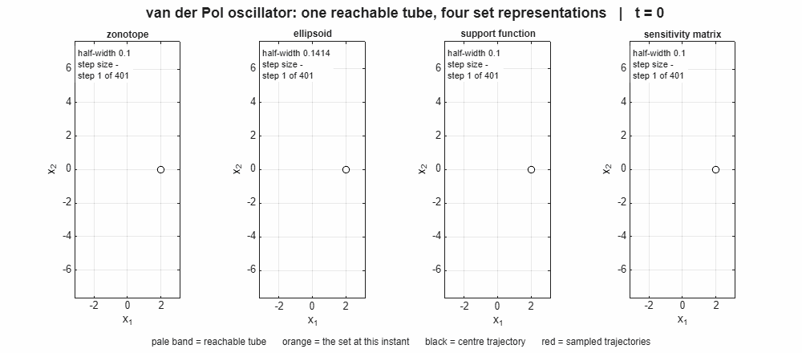
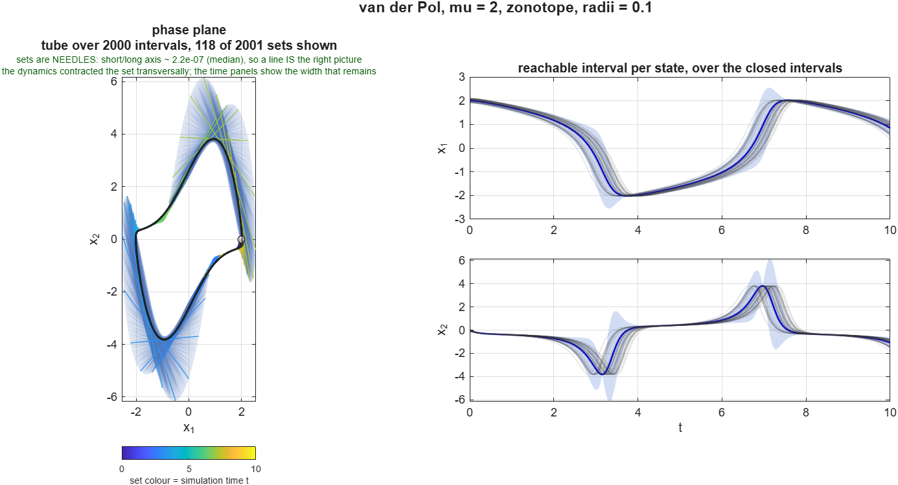
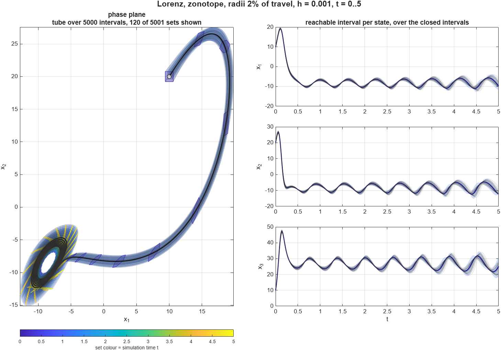
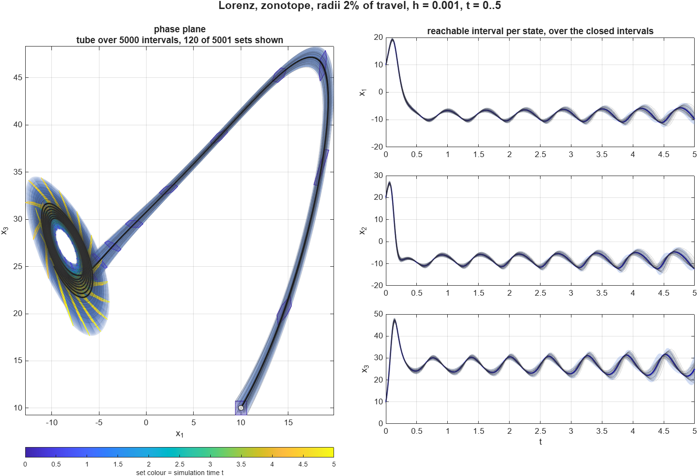

# Set-valued reachability as a Simulink solver

<!-- project-download-link:start -->
📦 Download this project [here](https://github.com/mathworks/Research-Office-Projects/releases/download/project-downloads/package-simulink-reachability-solvers.zip).
<!-- project-download-link:end -->

Simulate a Simulink model from a **set** of initial conditions instead of a single one, by selecting a solver from the Solver dropdown.

**It works on your own model, and pressing the ordinary Run button is the whole workflow.**
Register the solvers once, pick one in the Solver dropdown, and every run from then on computes and logs a reachable tube instead of a single trajectory.
Put a `SetIC` variable in the model workspace and the initial set travels with the model as well, so a run needs no commands at all, not even `setRadii`.
Drawing the tube is one further call: pressing Run computes and logs it, `plotSetTube` is what puts it on screen.

```matlab
setup                 % once per session, from the package root
registerSetSolvers    % once ever: the eight solvers join the Solver dropdown

vdp                   % any Simulink model will do; vdp is a shipping example
mdl = 'vdp';

set_param(mdl, 'SolverType', 'Fixed-step', 'Solver', 'SetReachZonotope')
SetReach.setRadii(0.1);
sim(mdl);             % or just press Run
plotSetTube;          % draws the log the run left behind
```

This is an **experiment and a proof of concept**, published so the research community can see what the plugin solver interface makes possible and build on it. It computes **approximate reachability**: at each step the set is pushed through the linearisation of the dynamics about the centre trajectory, which is exact for linear dynamics and an approximation for nonlinear dynamics.

## How it works

A Simulink plugin solver is handed the state at a given simulation step, the derivative and the step size by the Simulink engine, and is expected to return the state at the next simulation step back to the engine. That information received from the engine is also enough to propagate a set: Simulink will supply the solver Jacobian `A` at the current operating point, so the step map for the set is the matrix exponential

```
S(t + h) = expm(A*h) * S(t)
```

applied to whichever representation is carrying the set, while the centre advances under an
ordinary ODE step. The whole method is basically that one line, so the interesting choices are the representation of `S`
and the accuracy of `A`.

On that second one: `SolverJacobianMethodControl` defaults to `auto`, which obtains `A` by perturbation, leaving about `1e-8` in `A` and about `1e-6` in the propagated set, and refining `h` does not help because the error is not in the integration. Setting it to `SparseAnalytical` can make the map exact to machine precision, but only if every block on the state path implements a Jacobian method, and the fallback to differencing is silent. Both shipped examples ask for it: it works on the Lorenz model and is inert on `vdp`. Either way this term sits far below the linearisation error discussed below, which is what actually decides whether a tube holds.

The variable-step solvers put `A` to a second use. Its symmetric part gives the rate at which the set grows, `mu = lambda_max((A + A')/2)`, and since
`||expm(A*h)|| <= exp(mu*h)`, allowing at most `SetTol` relative growth per step sets `h = log1p(SetTol)/mu`, with `MaxStep` governing instead wherever `mu <= 0` and the set is contracting. So the step size is chosen by how the *set* behaves, which is the thing a stock solver cannot do:
Simulink's own variable-step solvers size their steps from a local error estimate on the state, and while the implicit ones do use a Jacobian, they use it to take the step rather than to measure how a neighbourhood deforms.
Two caveats, both deliberate.
What is under control is the set's expansion and not the centre's accuracy, because a plugin solver reports the next step time rather than an error estimate, so the engine's `RelTol` and `AbsTol` are not in play. And `mu` is evaluated at the centre rather than over the whole set, which makes the growth cap a good heuristic rather than a guaranteed bound.

`SetTol` defaults to `0.02`, so 2% set growth per step, and `SetReachVar.stepControl(struct('SetTol', 0.05))` changes it for this run and later ones.
`MaxStep` and `MinStep` are read from the model's own Solver pane rather than reinvented, so the ceiling on `h` stays wherever the configuration dialog puts it, and `auto` falls back to Simulink's documented rule of `StopTime/50`.

## Requirements

MATLAB and Simulink **R2026b or later**.
Plugin solvers and `Simulink.Solver.register` were introduced in R2026b, and the package is built on `Simulink.Solver.FixedStepSolver` and `Simulink.Solver.VariableStepSolver`.

MATLAB and Simulink are the only dependencies, and the solvers work on **any** Simulink model with continuous state.
The package ships no `.slx` of its own, which is why the examples borrow models that come with MathWorks products rather than committing one: nothing about the method is particular to them.

The sample results images are from van der Pol and Lorenz models that ship with MathWorks products.
Get them by typing `vdp` at the prompt, or
`openExample("globaloptim/OptimizeSimulinkModelInParallelExample")` for the Lorenz model.
Global Optimization Toolbox is only how you obtain that second model; it is not needed to run the solvers.

## The eight solvers

`registerSetSolvers` puts one fixed-step and one variable-step solver into the dropdown for
each of four set representations.

| shape | fixed-step | variable-step | what it is good at |
| --- | --- | --- | --- |
| zonotope | `SetReachZonotope` | `SetReachVarZonotope` | the default; exact under the linear map, and cheap |
| support | `SetReachSupport` | `SetReachVarSupport` | stores the set by its support function, so directional bounds are native |
| sensitivity | `SetReachSensitivity` | `SetReachVarSensitivity` | carries the sensitivity matrix itself, closest to the HSCC'09 formulation |
| ellipsoid | `SetReachEllipsoid` | `SetReachVarEllipsoid` | a single quadratic form, smooth and compact |

They coexist, so the dropdown itself is the shape picker and switching shape is one
`set_param`.

Registration is **persistent**, not per-session: `registerSetSolvers` is a once-ever step. Once registered, the eight names stay in the Solver dropdown
of every model across MATLAB restarts.
`registerSetSolvers('off')` is how you take them back out.

The first three are the same set, reached three ways: on van der Pol they agree on the
final interval hull to `1.1e-14`. The ellipsoid differs by `1.3e-01` because it is a different shape, and it starts with a different set of initial conditions. `SetReach.setFit('inscribed')`, the default, fits inside the initial box; `'circumscribed'` encloses it.

## Setting the initial set

```matlab
SetReach.setRadii(0.1)          % one half-width for every state
SetReach.setRadii([0.2 0.1 0])  % per-state half-widths, 0 pins a state
SetReach.setRadii(G0)           % an n-by-m generator matrix, for a set of lower rank
SetReach.config(rep)            % or hand over a fully built SetRep
```

The set is centred around whatever initial condition the model already has.

Or put it in the model workspace, which is what makes "just press Run" literally true:

```matlab
ws = get_param(bdroot, 'ModelWorkspace'); assignin(ws, 'SetIC', 0.1)
```

`SetIC` takes the same spec as `setRadii` and is read first, so the initial set is saved with the model and travels with it.
With nothing configured either way the solver does not error: it warns once, treats the initial set as the single point `x0`, and the tube comes out with zero width.

## Results

### van der Pol



One tube carried by all four representations at once, initial half-widths `0.1`, `h = 0.02`, over `t = 0..8`. The red curves are trajectories re-simulated from sampled initial states. The ellipsoid starts larger than the other three because it is circumscribing the initial box, which is `SetReach.setFit('circumscribed')`.

`examples/vdpReachTube.m`, `mu = 2`, initial half-widths `0.1`, `h = 0.005`, over `t = 0..10`.



The set collapses onto the limit cycle, and the linearised tube contracts harder than the true reachable set does, down to a reported half-width of
`6.9e-04`, so most of the sampled trajectories end up outside the thin band.

In the two still figures the **grey** curves are the sampled trajectories, and the colour of each set is its simulation time, read off the colorbar. The animation above keeps red, because being animated it already conveys time and needs no ramp to legend.

### Lorenz

`examples/lorenzReachTube.m`, from the model's own initial condition `[10 20 10]`, per-state half-widths of roughly 2% of each state's own travel, `h = 0.001`, over `t = 0..5`.





Two projections of one run: `x1`-`x2` reads the approach most clearly, `x1`-`x3` is the classic view of the attractor. All the way down the sweep from `[10 20 10]` onto one lobe the samples stay bundled inside the tube, and the failure comes late and lopsided. By `t = 5` the set has been stretched `5.5x` along one axis and flattened to `9e-17` of it, effectively rank two of three, so the tube reaches out further than any trajectory goes along
the needle while being paper-thin across it.

## Error handling: getting arbitrarily close

Van der Pol example shows that some simulated trajectories go outside the plotted tube due to it being an approximation. The error is quadratic in the diameter of the initial set. HSCC'09 gives the bound as `‖y − x‖ ≤ K‖S‖²` and an error handling mechanism: partition `S` into smaller subsets, propagate each one, and take the union. Halving the diameter quarters the error, so refining the partition until a chosen tolerance is met gets arbitrarily close to the true reachable set, at the cost of one simulation per piece. That paper also supplies the machinery to do it adaptively, refining only where the local error estimate exceeds the tolerance. **Splitting is not implemented here.**

## Limitations
- This work primarily supports continuous (continuous-time and continuous-valued) dynamics.
  - Discontinuities in the continuous state evolution ("hybrid dynamics") are not supported at the moment, as the zero crossings are still handled by the Simulink engine and not by the plugin solver.
    The variable-step solvers do sharpen *where* the engine puts a crossing, because `interpolateState` answers the engine's bisection with the step's own affine flow instead of a straight line.
    But that improves the **centre** only, and the set has no notion of the crossing, which is why it cannot be carried across the jump.
  - Discrete-time dynamics, e.g., the evolution of the state inside a Unit Delay block, are handled directly by the block types themselves and not the solver. Therefore our plugin solver has no way to directly interact with these, and their set-valued extensions are not supported. This is different from a fixed-step solver numerically integrating continuous-time state variables with a fixed stepsize, which *is* supported.

## References

1. A. Donzé, B. H. Krogh and A. Rajhans.
   *Parameter Synthesis for Hybrid Systems with an Application to Simulink Models.*
   Hybrid Systems: Computation and Control (HSCC), 2009.
   The error bound, the refining partition, and the tolerance-driven algorithm.
2. A. Donzé and O. Maler.
   *Systematic simulations using sensitivity analysis.*
   HSCC'07, LNCS, April 2007.
   The sensitivity formulation this package propagates.
3. A. Girard and G. J. Pappas.
   *Verification using simulation.*
   HSCC, volume 3927 of LNCS, pages 272-286, Springer-Verlag, 2006.
   Why a finite number of simulations can say something about a set.
4. E. Asarin, T. Dang, G. Frehse, A. Girard, C. Le Guernic and O. Maler.
   *Recent progress in continuous and hybrid reachability analysis.*
   IEEE International Symposium on Computer-Aided Control Systems Design, 2006.
   Background on the zonotope, support function and ellipsoid representations
   the eight solvers carry.
5. E. D. Sontag.
   *Contractive systems with inputs.*
   Perspectives in Mathematical System Theory, Control, and Signal Processing,
   pages 217-228, Springer, 2010.
   The matrix measure bound behind the `mu` logged at every step, which the
   variable-step solvers also use to choose the step.
6. C. Fan.
   *Formal Methods for Safe Autonomy: Data-Driven Verification, Synthesis, and Applications.*
   PhD dissertation, Department of Electrical and Computer Engineering,
   University of Illinois at Urbana-Champaign, 2019.
   That bound as Proposition 4.2, with the simulation-based verification context around it.
7. J. Kapinski, J. V. Deshmukh, X. Jin, H. Ito and K. Butts.
   *Simulation-Based Approaches for Verification of Embedded Control Systems: An overview
   of traditional and advanced modeling, testing, and verification techniques.*
   IEEE Control Systems Magazine, volume 36, number 6, pages 45-64, December 2016.
   Orientation rather than algorithm: industrial context for simulation-based
   verification of Simulink models, and where approximate reachability earns its
   place without being a proof.
8. Y. Deng, A. Rajhans and A. A. Julius.
   *STRONG: A Trajectory-Based Verification Toolbox for Hybrid Systems.*
   Quantitative Evaluation of Systems (QEST), LNCS, pages 165-168, 2013.
   Ellipsoidal neighbourhoods carried along simulated trajectories, which is the
   lineage `EllipsoidRep` sits in, implemented as a tool and for hybrid systems.

## Layout

| folder | contents |
| --- | --- |
| `solvers/` | `SetReach` and `SetReachVar` base classes, the eight registered subclasses, `registerSetSolvers` |
| `representations/` | `SetRep` and the `ZonotopeRep`, `SupportRep`, `SensitivityRep`, `EllipsoidRep`, `HullRep` implementations |
| `examples/` | `vdpReachTube`, `lorenzReachTube` |
| `visualization/` | `plotSetTube`, `zonotopeVertices` |
| `helpers/` | `sampleModelTrajectories` and set-log utilities |
| `tests/` | `tSetReach`, run with `runtests('tSetReach')` |

Run `setup` once per session to put all of it on the path.
