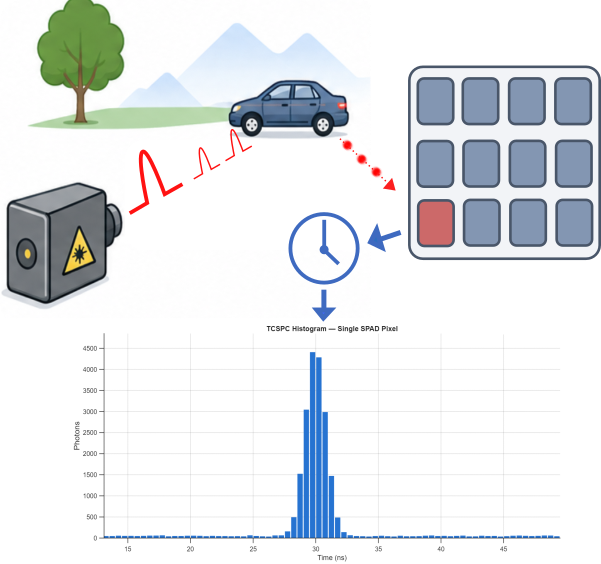

# SPAD dToF Simulation for MATLAB&reg;



A modular, optimized, physically accurate simulator for **Single-Photon Avalanche Diode (SPAD)** based **direct Time-of-Flight (dToF)** imaging systems in MATLAB&reg;.

## Overview

This toolbox simulates the full TCSPC (Time-Correlated Single Photon Counting) signal chain from photon arrival through detector physics to digitized timestamps. It is designed for:

- Evaluating SPAD array designs and parameter trade-offs
- Generating realistic dToF data for algorithm development
- Understanding pile-up distortion, dead time effects, and noise sources
- Teaching the physics of single-photon lidar systems

## Features

- **Poisson photon arrival generation** with arbitrary rate profiles and multiple sources
- **SPAD avalanche physics**: photon detection efficiency, nonparalyzable dead time, gate modulation
- **After-pulsing**: exponential decay model with configurable chaining depth
- **Optical crosstalk**: kernel-based neighbor coupling with exact and approximate modes
- **TDC digitization**: timing jitter (SPAD + TDC), electronics dead time, quantization, multi-stop capability
- **Pile-up correction**: Coates (1968) method for single-stop histograms
- **Multi-pixel arrays** with parallel processing support

## Quick Start

```matlab
% Setup
params = defaultSPADParams();
params.nCycles = 50000;

% Define a Gaussian laser return pulse
nBins = round(params.cycleTime / params.binWidth);
binCenters = ((0:nBins-1) + 0.5) * params.binWidth;
rateVector = 1e8 * exp(-0.5 * ((binCenters - 5e-9) / 200e-12).^2) + 1e6;
rateVector = reshape(rateVector, 1, 1, []);

% Run full pipeline
gateVector = ones(1, nBins);
result = runSPADSimulation(rateVector, gateVector, params);

% Build and plot histogram
[counts, ~, histCenters] = buildHistogram(result, params);
bar(histCenters * 1e9, squeeze(counts), 1)
xlabel("Time (ns)"); ylabel("Photons")
```

## Architecture

The simulation pipeline consists of three stages:

```
generateArrivals  -->  simulateSPAD  -->  digitize
   (Poisson)          (avalanche)       (TDC)
```

| Stage | Function | Models |
|-------|----------|--------|
| 1. Arrivals | `generateArrivals` | Inhomogeneous Poisson process, PDE, dark counts, gating |
| 2. Avalanche | `simulateSPAD` | Dead time, after-pulsing, optical crosstalk |
| 3. Digitize | `digitize` | SPAD jitter, TDC jitter, TDC dead time, quantization, max hits/cycle |

The convenience wrapper `runSPADSimulation` chains all three stages.

## Key Parameters

| Parameter | Default | Description |
|-----------|---------|-------------|
| `cycleTime` | 100 ns | Laser repetition period |
| `nCycles` | 100,000 | Number of laser cycles |
| `pde` | 0.25 | Photon detection efficiency |
| `dcr` | 1000 Hz | Dark count rate |
| `spadDeadTime` | 100 ns | SPAD quench + recharge time |
| `tdcDeadTime` | 5 ns | TDC conversion dead time |
| `trapProb` | 0.01 | Carrier trapping probability per avalanche |
| `afterPulseDecay` | 50 ns | Trapped-carrier release time constant |
| `spadJitterFWHM` | 100 ps | SPAD timing jitter (FWHM) |
| `tdcJitterFWHM` | 50 ps | TDC timing jitter (FWHM) |
| `tdcResolution` | 50 ps | TDC quantization step |
| `maxHitsPerCycle` | Inf | Max TDC recordings per cycle (1 = single-stop) |
| `crosstalkProb` | 0 | Optical crosstalk probability |

See `defaultSPADParams.m` for the full parameter list.

## Examples

| Example | Description |
|---------|-------------|
| `examples/basicExample.m` | Single-pixel simulation with event breakdown |
| `examples/dtofImaging.m` | 32x32 array imaging a 3D scene with depth estimation |
| `examples/pileupDistortion.m` | Demonstrates pile-up at high flux with Coates correction |

## Post-Processing

- **`buildHistogram`** — Constructs TCSPC histograms from timestamps (single pixel or full array)
- **`correctPileup`** — Coates pile-up correction for single-stop acquisition

## References

- J. Rapp, *Probabilistic Modeling for Single-Photon Lidar*, PhD Thesis, Boston University, 2020.
- P.B. Coates, "The correction for photon 'pile-up' in the measurement of radiative lifetimes," *J. Phys. E: Sci. Instrum.*, vol. 1, 1968.

## Requirements

- MATLAB&reg; R2021a or later
- Parallel Computing Toolbox&trade; (optional, for multi-pixel acceleration)

