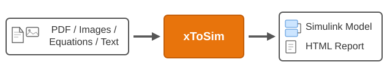

# xToSim — Multi-Builder Simulink Model Construction

Automated pipeline that converts any source (research papers, system descriptions, equations, block diagrams) into professional Simulink models. Powered by an AI coding assistant with a live MATLAB connection.



## What it does

You say what you want built. The agent handles the rest:

```
You:   "Build a Simulink model from this paper" + drop a PDF
Agent: Extracts equations → plans decomposition → builds model → validates → delivers report
```

Takes an input **x** (PDF, LaTeX, Word doc, image, text description, or existing model) and produces:

- A validated, hierarchical Simulink model (`.slx`)
- An HTML report with equations, parameters, and validation plots
- Standalone test scripts for reproducibility

---

## Installation

These instructions install xToSim as a **global skill** in your AI coding assistant. Once installed, you can invoke it from any project.

### 1. Install the MATLAB MCP Server

The MATLAB MCP server provides the live MATLAB connection required by the pipeline.

Follow the official setup instructions: **https://github.com/matlab/matlab-mcp-server**

The guide covers Claude Code, Claude Desktop, VS Code, and Codex. Make sure MATLAB is accessible and the server can connect to a running session before proceeding.

### 2. Install this skill

**Claude Code:**

```sh
# Clone into your skills directory
git clone <this-repo-url> ~/.claude/skills/xToSim
```

The skill is auto-detected when you invoke `/xToSim` or when the agent matches your request.

**Other AI assistants:**

Point the agent at `SKILL.md` as its system prompt. Ensure MATLAB is accessible via a persistent connection (MCP or equivalent).

### 3. Use it

Start a conversation with your AI assistant:

```
"Build a Simulink model from this paper"       + attach PDF/tex/docx
"Model a DC motor with field weakening"        (derives equations from scratch)
"Add a controller to my existing plant model"  (extends a loaded model)
"Combine these two models into one"            (composition)
```

The agent runs autonomously through 6 stages, pausing only at the architecture checkpoint (Stage B) for your confirmation before building.

---

## Modes

xToSim operates in two modes:

- **Interactive** (default) — the agent pauses at key checkpoints (architecture plan, build confirmation, composition) for your approval before proceeding. Uses strict validation that fails fast on errors. Best when you want to guide decisions or are exploring a new domain.

- **Autonomous** — the agent runs all stages end-to-end without pausing, making judgment calls on ambiguities and documenting them in the spec. Only stops when genuinely stuck after multiple failed attempts.

To switch to autonomous mode, say **"just build it"**, **"run pipeline"**, **"do all"**, or **"don't stop"** in your prompt. The default is interactive; no special command is needed to stay in that mode.

---

## What success looks like

After a few minutes, you'll have:

```
DCMotor/
├── DCMotor.slx          ← Clean, hierarchical, annotated Simulink model
├── params.m             ← All parameters (editable, sourced from paper)
├── init.m               ← Setup script (model runs with just Play button)
├── test/run_tests.m     ← Standalone validation (no AI needed)
├── docs/report.html     ← Build report with equations + validation plots
└── docs/figures/        ← All plots as .png
```

---

## Architecture

```
A: INTAKE ─── What are we building? From what source?
     │
     v
B: PLAN ───── How to decompose? Which builder per part?
     │         (user confirms architecture here)
     v
C: BUILD ──── Execute builders. Verify each component.
     │
     v
D: COMPOSE ── Wire components together.
     │
     v
E: VALIDATE ─ Run. Check physics. Score.
     │
     v
F: DELIVER ── Package. Report. Screenshots. Animation (optional).
```

## Builders

| Builder | Domain | Input |
|---------|--------|-------|
| `existing` | Pre-built subsystems from loaded models | Source model + subsystem path |
| `odeBuilder` | Novel nonlinear ODEs | LaTeX equations |
| `odeBuilder_cps` | Hybrid/switched systems | Modes + transitions + ODEs |
| `simscapeBuilder` | Physical networks (circuits, mechanisms) | Component topology |
| `blocksetBuilder` | Standard library blocks (TF, PID, delays) | Block spec + params |
| `stateflowBuilder` | Finite state machines | States + transitions |
| `simeventsBuilder` | Discrete-event systems (queues, entities) | Entity flow spec |
| `lookupTableBuilder` | Empirical data / maps | Breakpoints + table data |

The agent automatically selects the right builder for each component via a decision tree (see `SKILL.md` section B2).

---

## Requirements

| Component | Required? | Used By |
|-----------|-----------|---------|
| MATLAB R2024b+ | Yes | All builders |
| Simulink | Yes | All builders |
| Stateflow | For CPS/FSM models | `odeBuilder_cps`, `stateflowBuilder` |
| Simscape | For physical networks | `simscapeBuilder` |
| SimEvents | For discrete-event models | `simeventsBuilder` |
| System Composer | Optional | Architecture generation |

Builders check for toolbox licenses at runtime. If a required toolbox is missing, the builder returns a clear error with a recommended alternative (e.g., "Simscape not licensed — use odeBuilder with equivalent ODEs").

### Optional: External Tools

| Tool | Purpose | Without It |
|------|---------|------------|
| `pdftotext` / `pdftoppm` (poppler-utils) | PDF equation extraction via vision | User provides equations as LaTeX/text/image instead |
| `pdflatex` (MiKTeX/TeX Live) | Compile LaTeX reports & free-body diagrams | Reports saved as `.tex`; diagrams use MATLAB figure fallback |

These are not required — the skill detects availability at runtime and falls back gracefully.

---

## Project Structure

```
xToSim/
├── setup.m                 % Path setup (run once per session)
├── SKILL.md                % Agent instructions (entry point for AI assistant)
├── rules.md                % Invariant rules
├── builders.md             % Builder API reference
├── bus.md                  % Bus interface conventions
├── spec_format.md          % Plan/spec struct formats
├── builders/               % Builder implementations (.p in release)
│   ├── odeBuilder.p
│   ├── odeBuilder_cps.p
│   ├── simscapeBuilder.p
│   ├── blocksetBuilder.p
│   ├── stateflowBuilder.p
│   ├── simeventsBuilder.p
│   └── schemas/            % JSON schemas for builder specs
├── compose/                % Composition and wiring (.p in release)
│   ├── executePlan.p       % Single entry point (Stages C→F)
│   ├── composeModel.p      % Multi-builder wiring
│   ├── createHierarchy.p   % Flat → hierarchical
│   └── ...
├── validate/               % Model validation (.p in release)
├── package/                % Report generation (.p in release)
├── util/                   % Shared utilities (.p in release)
├── phases/                 % Per-stage instructions (.md, readable)
│   ├── stage_A_intake.md
│   ├── stage_B_plan.md
│   ├── stage_C_build.md
│   ├── stage_C_simscape.md
│   ├── stage_C_stateflow.md
│   ├── stage_C_simevents.md
│   ├── stage_D_controllers.md
│   ├── stage_D_hierarchy.md
│   ├── stage_E_validate.md
│   └── stage_F_deliver.md
├── tests/                  % Acceptance tests
├── design/                 % Internal architecture docs (not needed for operation)
└── docs/                   % Architecture docs
```

---

## Limitations & Known Constraints

- **Model complexity:** Works well up to ~50 states / 10 subsystems. Larger models may hit AI context limits requiring multiple sessions.
- **No code generation:** Produces Simulink models (`.slx`), not embedded C/C++ or HDL code.
- **No FMU/FMI export:** Model stays in Simulink ecosystem.
- **PDF quality matters:** Scanned PDFs with poor resolution may require manual equation input. Born-digital PDFs work best.
- **Single MATLAB session:** The pipeline assumes one MATLAB instance. Parallel builds across multiple MATLAB sessions are not supported.
- **Toolbox-specific builders:** If you don't have Simscape/Stateflow/SimEvents, the corresponding builders won't work — but the agent will suggest alternatives using odeBuilder.

---

## Troubleshooting

| Symptom | Likely Cause | Fix |
|---------|-------------|-----|
| "executePlan errors on first call" | Path not set up | Run `setup.m` first |
| "Stateflow/Simscape not licensed" | Missing toolbox | Agent auto-falls back to odeBuilder; or install the toolbox |
| "Model won't simulate" | Parameter mismatch | Check `params.m`, verify against paper values |
| "PDF equations garbled" | No `pdftoppm` installed | Install poppler-utils, or provide equations as LaTeX/images |
| Agent seems stuck / repeating | Context window full | Start a new session, provide the spec JSON from previous run |
| "MCP connection failed" | MATLAB MCP server not running | Follow troubleshooting at https://github.com/matlab/matlab-mcp-server |

For bugs or feature requests, open an issue in this repository.

---

## License

Licensed under the repository's MathWorks BSD-3-Clause License. See [LICENSE](../../LICENSE).
